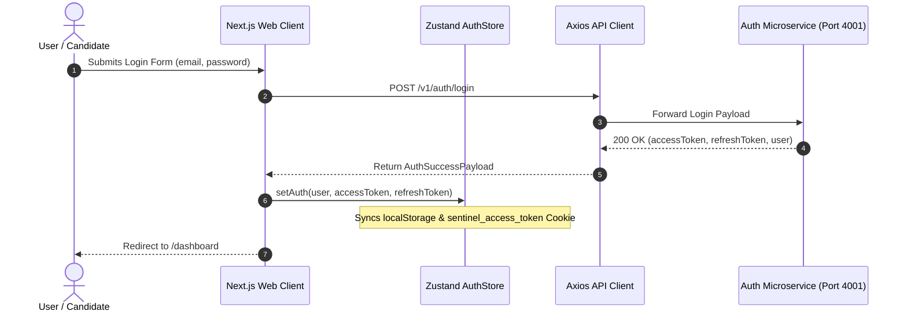
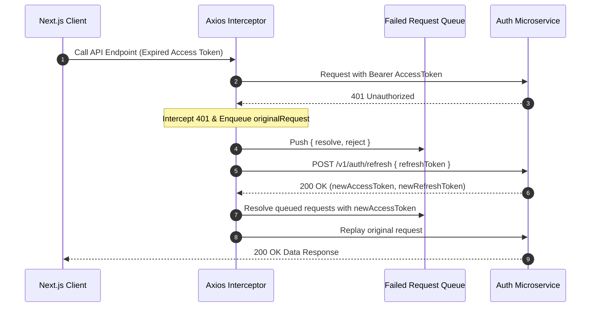
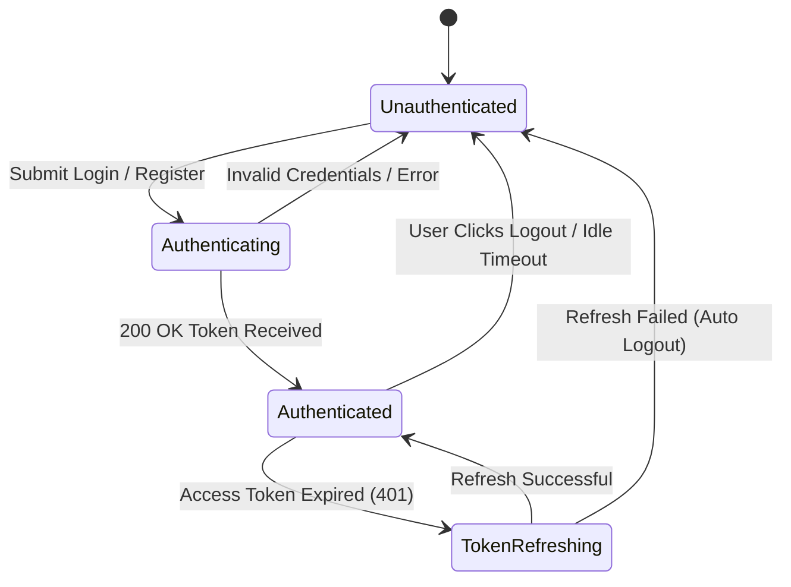

# Authentication Flow Architecture

## 1. Authentication Sequence Diagram

```mermaid
sequenceDiagram
    autonumber
    actor Candidate as User / Candidate
    participant UI as Next.js Web Client
    participant Store as Zustand AuthStore
    participant Axios as Axios API Client
    participant AuthAPI as Auth Microservice (Port 4001)

    Candidate->>UI: Submits Login Form (email, password)
    UI->>Axios: POST /v1/auth/login
    Axios->>AuthAPI: Forward Login Payload
    AuthAPI-->>Axios: 200 OK (accessToken, refreshToken, user)
    Axios-->>UI: Return AuthSuccessPayload
    UI->>Store: setAuth(user, accessToken, refreshToken)
    Note over Store: Syncs localStorage & sentinel_access_token Cookie
    UI-->>Candidate: Redirect to /dashboard
```

---

## 2. Silent Token Refresh & Request Queue

```mermaid
sequenceDiagram
    autonumber
    participant UI as Next.js Client
    participant Axios as Axios Interceptor
    participant Queue as Failed Request Queue
    participant AuthAPI as Auth Microservice

    UI->>Axios: Call API Endpoint (Expired Access Token)
    Axios->>AuthAPI: Request with Bearer AccessToken
    AuthAPI-->>Axios: 401 Unauthorized
    Note over Axios: Intercept 401 & Enqueue originalRequest
    Axios->>Queue: Push { resolve, reject }
    Axios->>AuthAPI: POST /v1/auth/refresh { refreshToken }
    AuthAPI-->>Axios: 200 OK (newAccessToken, newRefreshToken)
    Axios->>Queue: Resolve queued requests with newAccessToken
    Axios->>AuthAPI: Replay original request
    AuthAPI-->>UI: 200 OK Data Response
```

---

## 3. Auth State Machine

```mermaid
stateDiagram-v2
    [*] --> Unauthenticated
    Unauthenticated --> Authenticating: Submit Login / Register
    Authenticating --> Authenticated: 200 OK Token Received
    Authenticating --> Unauthenticated: Invalid Credentials / Error
    Authenticated --> TokenRefreshing: Access Token Expired (401)
    TokenRefreshing --> Authenticated: Refresh Successful
    TokenRefreshing --> Unauthenticated: Refresh Failed (Auto Logout)
    Authenticated --> Unauthenticated: User Clicks Logout / Idle Timeout
```
