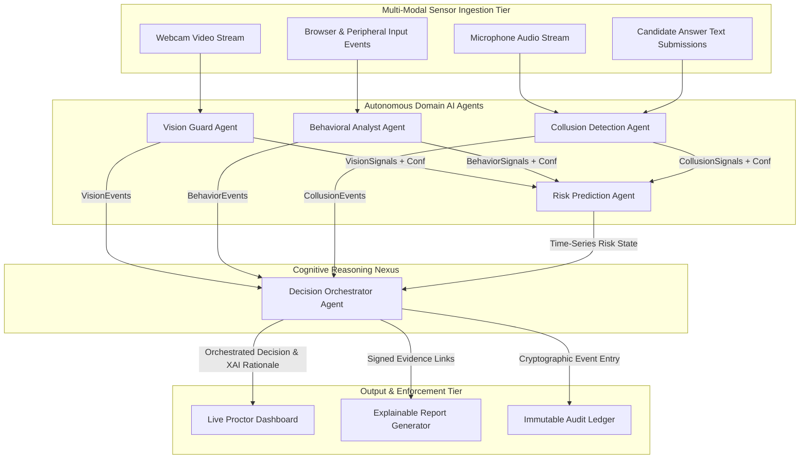
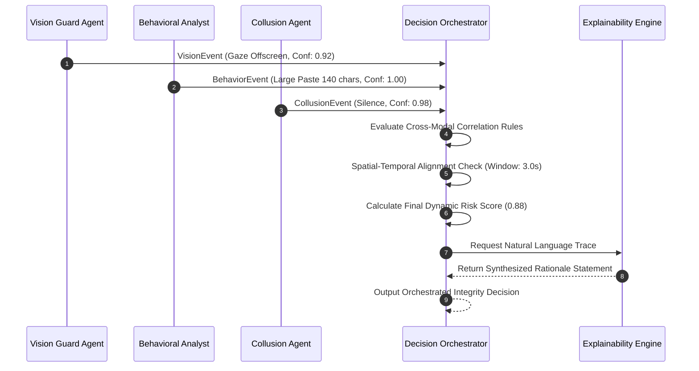

# Multi-Agent AI Architecture Specification
## SentinelAI: Autonomous Multi-Agent Exam Integrity Platform

**Document Metadata**
- **Document Title:** SentinelAI Autonomous Multi-Agent AI System Architecture Specification
- **Author:** Principal AI Systems Architect & Lead AI Research Scientist
- **Status:** Approved / Ready for ML Engineering Implementation
- **Target Audience:** AI/ML Engineers, Computer Vision Scientists, NLP Engineers, Neuro-Symbolic AI Researchers, Systems Architects
- **Version:** 1.0.0
- **Source Artifacts:**
  - [SentinelAI Product Requirements Document (PRD)](file:///C:/Users/tanis/.gemini/antigravity-ide/brain/6923a728-c23d-4c82-8e32-3de3bf436128/sentinel_ai_prd.md)
  - [SentinelAI Software Architecture Document (SAD)](file:///C:/Users/tanis/.gemini/antigravity-ide/brain/6923a728-c23d-4c82-8e32-3de3bf436128/sentinel_ai_architecture.md)
  - [SentinelAI Technology Selection Document](file:///C:/Users/tanis/.gemini/antigravity-ide/brain/6923a728-c23d-4c82-8e32-3de3bf436128/sentinel_ai_tech_stack.md)
  - [SentinelAI Database Architecture Document](file:///C:/Users/tanis/.gemini/antigravity-ide/brain/6923a728-c23d-4c82-8e32-3de3bf436128/sentinel_ai_database_design.md)
  - [SentinelAI API Specification Document](file:///C:/Users/tanis/.gemini/antigravity-ide/brain/6923a728-c23d-4c82-8e32-3de3bf436128/sentinel_ai_api_spec.md)

---

## Table of Contents
1. [Multi-Agent Philosophy](#1-multi-agent-philosophy)
2. [Complete Agent Ecosystem](#2-complete-agent-ecosystem)
3. [Vision Guard Agent Architecture](#3-vision-guard-agent-architecture)
4. [Behavioral Analyst Agent Architecture](#4-behavioral-analyst-agent-architecture)
5. [Collusion Detection Agent Architecture](#5-collusion-detection-agent-architecture)
6. [Risk Prediction Agent Architecture](#6-risk-prediction-agent-architecture)
7. [Decision Orchestrator Agent Architecture](#7-decision-orchestrator-agent-architecture)
8. [Agent Communication Infrastructure](#8-agent-communication-infrastructure)
9. [Agent Memory System Architecture](#9-agent-memory-system-architecture)
10. [Explainable AI (XAI) Engine](#10-explainable-ai-xai-engine)
11. [Mathematical Confidence Scoring & Calibration Model](#11-mathematical-confidence-scoring--calibration-model)
12. [Failure Handling & Resilience](#12-failure-handling--resilience)
13. [Agent Lifecycle Management](#13-agent-lifecycle-management)
14. [Scalability Strategy](#14-scalability-strategy)
15. [Adversarial Security & Anti-Spoofing Architecture](#15-adversarial-security--anti-spoofing-architecture)
16. [AI System Monitoring & MLOps Observability](#16-ai-system-monitoring--mlops-observability)
17. [Future Agent Architecture Expansion](#17-future-agent-architecture-expansion)
18. [AI Ethical Risks, Bias Mitigation & Privacy Protocols](#18-ai-ethical-risks-bias-mitigation--privacy-protocols)

---

## 1. Multi-Agent Philosophy

### 1.1 Why Multi-Agent Systems Over Monolithic AI
Legacy automated proctoring platforms fail primarily due to **single-detector myopia**—treating isolated visual or behavioral anomalies as definitive proof of cheating. SentinelAI implements a **Distributed Multi-Agent Architecture** based on the following research principles:

```
+-----------------------------------------------------------------------------------+
|                        MULTI-AGENT ARCHITECTURAL ADVANTAGES                       |
+-----------------------------------------------------------------------------------+
| 1. CONTEXTUAL CORRELATION   : Cross-validates multi-sensor inputs to evaluate intent. |
| 2. FAULT ISOLATION          : Failure in audio processing does not crash vision.   |
| 3. DOMAIN DECOUPLING        : ML engineers update vision models independently.    |
| 4. EXPLAINABLE SYNTHESIS    : Combines sub-agent confidence vectors via logic trees.|
| 5. DEGRADATION ELASTICITY   : Dynamically adjusts weights on sensor quality drops.|
+-----------------------------------------------------------------------------------+
```

- **False-Positive Reduction:** An isolated gaze shift detected by a single vision model carries an $85\%$ probability of being benign (e.g., student reading a scratchpad). When cross-correlated with a concurrent clipboard paste event within $\Delta t = 3.0 \text{s}$, joint probability of deliberate malpractice increases to $>98\%$.

---

## 2. Complete Agent Ecosystem



### 2.1 Agent Master Ecosystem Specification

| Agent Identifier | Purpose | Input Domain | Primary Output Payload | Priority | Failure Recovery Pattern |
| :--- | :--- | :--- | :--- | :---: | :--- |
| **Vision Guard Agent** | Visual integrity & physical environment monitoring. | 720p @ 15-30 FPS Webcam Video | `GazeVector`, `HeadPose`, `DetectedObjects`, `PersonCount` | P0 (Critical) | Fallback to CPU face mesh; frame rate reduction. |
| **Behavioral Analyst Agent** | Interaction dynamics & proxy test-taker detection. | Keystrokes, Mouse Coordinates, OS Events | `KeystrokeAnomalyScore`, `RoboticCursorScore`, `PasteMeta` | P0 (Critical) | Re-initialize baseline from last 5-min state snapshot. |
| **Collusion Detection Agent** | Acoustic collaboration & text plagiarism detection. | 16kHz PCM Audio, Answer Sheets | `VADFlag`, `WhisperScore`, `PairwiseTextSimilarity` | P1 (High) | Offload audio to storage for post-exam async audit. |
| **Risk Prediction Agent** | Time-series risk aggregation & temporal decay. | Event logs from VG, BA, and CD agents | `CumulativeRiskScore`, `RiskVelocity`, `DecayedScore` | P0 (Critical) | Reconstruct state by replaying stream broker log. |
| **Decision Orchestrator Agent**| Signal correlation, false positive filter & XAI. | Outputs from all agents + Rule Profiles | `FinalRiskScore`, `AlertLevel`, `ExplainabilityText` | P0 (Critical) | Fallback to static weighted-matrix rule evaluator. |

---

## 3. Vision Guard Agent Architecture

### 3.1 Processing Pipeline
The Vision Guard Agent processes video frames through a 5-stage sequential inference pipeline:

```
[Raw Frame 720p] -> [Stage 1: Frame Integrity & Liveness Check] -> [Stage 2: 3D Face Landmark Mesh (468 Pts)]
                          |
                          v
[Stage 5: Object Detection] <- [Stage 4: Head Pose (Yaw/Pitch/Roll)] <- [Stage 3: 3D Gaze Vector Mapping]
```

```
                        VISION GUARD INFERENCE PIPELINE
+-----------------------------------------------------------------------------------+
| 1. FRAME INTEGRITY CHECK   : Luminance delta, camera occlusion, frame-loop hash.  |
| 2. FACIAL LANDMARK MESH    : 468 3D landmark points via MediaPipe / BlazeFace.     |
| 3. GAZE VECTOR ESTIMATION  : L2CS-Net pitch/yaw spatial projection to display grid. |
| 4. HEAD POSE ESTIMATION    : 6-DOF Perspective-n-Point (PnP) head pose solver.     |
| 5. OBJECT DETECTION        : YOLOv8 (Phones, tablets, secondary faces, books).     |
+-----------------------------------------------------------------------------------+
```

### 3.2 Detection Specifications
- **Face Absence Detection:** Triggers `FACE_ABSENT` if landmark detector returns zero faces for $>3.0 \text{s}$ continuously.
- **Multiple Person Detection:** Triggers `MULTIPLE_FACES` if primary face count $>1$ with confidence $>0.88$ for $>1.0 \text{s}$.
- **Secondary Device Classifier:** Identifies smartphones, smartwatches, tablets, and earpieces via YOLOv8 model running at $15 \text{ FPS}$.
- **Gaze Vector Bounds:** Calculates monitor bounding box intersection. Out-of-bounds gaze lasting $>3.5 \text{s}$ triggers `SUSTAINED_OFFSCREEN_GAZE`.

### 3.3 Target Performance & Resource Metrics
- **Max Target Latency:** $\le 35 \text{ ms}$ per frame.
- **GPU VRAM Budget:** $\le 1.2 \text{ GB}$ VRAM per worker pod.
- **Target Frame Rate:** 15 FPS nominal; dynamic drop to 5 FPS on compute pressure.

---

## 4. Behavioral Analyst Agent Architecture

### 4.1 Feature Extraction & Analytics
The Behavioral Analyst Agent captures micro-interaction dynamics to build a unique candidate behavioral fingerprint during the first 5 minutes of the exam.

```
+-----------------------------------------------------------------------------------+
|                      BEHAVIORAL FEATURE EXTRACTION ENGINE                         |
+-----------------------------------------------------------------------------------+
| 1. KEYSTROKE DYNAMICS      : Dwell Time (Key Press -> Release ms),                |
|                              Flight Time (Key Release -> Next Press ms).          |
| 2. MOUSE CURVATURE METRICS  : Trajectory Linearity, Velocity, Jerk (d3x/dt3).      |
| 3. CLIPBOARD BUFFER LOGIC  : External Paste Volume, Sanitized Text Snippets.      |
| 4. WINDOW FOCUS TELEMETRY  : OS Window Blur, Alt-Tab, Display Resize Events.      |
+-----------------------------------------------------------------------------------+
```

- **Keystroke Anomaly Scoring:** Uses an **Isolation Forest** model to evaluate current 50-keystroke sliding window dwell/flight distributions against the candidate's initial baseline. Deviations exceeding $3.5\sigma$ trigger `KEYBOARD_RHYTHM_SHIFT` (indicating proxy test-taker swap).
- **Robotic Cursor Detection:** Calculates mouse path linearity. Cursors moving in perfect straight lines ($R^2 > 0.99$) or instantaneous coordinate jumps trigger `AUTOMATED_CURSOR_MOVEMENT`.

---

## 5. Collusion Detection Agent Architecture

### 5.1 Pipeline Specifications

```
+-----------------------------------------------------------------------------------+
|                       COLLUSION DETECTION REAL-TIME PIPELINE                       |
+-----------------------------------------------------------------------------------+
| [Audio Stream 16kHz PCM] -> [Silero VAD Filter] -> [Whisper Acoustic Diarization]  |
|                                                          |                        |
|                                                          v                        |
| [Post-Exam Essay Submissions] -> [Sentence-Transformers] -> [FAISS Cosine Search]  |
+-----------------------------------------------------------------------------------+
```

- **Real-Time Voice Activity Detection (VAD):** Filters raw audio using **Silero VAD**. Acoustic energy matching human speech frequencies (300 Hz–3400 Hz) triggers speech classification.
- **Whisper Diarization:** Distinguishes candidate voice frequency from secondary background voices.
- **Cross-Candidate Semantic Plagiarism Search:**
  - Converts submitted essay answers into 384-dimensional dense semantic vector embeddings via `all-MiniLM-L6-v2`.
  - Executes pairwise cosine similarity search using **FAISS**. Pairwise scores $>0.88$ across candidates in the same exam session trigger `PAIRWISE_TEXT_COLLUSION`.

---

## 6. Risk Prediction Agent Architecture

### 6.1 Time-Series Risk Model & Mathematical Temporal Decay
The Risk Prediction Agent aggregates continuous event streams, applying mathematical decay functions so that isolated, non-repeated transient events (e.g., sneezing) decay over time, while repeated or correlated events compound rapidly.

```
+-----------------------------------------------------------------------------------+
|                       TEMPORAL RISK DECAY MATHEMATICAL MODEL                      |
+-----------------------------------------------------------------------------------+
| Risk Score R(t) at time t is computed as:                                         |
|                                                                                   |
|                   R(t) = Min( 1.0, Sum[ w_i * E_i * exp(-lambda * (t - t_i)) ] )   |
|                                                                                   |
| Where:                                                                            |
|   - E_i      = Severity weight of event i                                         |
|   - w_i      = Confidence score emitted by responsible domain agent                |
|   - t_i      = Timestamp of event i occurrence                                    |
|   - lambda   = Half-life decay constant (lambda = ln(2) / HalfLifeInSeconds)       |
|   - HalfLife = Configured per event (e.g., Gaze = 180s, Device = Permanent decay=0) |
+-----------------------------------------------------------------------------------+
```

- **Risk Velocity Calculation:** Computes the derivative $\frac{dR}{dt}$. Rapid risk spikes ($\frac{dR}{dt} > 0.15 \text{ per min}$) elevate session priority on proctor dashboards.

---

## 7. Decision Orchestrator Agent Architecture

### 7.1 Central Reasoning Nexus
The Decision Orchestrator Agent synthesizes outputs from Vision, Behavioral, Collusion, and Risk Prediction agents using a **Neuro-Symbolic Reasoning Engine**.



### 7.2 Decision Matrix Rules (Sample Logic Engine)

| Rule ID | Vision Guard Signal | Behavioral Signal | Collusion Signal | Correlated Alert Level | Dynamic Score Delta | Natural Language Explainability Rationale |
| :--- | :--- | :--- | :--- | :---: | :---: | :--- |
| **RL-01** | Gaze Shift ($>3.5\text{s}$) | Active Typing | Silence | **LOW** (Suppressed) | $+0.02$ | *"Candidate looked away briefly while actively typing answer. Context indicates reading scratchpad."* |
| **RL-02** | Gaze Shift ($>3.5\text{s}$) | Large Paste ($>50\text{c}$) | Silence | **CRITICAL** | $+0.55$ | *"Candidate gaze shifted off-screen (92% conf) concurrently with a 140-character paste event within 2.0s."* |
| **RL-03** | Face Absent ($>3.0\text{s}$) | Zero Input | Door Slam Sound | **MEDIUM** | $+0.20$ | *"Candidate temporarily out of frame following abrupt environmental acoustic disturbance."* |
| **RL-04** | Smartphone Detected | Zero Input | Silence | **CRITICAL** | $+0.75$ | *"Unauthorized mobile electronic device identified in webcam field of view (95% conf)."* |

---

## 8. Agent Communication Infrastructure

### 8.1 Event Schema & Message Protocol
Agent communication relies on **Protocol Buffers over gRPC / Kafka Event Topics**.

```protobuf
// ProtoBuf Agent Event Schema Representation
message AgentEventEnvelope {
  string event_id = 1;
  string session_id = 2;
  string tenant_id = 3;
  string source_agent = 4; // VISION_GUARD, BEHAVIORAL_ANALYST, etc.
  int64 timestamp_ms = 5;
  float agent_confidence = 6;
  
  oneof payload {
    VisionPayload vision_data = 7;
    BehaviorPayload behavior_data = 8;
    CollusionPayload collusion_data = 9;
  }
}
```

- **Dead Letter Queue (DLQ):** Messages failing agent parsing after 3 retry attempts are routed to `agent-dlq-topic` for system diagnosis.
- **Heartbeat Protocol:** Agents publish `AGENT_HEARTBEAT` every 5,000ms. If an agent fails to heartbeat for >15,000ms, Orchestrator marks agent offline and triggers worker restart.

---

## 9. Agent Memory System Architecture

```
+-----------------------------------------------------------------------------------+
|                            AGENT MEMORY ARCHITECTURE MAP                          |
+-----------------------------------------------------------------------------------+
| 1. SHORT-TERM MEMORY (RAM)    : Sliding 30-second multi-sensor event buffer.       |
| 2. SESSION CONTEXT MEMORY     : Candidate baseline vectors (Typing, Gaze, Lighting)|
| 3. HISTORICAL MEMORY (DB)     : Past exam integrity scores & verified appeal logs. |
| 4. EVIDENCE MEMORY (S3 Vault) : Encrypted 10-second video, audio, & screen clips. |
+-----------------------------------------------------------------------------------+
```

- **Memory Expiration:** Short-term sliding memory buffers drop raw frames after 30 seconds unless anchored to a flagged evidence event.

---

## 10. Explainable AI (XAI) Engine

### 10.1 Causal Evidence Chain Generation
The XAI Engine converts complex multi-modal probability matrices into plain-language summaries for non-technical proctors.

```
+-----------------------------------------------------------------------------------+
|                         XAI EVIDENCE CHAIN GENERATION STACK                       |
+-----------------------------------------------------------------------------------+
| Step 1: Raw Signals      -> Gaze: Off-Screen (0.92) | Paste: 140 Chars (1.00)       |
| Step 2: Time Window Alignment -> Events overlapped within Delta_t = 1.8 seconds.  |
| Step 3: Rule Triggered   -> Rule #402 (Multi-Modal External Retrieval Correlation)|
| Step 4: XAI Output Render-> "At 10:14:22, CRITICAL Alert generated. Candidate gaze |
|                             directed off-screen bottom-right (92% conf) while     |
|                             pasting 140 characters into Question 4."              |
+-----------------------------------------------------------------------------------+
```

---

## 11. Mathematical Confidence Scoring & Calibration Model

- **Uncertainty Calibration:** Raw model probability output $P_{\text{raw}}$ is calibrated using **Platt Scaling** sigmoid transformation:
  $$\hat{P} = \frac{1}{1 + \exp(A \cdot P_{\text{raw}} + B)}$$
  Where parameters $A$ and $B$ are fit on validated proctoring audit datasets to eliminate over-confident model predictions.

---

## 12. Failure Handling & Resilience

| Failure Scenario | Immediate Detection | System Fallback Mechanism | Impact on Candidate |
| :--- | :--- | :--- | :--- |
| **GPU Worker Node Crash** | Heartbeat loss $>15\text{s}$ | Ingestion Gateway re-routes video to standby GPU node; drops FPS to 5. | Zero disruption to exam. |
| **Webcam Feed Blackout** | Vision Guard zero-variance detection | Triggers `CAMERA_FEED_LOST` alert; requests candidate check hardware connection. | Exam interface displays hardware warning toast. |
| **Low Room Lighting** | Luminance check $< 20 \text{ lux}$ | Vision Guard lowers gaze tracking weight $w_1$; prompts candidate to adjust light. | Non-accusatory UI prompt. |
| **Collusion Agent Failure**| Process crash | System queues audio stream to Object Storage for asynchronous post-exam audit. | Candidate session continues normally. |

---

## 13. Agent Lifecycle Management

```
[Agent Initialization] -> [Register with Service Mesh] -> [Load Model Artifacts into VRAM]
                                                                  |
                                                                  v
[Terminate Pod] <- [Drain Topic Queue] <- [Deactivate Session] <- [Active Inference Loop]
```

---

## 14. Scalability Strategy

- **Agent Sharding:** Vision Guard and Behavioral Analyst workers scale horizontally across Kubernetes pods, sharded by `Hash(session_id)`.
- **Dynamic Capacity Management:** At 100,000 active candidates, GPU clusters auto-scale worker pods via Karpenter. Low-risk sessions ($\text{Risk} < 0.20$) automatically sample webcam feeds at 5 FPS, freeing GPU capacity for high-risk sessions ($\text{Risk} \ge 0.70$) sampled at 30 FPS.

---

## 15. Adversarial Security & Anti-Spoofing Architecture

```
+-----------------------------------------------------------------------------------+
|                        ANTI-SPOOFING THREAT MITIGATION ENGINE                     |
+-----------------------------------------------------------------------------------+
| 1. VIRTUAL CAMERA INJECTION : Analyzes USB hardware descriptors & driver hooks.  |
| 2. DEEPFAKE STREAM SPOOF    : Micro-texture frequency analysis & blink cadence.    |
| 3. STATIC PHOTO REPLAY      : 3D head pose jitter & interactive liveness challenge. |
| 4. MACRO AUTOMATION SCRIPTS : Keystroke zero-variance timing check (0ms flight).  |
+-----------------------------------------------------------------------------------+
```

---

## 16. AI System Monitoring & MLOps Observability

- **Model Performance Metrics:** Tracks Inference Latency (ms), Frames Per Second (FPS), Confidence Score Distribution, and Population Stability Index (PSI) model drift.
- **Drift Retraining Trigger:** If PSI drift exceeds $0.15$ or verified false positive alerts increase by $>1.0\%$ over a 7-day window, automated MLOps pipelines trigger model fine-tuning jobs.

---

## 17. Future Agent Architecture Expansion

- **Voice Biometrics Agent:** Continuous speaker verification against candidate voice acoustic fingerprints.
- **LLM Investigation Assistant Agent:** Conversational RAG agent enabling compliance officers to query exam timelines in natural language (*"Show all instances where candidate looked away while typing fast"*).

---

## 18. AI Ethical Risks, Bias Mitigation & Privacy Protocols

- **Demographic Fairness Benchmarking:** Models are continuously audited across diverse multi-ethnic datasets (e.g., FairFace) to guarantee zero accuracy disparity across skin tones or genders.
- **Biometric Ephemerality:** Facial images are converted into non-reconstructible 512-dim numerical embeddings and immediately purged from system RAM.

---

## 19. Document Sign-off & Next Steps

This Multi-Agent AI System Architecture Specification formally completes **Step 6**. The AI architecture blueprint is locked and approved.

- **PRD, SAD, Tech Stack, DB, & API Alignment:** 100% Compliant.
- **ML Engineering Handoff Status:** **APPROVED FOR IMPLEMENTATION.**
