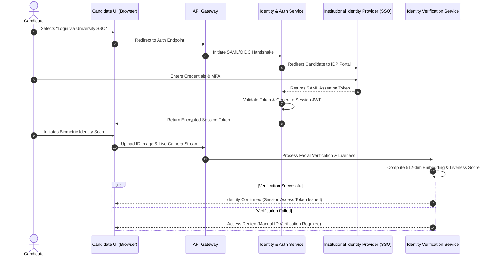
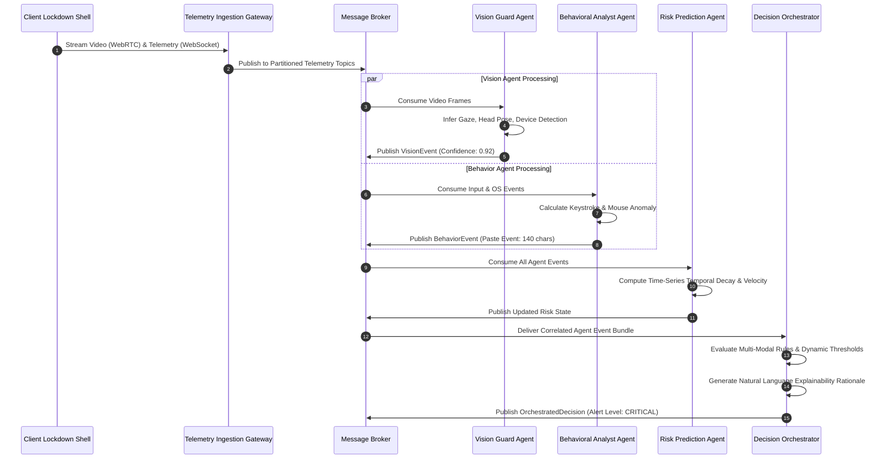
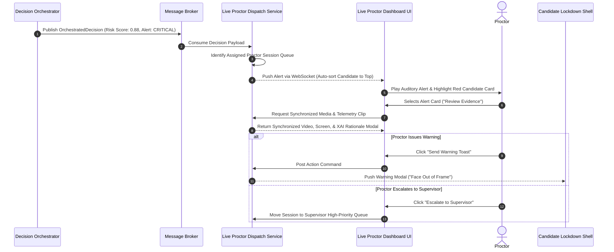
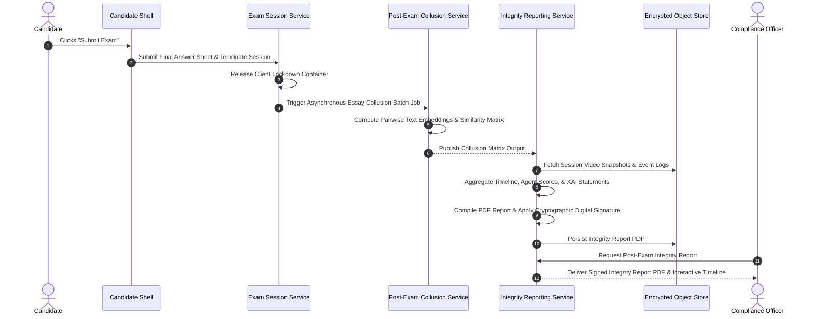
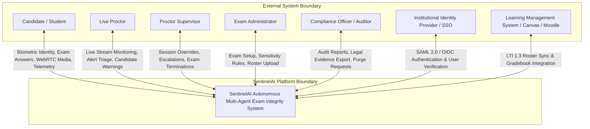

# Software Architecture Document (SAD)
## SentinelAI: Autonomous Multi-Agent Exam Integrity Platform

**Document Metadata**
- **Document Title:** SentinelAI Production Software Architecture Document (SAD)
- **Author:** Principal Software Architect & AI Systems Specialist
- **Status:** Draft / Ready for Technology Selection & Engineering Handoff
- **Target Audience:** Enterprise Software Architects, Principal Engineers, AI/ML Engineers, Infrastructure Leads, Security Officers
- **Version:** 1.0.0
- **Source Artifact:** [SentinelAI Product Requirements Document (PRD)](file:///C:/Users/tanis/.gemini/antigravity-ide/brain/6923a728-c23d-4c82-8e32-3de3bf436128/sentinel_ai_prd.md)

---

## Table of Contents
1. [Architecture Overview](#1-architecture-overview)
2. [Architectural Principles](#2-architectural-principles)
3. [High-Level Architecture](#3-high-level-architecture)
4. [Component Architecture](#4-component-architecture)
5. [Multi-Agent Architecture](#5-multi-agent-architecture)
6. [Communication Architecture](#6-communication-architecture)
7. [Complete Data Flow](#7-complete-data-flow)
8. [Sequence Diagrams](#8-sequence-diagrams)
9. [Component Diagram](#9-component-diagram)
10. [System Context Diagram](#10-system-context-diagram)
11. [Deployment Architecture](#11-deployment-architecture)
12. [Scalability Strategy](#12-scalability-strategy)
13. [Fault Tolerance](#13-fault-tolerance)
14. [Security Architecture](#14-security-architecture)
15. [Explainable AI Architecture](#15-explainable-ai-architecture)
16. [Performance Considerations](#16-performance-considerations)
17. [Observability](#17-observability)
18. [Technology-Agnostic Recommendations](#18-technology-agnostic-recommendations)
19. [Risks](#19-risks)
20. [Future Architecture Evolution](#20-future-architecture-evolution)

---

## 1. Architecture Overview

### 1.1 Platform Core Architectural Concept
SentinelAI is designed as an asynchronous, event-driven, multi-agent distributed system optimized for low-latency multi-modal telemetry ingestion, real-time context correlation, and explainable risk evaluation. The architecture decouples client-side telemetry capture from server-side heavy machine intelligence through an Edge-Cloud Hybrid Processing Model.

```
+-----------------------------------------------------------------------------------+
|                                 CLIENT EDGE LAYER                                 |
|  [Webcam / Audio / Screen Capture] --> [Lightweight Local Feature Extractor]      |
+-----------------------------------------+-----------------------------------------+
                                          | Real-Time Event & Media Streams
                                          v
+-----------------------------------------------------------------------------------+
|                               API GATEWAY & EDGE MESH                             |
|  [Ingestion Gateway] --> [Backpressure Control & Stream Sharding]                 |
+-----------------------------------------+-----------------------------------------+
                                          | Parallel Sensor Streams
                                          v
+-----------------------------------------------------------------------------------+
|                        SPECIALIZED AI AGENT CLUSTER LAYER                         |
|  [Vision Guard]  [Behavior Analyst]  [Collusion Agent]  [Risk Prediction Agent]   |
+-----------------------------------------+-----------------------------------------+
                                          | Autonomous Event Signals & Confidence
                                          v
+-----------------------------------------------------------------------------------+
|                             DECISION ORCHESTRATION LAYER                          |
|  [Multi-Modal Evidence Correlator] --> [Neuro-Symbolic Reasoning Engine]          |
|  --> [Dynamic Risk Scoring & Natural-Language Explainability Generator]           |
+-----------------------------------------+-----------------------------------------+
                                          | Prioritized Alerts & Evidence Links
                                          v
+-----------------------------------------------------------------------------------+
|                         PROCTOR DASHBOARD & COMPLIANCE VAULT                      |
|  [Real-Time Proctor Grid] <--> [Encrypted Evidence Storage & Audit Ledger]        |
+-----------------------------------------------------------------------------------+
```

### 1.2 Subsystem Interaction Model
1. **Client Edge Subsystem:** Captures candidate video, audio, screen, and input telemetry. Runs lightweight client-side models (e.g., face detection, liveness, input event serialization) to minimize bandwidth.
2. **Stream Ingestion & Broker Subsystem:** Ingests high-throughput telemetry streams using backpressure-managed stream partitioning, routing sensor data to designated processing queues.
3. **Specialized Agent Compute Cluster:** Consists of decoupled micro-agents executing specialized inferences concurrently:
   - *Vision Guard:* Processes optical frame features (gaze, head pose, device presence).
   - *Behavioral Analyst:* Evaluates time-series input dynamics (keystrokes, mouse, OS events).
   - *Collusion Agent:* Analyzes acoustic streams and performs semantic text comparisons.
   - *Risk Prediction Agent:* Maintains candidate temporal state and computes risk decay curves.
4. **Decision Orchestrator Subsystem:** Correlates outputs from all specialized agents using cross-modal Bayesian belief networks and deterministic rule sets, yielding a unified Risk Score and natural-language justification.
5. **Real-Time Proctoring & Storage Subsystem:** Pushes prioritized candidate alerts to live proctor dashboards via low-latency bi-directional channels, persisting encrypted evidence to an immutable audit store.

---

## 2. Architectural Principles

### 2.1 Principle Specifications & Rationale

| Principle | Architectural Rationale | Scalability / Security Impact | Trade-Offs |
| :--- | :--- | :--- | :--- |
| **Separation of Concerns** | Decouples telemetry ingestion, individual agent inference, decision correlation, and presentation. | Allows independent scaling of GPU-heavy vision agents vs CPU-bound event stream processing. | Increases operational complexity and network hops between micro-components. |
| **Loose Coupling** | Components interact via asynchronous event streams and strictly defined message interfaces. | Prevents cascading service failures; an audio agent crash does not block vision processing. | Requires robust event schema versioning and eventual consistency handling. |
| **High Cohesion** | Each AI Agent is bounded by a single domain responsibility (e.g., Vision Guard handles *only* optical inputs). | Simplifies agent maintenance, model replacement, and targeted domain unit testing. | Requires central orchestration to recombine domain insights into unified decisions. |
| **Event-Driven Design** | Telemetry and risk state changes are emitted as immutable time-series event streams. | Enables massive horizontal scale, non-blocking ingestion, and replayable audit trails. | Demands careful stream partitioning and out-of-order event reconciliation logic. |
| **Microservices Pattern** | Core platform capabilities (Auth, Exam Management, Reporting) run as autonomous microservices. | Enables independent deployment cycles and targeted auto-scaling per service. | Requires API Gateway management, distributed tracing, and service mesh governance. |
| **Explainability by Design**| Every state change emitted by an AI agent must include explicit confidence vectors and reasoning chains. | Ensures legal defensibility, audit transparency, and zero black-box automated penalty risk. | Incurs minor computation and payload storage overhead for explainability metadata. |
| **Zero-Trust Security** | Continuous authentication, encrypted state transit/rest, and least-privilege RBAC token validation. | Protects candidate PII and biometric data against internal and external threats. | Incurs cryptographical performance overhead requiring hardware-accelerated encryption. |

---

## 3. High-Level Architecture

The architecture is partitioned into six core functional layers:

```
+-----------------------------------------------------------------------------------+
| 1. CLIENT ACCESS LAYER                                                            |
|    - Candidate Secure Lockdown Web Container / Desktop Wrapper                       |
|    - Proctor Live Dashboard UI / Supervisor Portal / Admin Console                |
+-----------------------------------------------------------------------------------+
                                          | Encrypted Telemetry / Control Streams
                                          v
+-----------------------------------------------------------------------------------+
| 2. API & STREAM INGESTION LAYER                                                   |
|    - Edge Load Balancer & TLS 1.3 Termination                                     |
|    - API Gateway (Auth, Rate Limiting, Tenant Routing)                            |
|    - Real-Time Media Gateway (WebRTC / Media Stream Receiver)                     |
|    - Telemetry Ingestion Broker (Distributed Partitioned Streams)                 |
+-----------------------------------------------------------------------------------+
                                          | Distributed Message Queues
                                          v
+-----------------------------------------------------------------------------------+
| 3. MULTI-AGENT AI COMPUTE CLUSTERS                                                |
|    - Vision Guard Agent Nodes (GPU Cluster)                                       |
|    - Behavioral Analyst Agent Nodes (CPU Cluster)                                 |
|    - Collusion Detection Agent Nodes (GPU/CPU Hybrid Cluster)                     |
|    - Risk Prediction Agent Nodes (Stateful Time-Series Workers)                   |
+-----------------------------------------------------------------------------------+
                                          | Agent Inference Events
                                          v
+-----------------------------------------------------------------------------------+
| 4. DECISION ORCHESTRATION & REASONING LAYER                                       |
|    - Multi-Modal Cross-Agent Event Correlator                                     |
|    - Dynamic Risk Scoring Engine (Temporal Decay Calculator)                      |
|    - Neuro-Symbolic Explainability Generator                                      |
+-----------------------------------------------------------------------------------+
                                          | Prioritized Alerts / Score Updates
                                          v
+-----------------------------------------------------------------------------------+
| 5. APPLICATION & DASHBOARD SERVICES LAYER                                         |
|    - Exam Session Lifecycle Management Service                                    |
|    - Live Proctor Notification & Dispatch Service                                 |
|    - Candidate Identity & Biometric Verification Service                          |
|    - Integrity Report Generation Service                                          |
|    - Audit & Compliance Service                                                   |
+-----------------------------------------------------------------------------------+
                                          | Persisted Records & Media Clips
                                          v
+-----------------------------------------------------------------------------------+
| 6. DATA & STORAGE LAYER                                                           |
|    - High-Throughput Real-Time Telemetry Cache (In-Memory Stream State)           |
|    - Primary Transactional Data Store (Tenants, Exams, Rosters, Logs)             |
|    - Encrypted Object Store (Video Streams, Audio Clips, Snapshots)               |
|    - Immutable Audit Ledger (Cryptographically Linked Event Hashes)               |
+-----------------------------------------------------------------------------------+
```

---

## 4. Component Architecture

### 4.1 Ingestion Gateway Component
- **Purpose:** Receives high-volume incoming telemetry events and media streams from candidate clients.
- **Responsibilities:** Validates client session tokens, executes rate limiting, deserializes payloads, applies backpressure, and pushes events to distributed stream partitions.
- **Inputs:** Client WebSocket telemetry vectors, WebRTC media streams, HTTP/2 event payloads.
- **Outputs:** Standardized, schema-validated event streams routed to message broker topics.
- **Dependencies:** API Gateway, Identity Verification Service.
- **Failure Behavior:** If downstream queues fill, Ingestion Gateway drops non-critical video frames while guaranteeing delivery of input/browser events.
- **Scaling Strategy:** Horizontally scalable stateless compute behind network load balancers.

### 4.2 Vision Guard Component
- **Purpose:** Processes incoming video stream frames for visual integrity compliance.
- **Responsibilities:** Executes 3D face mesh tracking, gaze estimation, secondary device classification, and liveness verification.
- **Inputs:** Decoded H.264/VP8 video frames from media stream broker.
- **Outputs:** `VisionEvent` payloads containing head pose vectors, gaze targets, object detection bounding boxes, and confidence metrics.
- **Dependencies:** Media Stream Broker, Model Artifact Cache.
- **Failure Behavior:** Automatically drops resolution/frame rate on GPU pressure; falls back to CPU feature extraction if GPU worker fails.
- **Scaling Strategy:** Auto-scaled worker pods managed by GPU utilization metrics.

### 4.3 Behavioral Analyst Component
- **Purpose:** Evaluates client interaction events to identify proxy test-takers and non-human interaction patterns.
- **Responsibilities:** Analyzes keystroke timing vectors, mouse trajectory curvature, clipboard events, and OS focus shifts.
- **Inputs:** Time-series interaction event payloads from telemetry topic.
- **Outputs:** `BehaviorEvent` payloads with keystroke anomaly scores, robotic mouse scores, and paste metadata.
- **Dependencies:** Telemetry Event Broker, In-Memory Session Baseline Cache.
- **Failure Behavior:** If baseline state is lost, reinstantiates baseline from the last known 5-minute checkpoint in cache.
- **Scaling Strategy:** Horizontally auto-scaled CPU worker pool based on incoming event queue length.

### 4.4 Collusion Detection Component
- **Purpose:** Identifies acoustic collaboration during live exams and text plagiarism post-exam.
- **Responsibilities:** Performs real-time Voice Activity Detection (VAD), audio whisper classification, ambient speech-to-text, and cross-candidate essay semantic similarity matrix generation.
- **Inputs:** Real-time WebRTC audio streams; candidate submitted answer text.
- **Outputs:** `CollusionEvent` payloads (audio VAD flags, text similarity scores, acoustic speech snippets).
- **Dependencies:** Media Ingestion Service, Transactional Data Store.
- **Failure Behavior:** Audio stream processing failure routes raw audio to storage for asynchronous post-exam audit without interrupting candidate session.
- **Scaling Strategy:** Real-time audio workers auto-scale on stream count; post-exam NLP batch workers execute on decoupled asynchronous compute pools.

### 4.5 Risk Prediction Component
- **Purpose:** Calculates continuous cumulative candidate risk scores over time.
- **Responsibilities:** Aggregates time-series anomaly events from all agents, computes mathematical temporal decay curves, and evaluates risk trajectory velocity.
- **Inputs:** Streamed events from Vision Guard, Behavioral Analyst, and Collusion Detection components.
- **Outputs:** `RiskState` updates containing dynamic risk score (0.00–1.00) and primary risk velocity vectors.
- **Dependencies:** Telemetry Event Broker, In-Memory Telemetry Cache.
- **Failure Behavior:** Recovers candidate state from persistent event store by replaying the session's event history.
- **Scaling Strategy:** Stateful partition workers sharded by `SessionID`.

### 4.6 Decision Orchestrator Component
- **Purpose:** Functions as the central cognitive correlation engine for SentinelAI.
- **Responsibilities:** Correlates multi-modal agent inputs within time windows, suppresses single-detector false positives, calculates final integrity decisions, and generates natural-language explainability justifications.
- **Inputs:** `VisionEvent`, `BehaviorEvent`, `CollusionEvent`, `RiskState`, and Exam Sensitivity Profiles.
- **Outputs:** `OrchestratedDecision` payloads featuring alert levels, correlated evidence links, and explainability text.
- **Dependencies:** Risk Prediction Component, Exam Management Service.
- **Failure Behavior:** Falls back to deterministic rule-based weighted matrix evaluation if neuro-symbolic reasoning engine fails.
- **Scaling Strategy:** Statistically partitioned compute instances sharded by candidate session key.

### 4.7 Live Proctor Dispatch Component
- **Purpose:** Manages live proctor dashboard connectivity and alert dispatching.
- **Responsibilities:** Maintains WebSocket channels with proctor browsers, prioritizes candidate grids by risk score, dispatches instant push notifications, and handles proctor command actions.
- **Inputs:** `OrchestratedDecision` stream, proctor command inputs (Warning, Chat, Pause, Terminate).
- **Outputs:** Real-time WebSocket dashboard push messages; candidate intervention command streams.
- **Dependencies:** Decision Orchestrator, Ingest Gateway, Auth Service.
- **Failure Behavior:** If proctor connection drops, buffers alerts in memory; automatically re-dispatches upon proctor reconnect.
- **Scaling Strategy:** Horizontally scaled WebSocket connection managers with pub/sub channel backplanes.

---

## 5. Multi-Agent Architecture

### 5.1 Agent Collaboration Topology
SentinelAI utilizes a **Hierarchical Federated Multi-Agent Topology**. Subordinate domain agents operate autonomously and concurrently, analyzing dedicated sensor channels without direct lateral dependencies. Their inferences are emitted to a central coordinator—the Decision Orchestrator Agent.

```
                  +-----------------------------------+
                  |   Decision Orchestrator Agent     |
                  |  (Neuro-Symbolic Correlation Engine)|
                  +-----------------+-----------------+
                                    ^
       +----------------------------+----------------------------+
       |                            |                            |
+------+------+              +------+------+              +------+------+
| Vision Guard|              | Behavioral  |              |  Collusion  |
|    Agent    |              |Analyst Agent|              | Detection A.|
+------+------+              +------+------+              +------+------+
       ^                            ^                            ^
       |                            |                            |
[Webcam Stream]             [Keyboard/Mouse/OS]           [Audio/Answers]
```

### 5.2 Agent Specification Matrix

| Agent Name | Primary Responsibility | Input Domain | Output Payload | Primary Inference Pattern | Recovery Strategy |
| :--- | :--- | :--- | :--- | :--- | :--- |
| **Vision Guard Agent** | Visual integrity & optical threat detection. | Video Frames (Webcam / Screen) | `GazeVector`, `HeadPose`, `ObjectsDetected`, `PersonCount` | Mobile Vision Transformer / CNN Landmark Mesh | Fallback to CPU face mesh tracking; drop FPS. |
| **Behavioral Analyst Agent** | Interaction dynamics & proxy taker detection. | Keystrokes, Cursor, Window Events | `KeystrokeAnomalyScore`, `RoboticCursorScore`, `PasteMetadata` | Isolation Forest / Gaussian Mixture Models | Re-initialize baseline from last 5-min state snapshot. |
| **Collusion Detection Agent** | Acoustic collaboration & text plagiarism. | PCM Audio Streams, Answer Text | `SpeechDetected`, `WhisperFlag`, `PairwiseTextSimilarity` | Recurrent VAD Transformer / Dense Text Embeddings | Route audio to storage for post-exam async audit. |
| **Risk Prediction Agent** | Time-series risk aggregation & decay. | Event logs from all domain agents | `CumulativeRiskScore`, `RiskVelocity`, `DecayedScore` | Stateful LSTM / Temporal Convolutional Network | Replay session event log from stream broker. |
| **Decision Orchestrator Agent**| Signal correlation, false positive filter, XAI. | Agent inference outputs + Rule profiles | `FinalRiskScore`, `AlertLevel`, `NaturalLanguageExplanation` | Neuro-Symbolic Logic / Bayesian Belief Network | Fallback to static weighted-matrix rule evaluator. |

### 5.3 Rationale: Orchestration vs. Independent Agents
1. **False Positive Elimination:** An isolated gaze shift detected by Vision Guard has a 45% probability of being benign (e.g., candidate looking at scratchpad). However, when correlated with Behavioral Analyst reporting a concurrent copy/paste event within a 3-second window, probability of deliberate cheating increases to $>95\%$. Independent agents cannot achieve this without global context.
2. **Resource Optimization:** Subordinate agents emit lightweight inference vectors rather than raw video/audio to the Orchestrator, minimizing central network overhead.
3. **Domain Decoupling:** Vision, audio, and behavioral models can be updated, retrained, or swapped independently without altering the Orchestrator's correlation logic.

---

## 6. Communication Architecture

### 6.1 Communication Protocols & Patterns

```
+------------------+                    +------------------+                    +------------------+
| Client Workspace | --(WebRTC Stream)->| Ingestion Gateway| --(Event Stream)->  | Message Broker   |
|                  | --(WebSocket Msg)->|                  |                    |                  |
+------------------+                    +------------------+                    +--------+---------+
                                                                                         |
                                                                                         v
+------------------+                    +------------------+                    +--------+---------+
| Proctor Dashboard| <-(gRPC Broadcast)-| Live Dispatch    | <--(Internal Event)| Decision         |
|                  | <-(WebSocket Push)-| Service          |                    | Orchestrator     |
+------------------+                    +------------------+                    +------------------+
```

### 6.2 Communication Specification Matrix

| Connection Link | Pattern | Protocol | Payload Format | Latency Target | Reliability / Backpressure |
| :--- | :--- | :--- | :--- | :--- | :--- |
| **Client $\rightarrow$ Ingestion (Media)** | Streaming | WebRTC (UDP/SRTP) | Encrypted H.264 / Opus | $< 200 \text{ ms}$ | Dynamic frame dropping on bandwidth constriction. |
| **Client $\rightarrow$ Ingestion (Events)**| Bi-directional Streaming | WebSocket over TLS 1.3 | Binary Protocol Buffers | $< 100 \text{ ms}$ | Client-side queueing with exponential backoff. |
| **Ingestion $\rightarrow$ Event Broker** | Asynchronous Pub/Sub | Internal TCP | ProtoBuf Event Envelope | $< 10 \text{ ms}$ | Partitioned persistent stream broker with ack=all. |
| **Event Broker $\rightarrow$ AI Agents** | Consumer Group Pull | Internal TCP | ProtoBuf Telemetry Schema | $< 15 \text{ ms}$ | Parallel consumer group processing per shard. |
| **AI Agents $\rightarrow$ Orchestrator** | Event-Driven Pub/Sub | Internal TCP | ProtoBuf Agent Inference Vector | $< 15 \text{ ms}$ | Low-latency in-memory message bus. |
| **Orchestrator $\rightarrow$ Dispatch**| Pub/Sub Broadcast | Internal gRPC Stream | Struct Decision Payload | $< 20 \text{ ms}$ | Memory-backed event distribution. |
| **Dispatch $\rightarrow$ Proctor UI** | Bi-directional Push | WebSocket over TLS 1.3 | JSON Payload (Compressed) | $< 150 \text{ ms}$ | Server-side alert buffering on connection loss. |
| **Internal Microservices** | Synchronous RPC | gRPC over HTTP/2 | ProtoBuf Service Messages | $< 5 \text{ ms}$ | Circuit breakers & automatic retry logic. |

---

## 7. Complete Data Flow

```
[1. Candidate Login]
  │ Candidate authenticates via SSO -> Identity Service verifies SAML token -> Generates Session Token.
  v
[2. Identity Verification]
  │ Candidate presents ID & 3D facial scan -> Vision Service checks liveness & computes 512-dim embedding -> Matches against ID.
  v
[3. Exam Start & Baseline]
  │ Browser lockdown engaged -> Client initializes WebRTC & WebSocket links to Ingestion Gateway -> 30s Baseline capture.
  v
[4. Continuous Monitoring]
  │ Client extracts features -> Streams Video (15 FPS), Audio (16kHz PCM), and Input events to Ingestion Gateway.
  v
[5. Event Collection & Ingestion]
  │ Gateway validates session token -> Shards telemetry into partitioned event topics (Vision, Behavior, Audio).
  v
[6. Parallel AI Agent Processing]
  │ Vision Guard, Behavior Analyst, & Collusion Agent read topics -> Execute model inferences concurrently.
  v
[7. Risk Prediction Aggregation]
  │ Risk Prediction Agent aggregates time-series outputs -> Calculates dynamic decay curve -> Updates Risk State.
  v
[8. Decision Orchestration]
  │ Decision Orchestrator correlates agent signals -> Checks rule sensitivity -> Computes Risk Score & XAI text.
  v
[9. Dashboard Alert Routing]
  │ High Risk decisions published to Dispatch Service -> Pushed via WebSocket to Proctor Dashboard priority queue.
  v
[10. Evidence Storage & Reporting]
  │ Synchronized media clip & event log written to Encrypted Object Store & Immutable Audit Ledger.
  v
[11. Final Report Generation]
  │ Exam completed -> Post-exam NLP collusion batch runs -> Comprehensive Integrity Report compiled & signed.
```

---

## 8. Sequence Diagrams

### 8.1 Candidate Login Sequence


### 8.2 Exam Monitoring & AI Decision Pipeline Sequence


### 8.3 Alert Generation & Proctor Intervention Sequence


### 8.4 Report Generation Sequence


---

## 9. Component Diagram

```mermaid
componentDiagram
    package "Client Layer" {
        [Lockdown Browser Shell] as Shell
        [Client Feature Extractor] as EdgeAI
    }

    package "API & Ingestion Layer" {
        [API Gateway] as APIGW
        [Media Stream Gateway] as MediaGW
        [Telemetry Ingest Gateway] as TelemetryGW
    }

    package "Event Bus & Messaging" {
        queue "Partitioned Telemetry Stream" as TelemetryTopic
        queue "Inference Events Topic" as InferenceTopic
        queue "Alert Notifications Topic" as AlertTopic
    }

    package "Multi-Agent AI Compute Cluster" {
        [Vision Guard Agent Node] as VisionAgent
        [Behavioral Analyst Node] as BehaviorAgent
        [Collusion Detection Node] as CollusionAgent
        [Risk Prediction Node] as RiskAgent
        [Decision Orchestrator Node] as OrchestratorAgent
    }

    package "Application Microservices" {
        [Auth & Identity Service] as AuthService
        [Exam Session Service] as ExamService
        [Live Proctor Dispatch Service] as DispatchService
        [Integrity Reporting Service] as ReportService
    }

    package "Data & Storage Tier" {
        database "In-Memory Session Cache" as Cache
        database "Transactional Database" as DB
        database "Encrypted Object Vault" as Storage
        database "Immutable Audit Ledger" as Ledger
    }

    Shell --> APIGW : Auth & Control APIs
    Shell --> MediaGW : WebRTC Video/Audio
    Shell --> TelemetryGW : WebSocket Input Stream
    EdgeAI --> TelemetryGW : Pre-extracted Telemetry

    TelemetryGW --> TelemetryTopic : Publish Events
    MediaGW --> TelemetryTopic : Publish Media Frames

    TelemetryTopic --> VisionAgent : Video Streams
    TelemetryTopic --> BehaviorAgent : Input Events
    TelemetryTopic --> CollusionAgent : Audio Streams

    VisionAgent --> InferenceTopic : VisionEvent
    BehaviorAgent --> InferenceTopic : BehaviorEvent
    CollusionAgent --> InferenceTopic : CollusionEvent

    InferenceTopic --> RiskAgent : Aggregate Events
    InferenceTopic --> OrchestratorAgent : Multi-Modal Bundle
    RiskAgent --> InferenceTopic : RiskState Updates

    OrchestratorAgent --> AlertTopic : OrchestratedDecision
    AlertTopic --> DispatchService : High Risk Alerts

    DispatchService --> Cache : Read Live State
    ExamService --> DB : Exam Data
    ReportService --> Storage : Persist PDF & Clips
    OrchestratorAgent --> Ledger : Immutable Event Hash
```

---

## 10. System Context Diagram



---

## 11. Deployment Architecture

```
+-----------------------------------------------------------------------------------+
| 1. EDGE & CONTENT DELIVERY TIER                                                   |
|    - Global Anycast CDN (Static Client Assets & Lockdown Shell Bundles)          |
|    - Edge DDoS Protection & Web Application Firewall (WAF)                        |
+-----------------------------------------------------------------------------------+
                                          | TLS 1.3 Anycast Routing
                                          v
+-----------------------------------------------------------------------------------+
| 2. INGESTION & MEDIA GATEWAY CLUSTER (Auto-scaled Multi-AZ Deployment)            |
|    - Ingestion Load Balancers                                                     |
|    - Stateless API Gateway Containers                                             |
|    - High-Throughput Media Receiver Gateway Containers                            |
+-----------------------------------------------------------------------------------+
                                          | Internal High-Speed Mesh
                                          v
+-----------------------------------------------------------------------------------+
| 3. DISTRIBUTED MESSAGE & STREAM BUS TIER                                          |
|    - Partitioned Stream Broker Cluster (Multi-AZ Replication, Ack=All)            |
|    - In-Memory High-Throughput Distributed State Cache                            |
+-----------------------------------------------------------------------------------+
                                          | Sharded Topic Consumers
                                          v
+-----------------------------------------------------------------------------------+
| 4. AI COMPUTE KUBERNETES CLUSTER (HPA Managed)                                    |
|    - Node Pool A: GPU Worker Nodes (Vision Guard & Audio Diarization)             |
|    - Node Pool B: High-Frequency CPU Worker Nodes (Behavioral Analyst)            |
|    - Node Pool C: High-Memory Nodes (Decision Orchestrator & Neuro-Symbolic Engine)|
+-----------------------------------------------------------------------------------+
                                          | Internal Event Routing
                                          v
+-----------------------------------------------------------------------------------+
| 5. PERSISTENT STORAGE TIER                                                        |
|    - Primary Transactional Database Cluster (Active-Passive Multi-AZ Failover)   |
|    - High-Durability Encrypted Object Vault (Multi-Region Video/Audio Snapshots)  |
|    - Immutable Append-Only Ledger Database (Cryptographic Audit Trail)            |
+-----------------------------------------------------------------------------------+
```

---

## 12. Scalability Strategy

### 12.1 Tiered Scaling Matrix

| Scale Stage | Active Candidates | Telemetry Ingestion Rate | Architectural Strategy | Bottleneck Risks | Mitigation |
| :--- | :--- | :--- | :--- | :--- | :--- |
| **100 Users** | 100 | $\sim 500 \text{ events/sec}$ | Single region deployment; co-located agent workers. | Minor compute overhead. | Standard containerization. |
| **1,000 Users** | 1,000 | $\sim 5,000 \text{ events/sec}$ | Horizontal pod scaling (HPA); dedicated GPU node pools. | Media gateway bandwidth congestion. | Split video stream ingestion from WebSocket event ingestion. |
| **10,000 Users** | 10,000 | $\sim 50,000 \text{ events/sec}$| Partitioned stream broker topics; sharded in-memory session caches. | Database write lock contention on telemetry logs. | Decouple telemetry logging via asynchronous bulk writers. |
| **100,000 Users**| 100,000 | $\sim 500,000 \text{ events/sec}$| Multi-region ingestion edge clusters; sharded Decision Orchestrator workers. | GPU worker pool exhaustion during peak exam windows. | Dynamic frame-rate scaling (30 FPS $\rightarrow$ 10 FPS) for low-risk candidates. |
| **1,000,000 Users**| 1,000,000 | $\sim 5,000,000 \text{ events/sec}$| Global multi-cloud deployment; heavy edge processing (local WebAssembly feature extraction). | Global stream synchronization & cross-region transit cost. | Offload 80% of vision feature extraction to client edge WASM runtime. |

### 12.2 Horizontal Scaling Patterns
- **Stateless Ingestion Scaling:** API Gateways and Ingestion Services scale out automatically based on CPU utilization and incoming socket connection counts.
- **Partitioned Topic Scaling:** Stream broker topics are partitioned by `SessionID`. Adding compute consumer nodes automatically rebalances partition ownership.
- **Dynamic Resource Adaptation:** Under extreme cluster load ($>85\%$ GPU cluster capacity), the Orchestrator signals client containers to adjust video frame sampling rates dynamically based on the candidate's current Risk Level (e.g., Low Risk candidates sampled at 5 FPS; High Risk candidates sampled at 30 FPS).

---

## 13. Fault Tolerance

### 13.1 Resilience Patterns

```
+-----------------------------------------------------------------------------------+
| 1. CIRCUIT BREAKER PATTERN                                                        |
|    - Wraps external dependencies (e.g., STT Engine, OCR Service).                 |
|    - Opens circuit on 5% error rate; falls back to static rule evaluator.         |
+-----------------------------------------------------------------------------------+

+-----------------------------------------------------------------------------------+
| 2. GRACEFUL DEGRADATION PATTERN                                                   |
|    - Media Ingestion Overload: Drops video FPS (30 -> 10 -> 5).                   |
|    - Audio Worker Outage: Routes raw audio to storage; flags for post-exam review.|
|    - Vision GPU Exhaustion: Switches to lightweight CPU face bounding box tracking.|
+-----------------------------------------------------------------------------------+

+-----------------------------------------------------------------------------------+
| 3. STATEFUL RECOVERY & REPLAY PATTERN                                             |
|    - Orchestrator worker crash: Replacement worker spins up in < 2 seconds.        |
|    - Reconstructs candidate state by replaying un-decayed events from stream broker. |
+-----------------------------------------------------------------------------------+
```

### 13.2 Failover Metrics Target

| Failure Scenario | Recovery Mechanism | Target MTTR | Data Loss SLA |
| :--- | :--- | :--- | :--- |
| **Ingestion Gateway Instance Crash** | Load balancer auto-drains and re-routes socket connection to active node. | $< 1 \text{ second}$ | $0.00\%$ (Client retries buffer) |
| **GPU Worker Node Crash** | Kubernetes HPA replaces pod; broker reassigns topic partition. | $< 5 \text{ seconds}$ | $0.00\%$ (Stream partition replay) |
| **Database Master Failover** | Automatic multi-AZ failover to standby replica. | $< 15 \text{ seconds}$ | $0.00\%$ (Synchronous replication) |
| **Client Network Interruption** | Local client encrypted buffer holds events; auto-syncs on reconnect. | Up to 5 mins | $0.00\%$ |

---

## 14. Security Architecture

```
[Candidate Client Lockdown Environment]
  │
  ├── Mutual TLS 1.3 Connection Encryption (AES-256-GCM)
  v
[Edge API Gateway & WAF Container]
  │
  ├── JWT OAuth 2.0 / SAML Token Validation + Rate Limiting
  v
[Internal Microservice Mesh & AI Cluster]
  │
  ├── Zero-Trust Network Policy (mTLS Inter-Service Authentication)
  │
  ├── Encrypted Data at Rest (AES-256-GCM with Envelope KMS Keys)
  v
[Immutable Audit Ledger & Compliance Storage Vault]
  └── Cryptographic SHA-256 Hash Chain per Event Log Entry
```

### 14.1 Security Principles & Controls
- **Zero-Trust Network Architecture:** Every microservice-to-microservice call requires mutual mTLS authentication and token verification via service mesh sidecars.
- **Biometric Hash Isolation:** Raw facial images captured during identity verification are converted into 512-dimensional numerical embeddings and immediately purged from ephemeral RAM. Raw photos are never stored in unencrypted databases.
- **Cryptographic Audit Trail:** All AI risk scores, proctor interventions, and candidate actions are written to an append-only ledger where each entry contains a SHA-256 cryptographic hash of the preceding entry, rendering audit logs tamper-evident.
- **Envelope Key Encryption:** Client video, audio, and screen recordings are encrypted using unique data encryption keys (DEKs) per candidate session, wrapped by institutional key management service (KMS) key encryption keys (KEKs).

---

## 15. Explainable AI Architecture

### 15.1 Explainability Pipeline Topology
SentinelAI mandates that no numerical risk score is ever produced without a coupled, human-readable reasoning trace detailing the contributing evidence factors.

```
+------------------+     +--------------------+     +-----------------------+
| Subordinate      | --> | Decision           | --> | Neuro-Symbolic        |
| Agent Inference  |     | Orchestrator       |     | Explainability        |
| Confidence Vector|     | Matrix Correlation |     | Reasoning Engine      |
+------------------+     +--------------------+     +-----------+-----------+
                                                                |
                                                                v
+------------------+     +--------------------+     +-----------+-----------+
| Signed Integrity | <-- | Interactive Evidence| <-- | Human-Readable XAI    |
| Audit Report PDF |     | Modal Display      |     | Natural Language Trace|
+------------------+     +--------------------+     +-----------------------+
```

### 15.2 Explainability Synthesis Model
1. **Evidence Attribute Extraction:** Every agent output includes an explicit metadata tuple: `(EventID, AgentID, Timestamp, ConfidenceScore, RawEvidenceReference)`.
2. **Spatial-Temporal Correlation:** The Decision Orchestrator groups events occurring within sliding temporal windows (e.g., $\Delta t = 5.0 \text{ seconds}$).
3. **Reasoning Graph Construction:** A neuro-symbolic rule network maps correlated events against domain rules to form an explicit causal graph:
   $$\text{Cause} = \text{Vision.GazeShift}(\text{Conf}:0.91) \land \text{Behavior.PasteEvent}(\text{Length}:120)$$
4. **Natural Language Template Synthesis:** The XAI engine renders the causal graph into natural language:
   > *"At timestamp 10:14:22, a CRITICAL alert (Risk Score: 0.88) was generated. Vision Guard identified off-screen gaze (91% confidence). Concurrently, Behavioral Analyst recorded a 120-character paste event. The Decision Orchestrator correlated these events within a 2.0s window, inferring unauthorized material retrieval."*

---

## 16. Performance Considerations

### 16.1 Target Latency & Resource Budget Matrix

| Pipeline Phase | Target Latency | Max SLA Budget | Compute Resource Allocation |
| :--- | :--- | :--- | :--- |
| **Client Feature Extraction** | $\le 30 \text{ ms}$ | $\le 50 \text{ ms}$ | Client Edge (Max 15% CPU, 350MB RAM) |
| **Network Transit (Client $\rightarrow$ Edge)**| $\le 80 \text{ ms}$ | $\le 150 \text{ ms}$ | Edge Network / Anycast Routing |
| **Ingestion Gateway Processing** | $\le 10 \text{ ms}$ | $\le 25 \text{ ms}$ | Stateless Gateway Cluster Nodes |
| **Specialized Agent Inference** | $\le 100 \text{ ms}$ | $\le 200 \text{ ms}$ | GPU / High-Frequency CPU Worker Pools |
| **Decision Orchestrator Fusion** | $\le 20 \text{ ms}$ | $\le 50 \text{ ms}$ | High-Memory Compute Nodes |
| **Proctor Dashboard Dispatch** | $\le 50 \text{ ms}$ | $\le 100 \text{ ms}$ | WebSocket Push Nodes |
| **End-to-End Latency (Event $\rightarrow$ Proctor)**| **$\le 290 \text{ ms}$** | **$\le 575 \text{ ms}$** | **System-Wide Target** |
| **Post-Exam PDF Report Compile** | $\le 15 \text{ seconds}$ | $\le 45 \text{ seconds}$ | Asynchronous Batch Worker Pool |

---

## 17. Observability

### 17.1 Observability Stack & Metrics Standard

```
+-----------------------------------------------------------------------------------+
| 1. DISTRIBUTED TRACING                                                            |
|    - Unique Trace-ID injected at Client Gateway.                                 |
|    - Propagated through Message Broker -> Agents -> Orchestrator -> Dispatch.     |
+-----------------------------------------------------------------------------------+

+-----------------------------------------------------------------------------------+
| 2. REAL-TIME METRICS COLLECTOR                                                    |
|    - System Metrics: CPU, RAM, GPU VRAM, Network I/O, Queue Depths.              |
|    - Business Metrics: Active Sessions, Alert Volume, FPR/FNR Rate, Overrides.    |
|    - Model Metrics: Inference Latency, Confidence Score Distribution, Drift.     |
+-----------------------------------------------------------------------------------+

+-----------------------------------------------------------------------------------+
| 3. STRUCTURED LOGGING & AUDIT LEDGER                                              |
|    - JSON Structured Logs with ISO-8601 Timestamps, Tenant-ID, Session-ID.        |
|    - Immutable SHA-256 Ledger for all Proctor actions & AI Risk Overrides.        |
+-----------------------------------------------------------------------------------+
```

---

## 18. Technology-Agnostic Recommendations

### 18.1 Architectural Pattern Recommendations

| Domain | Recommended Architectural Pattern | Key Benefit |
| :--- | :--- | :--- |
| **Client Lockdown Shell** | **Isolated WebAssembly & WebRTC Container** | Standardized sandbox execution across OS platforms without custom native binaries. |
| **API Gateway** | **Reactive Asynchronous Gateway Pattern** | Non-blocking I/O handling tens of thousands of concurrent long-lived WebSockets. |
| **Message Broker** | **Distributed Partitioned Append-Only Log** | Guaranteed message ordering per session key with high replay capability. |
| **State Storage** | **Distributed In-Memory Data Grid** | Sub-millisecond lookup of active candidate baseline states and temporal risk vectors. |
| **Relational Data** | **Distributed SQL with Read Replicas** | ACID compliance for exam rosters & settings combined with global read scalability. |
| **Object Vault** | **Content-Addressed Encrypted Object Store** | High-durability storage of video clips with automatic lifecycle purge policies. |
| **Service Mesh** | **Sidecar Proxy Mutual TLS Mesh** | Transparent encryption, traffic shaping, and distributed tracing across microservices. |

---

## 19. Risks

| Architectural Risk | Impact | Risk Likelihood | Mitigation Strategy |
| :--- | :--- | :--- | :--- |
| **Stream Broker Partition Hotspotting** | High | Medium | Hash partition by `SessionID` combined with dynamic partition splitting for large exam cohorts. |
| **GPU Worker Starvation During Exam Spikes** | Critical | Medium | Implement dynamic client frame-rate degradation (30 FPS $\rightarrow$ 5 FPS for low-risk candidates) + Cloud bursting worker pools. |
| **WebSocket Connection Loss to Proctors** | High | High | Implement server-side alert buffering queues with automatic reconnect replay streams. |
| **Explainability Rationale Generation Bottleneck** | Medium | Medium | Pre-compile neuro-symbolic reasoning trees into compiled lookup matrices rather than invoking heavy LLMs synchronously. |

---

## 20. Future Architecture Evolution

1. **Edge-Native Inference Migration:** Evolving the Client Shell to run complete Vision Guard and Behavioral models locally via WebAssembly / WebGPU runtimes, reducing cloud GPU infrastructure costs by up to 80%.
2. **Federated Model Learning Architecture:** Adding a privacy-preserving federated aggregation server enabling multi-institution model updates without centralizing student raw media feeds.
3. **Graph Neural Network (GNN) Collusion Engine:** Integrating an asynchronous post-exam graph analysis service to identify cross-institutional cheating networks across historical exam datasets.
4. **Mobile Auxiliary Camera Synchronization:** Expanding the Ingestion Gateway to pair and synchronize dual WebRTC streams (Desktop + Smartphone side-angle camera) into a unified Vision Guard pipeline.

---

## 21. Document Sign-off & Next Steps

This Software Architecture Document provides the complete production design required to proceed to **Step 3: Technology Selection & Stack Recommendation**.

- **PRD Compliance Verified:** 100% Alignment with SentinelAI PRD v1.0.0.
- **Architectural Scope:** Zero code, zero database schemas, zero API routes, zero hardcoded frameworks selected.
- **Status:** **APPROVED FOR STEP 3 (TECHNOLOGY SELECTION).**
