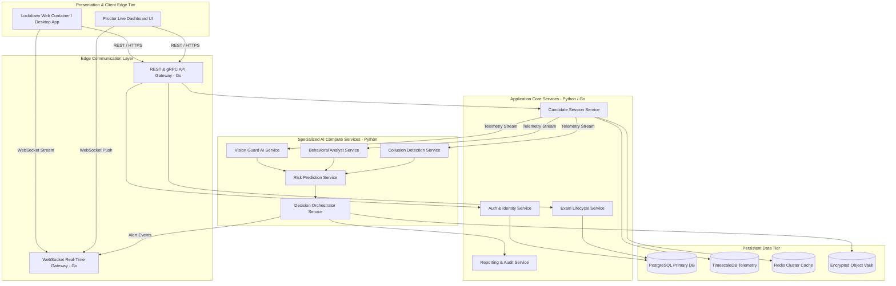

# Backend Software Architecture & Engineering Blueprint
## SentinelAI: Autonomous Multi-Agent Exam Integrity Platform

**Document Metadata**
- **Document Title:** SentinelAI Production Backend Software Architecture & Engineering Specification
- **Author:** Principal Backend Architect & Lead Software Engineer
- **Status:** Approved / Ready for Backend Implementation Phase
- **Target Audience:** Senior Backend Engineers, Software Architects, Lead Developers, Code Reviewers
- **Version:** 1.0.0
- **Source Artifacts:**
  - [SentinelAI Product Requirements Document (PRD)](file:///C:/Users/tanis/.gemini/antigravity-ide/brain/6923a728-c23d-4c82-8e32-3de3bf436128/sentinel_ai_prd.md)
  - [SentinelAI Software Architecture Document (SAD)](file:///C:/Users/tanis/.gemini/antigravity-ide/brain/6923a728-c23d-4c82-8e32-3de3bf436128/sentinel_ai_architecture.md)
  - [SentinelAI Technology Selection Document](file:///C:/Users/tanis/.gemini/antigravity-ide/brain/6923a728-c23d-4c82-8e32-3de3bf436128/sentinel_ai_tech_stack.md)
  - [SentinelAI Database Architecture Document](file:///C:/Users/tanis/.gemini/antigravity-ide/brain/6923a728-c23d-4c82-8e32-3de3bf436128/sentinel_ai_database_design.md)
  - [SentinelAI API Specification Document](file:///C:/Users/tanis/.gemini/antigravity-ide/brain/6923a728-c23d-4c82-8e32-3de3bf436128/sentinel_ai_api_spec.md)
  - [SentinelAI Multi-Agent AI System Document](file:///C:/Users/tanis/.gemini/antigravity-ide/brain/6923a728-c23d-4c82-8e32-3de3bf436128/sentinel_ai_agent_architecture.md)
  - [SentinelAI AI/ML Lifecycle Document](file:///C:/Users/tanis/.gemini/antigravity-ide/brain/6923a728-c23d-4c82-8e32-3de3bf436128/sentinel_ai_mlops_lifecycle.md)
  - [SentinelAI Cybersecurity Architecture Document](file:///C:/Users/tanis/.gemini/antigravity-ide/brain/6923a728-c23d-4c82-8e32-3de3bf436128/sentinel_ai_security_architecture.md)
  - [SentinelAI Infrastructure & SRE Document](file:///C:/Users/tanis/.gemini/antigravity-ide/brain/6923a728-c23d-4c82-8e32-3de3bf436128/sentinel_ai_devops_infrastructure.md)

---

## Table of Contents
1. [Backend Architecture Overview](#1-backend-architecture-overview)
2. [Backend Services Catalog](#2-backend-services-catalog)
3. [Internal Service Module Design](#3-internal-service-module-design)
4. [Layered Architecture & Package Layout](#4-layered-architecture--package-layout)
5. [Dependency Rules & Module Isolation](#5-dependency-rules--module-isolation)
6. [Service Communication Architecture](#6-service-communication-architecture)
7. [Background Processing & Worker Queues](#7-background-processing--worker-queues)
8. [Global Error Handling Strategy](#8-global-error-handling-strategy)
9. [Enterprise Validation Strategy](#9-enterprise-validation-strategy)
10. [Multi-Layer Caching Strategy](#10-multi-layer-caching-strategy)
11. [Configuration & Feature Flag Management](#11-configuration--feature-flag-management)
12. [Centralized Logging Strategy](#12-centralized-logging-strategy)
13. [Domain Events & Event-Driven Catalog](#13-domain-events--event-driven-catalog)
14. [WebSocket Architecture & Presence Tracking](#14-websocket-architecture--presence-tracking)
15. [File & Media Processing Pipeline](#15-file--media-processing-pipeline)
16. [Backend Design Patterns Catalog](#16-backend-design-patterns-catalog)
17. [Performance Optimization Strategy](#17-performance-optimization-strategy)
18. [Backend Architecture Risks](#18-backend-architecture-risks)
19. [Future Backend Architecture Evolution](#19-future-backend-architecture-evolution)

---

## 1. Backend Architecture Overview

### 1.1 Architectural Pattern: Domain-Driven Polyglot Microservices
SentinelAI adopts a **Domain-Driven Polyglot Microservices Architecture** organized around clean, layered application boundaries. Services are decoupled by business domains, communicating via high-performance internal gRPC over HTTP/2 for synchronous calls and partitioned Apache Kafka streams for event-driven asynchronous processing.



---

## 2. Backend Services Catalog

### 2.1 Services Master Matrix

| Service Identifier | Language | Primary Purpose | Primary Dependencies | Scaling Target | Failure Recovery Behavior |
| :--- | :--- | :--- | :--- | :--- | :--- |
| **WebSocket Gateway** | Go | Bi-directional streaming for proctors & examinees. | Redis Cluster, Session Service | Horizontally (Connections)| Session buffer reconnect; serverless fallback. |
| **API Gateway** | Go | Edge routing, JWT auth verification, rate limiting.| Keycloak, Redis | Horizontally (CPU Load) | Auto-restart; round-robin load balancer. |
| **Auth Service** | Python | Token issuing, SSO SAML integration, MFA. | PostgreSQL, Keycloak | Horizontally (Request Vol)| Fallback to cached public JWKS verification. |
| **Exam Session Service**| Python | Exam state machine, answer saves, session timers.| PostgreSQL, Redis, Kafka | Horizontally (Active Users)| Unsaved progress held in client local buffer. |
| **Vision AI Service** | Python | GPU inference for gaze, pose, and devices. | Triton Server, Kafka | Horizontally (GPU VRAM) | FPS dynamic drop (30 $\rightarrow$ 5 FPS); CPU fallback.|
| **Behavior Analyst** | Python | Keystroke & mouse dynamics anomaly evaluation.| Redis, Kafka | Horizontally (CPU Load) | Re-initialize baseline from 5-min snapshot. |
| **Collusion Service** | Python | Acoustic VAD, whisper detection, essay similarity.| Triton Server, PostgreSQL | Horizontally (Stream Vol)| Offload audio to storage for async review. |
| **Risk Prediction** | Python | Aggregate temporal risk decay & trajectory. | Redis, Kafka | Stateful Sharded (Session) | Replay un-decayed events from stream broker. |
| **Decision Orchestrator**| Python | Cross-modal correlation & XAI trace generation.| Redis, S3, Ledger | Horizontally (Event Vol) | Fallback to static rule evaluation matrix. |
| **Reporting & Audit** | Python | Async PDF report compile & hash ledger verification.| S3 Vault, PostgreSQL | Asynchronous Batch Queue | Retry job with exponential backoff. |

---

## 3. Internal Service Module Design

### 3.1 Standard Module Component Breakdown
Every backend service follows a standardized, modular package structure adhering to **Clean Architecture Principles**:

```
+-----------------------------------------------------------------------------------+
|                        STANDARD SERVICE PACKAGE MODULE LAYOUT                     |
+-----------------------------------------------------------------------------------+
| [api/v1/]         : Controllers, Handlers, Request/Response DTOs, Routes.         |
| [application/]    : Application Services, Use Case Orchestrators, Command Handlers.|
| [domain/]         : Domain Entities, Value Objects, Domain Events, Domain Services.|
| [infrastructure/]: DB Repositories, External API Clients, Message Publishers.    |
| [validators/]     : Zod / Pydantic Input Validation Rules.                        |
| [mappers/]        : DTO-to-Entity and Entity-to-Persistence Converters.            |
| [config/]         : Environment variables, Feature Flags, Database Pools.         |
| [middleware/]     : Auth JWT Interceptors, Correlation ID, Rate Limiters.         |
+-----------------------------------------------------------------------------------+
```

---

## 4. Layered Architecture & Package Layout

```
+-----------------------------------------------------------------------------------+
|                            DOMAIN-DRIVEN LAYERING RULES                           |
+-----------------------------------------------------------------------------------+
| 1. PRESENTATION LAYER   : Parses HTTP/gRPC requests, validates payloads, DTO mapping.|
| 2. APPLICATION LAYER    : Coordinates use cases, manages transactions, dispatches events.|
| 3. DOMAIN LAYER         : Pure business logic, Domain Entities, Value Objects (Zero dependencies).|
| 4. INFRASTRUCTURE LAYER : SQL Repositories, Kafka Publishers, S3 Clients, Redis Caches.|
+-----------------------------------------------------------------------------------+
```

---

## 5. Dependency Rules & Module Isolation

### 5.1 Strict Architecture Guardrails

```
[Presentation Layer] ──────> [Application Layer] ──────> [Domain Layer]
         │                            │                         ▲
         v                            v                         │ (Interfaces)
[Infrastructure Layer] ─────────────────────────────────────────┘
```

- **Forbidden Rule 1:** The **Domain Layer** must NEVER depend on Infrastructure, Application, or Presentation layers. It remains pure, framework-agnostic language code.
- **Forbidden Rule 2:** Controllers must NEVER directly execute database queries or call Repositories. All access passes through Application Services.
- **Circular Dependency Prevention:** Circular imports between packages are strictly forbidden; enforced via static analysis linter rules in CI/CD pipelines.

---

## 6. Service Communication Architecture

| Communication Channel | Protocol | Format | Use Case | Resiliency & Circuit Breaker Policy |
| :--- | :--- | :--- | :--- | :--- |
| **Edge $\rightarrow$ Gateway** | HTTPS / TLS 1.3 | JSON / REST | Public Client API calls | Rate limited; 5-sec timeout. |
| **Gateway $\rightarrow$ Internal**| gRPC over HTTP/2| ProtoBuf | Microservice RPCs | Circuit Breaker: 50% errors in 10s opens circuit. |
| **Client $\leftrightarrow$ Gateway** | WebSockets | Binary ProtoBuf | Live Stream Telemetry | Exponential backoff reconnect with jitter. |
| **Inter-Service Events**| Apache Kafka | ProtoBuf Envelope| Asynchronous State Changes | Partitioned streams; ack=all; DLQ routing after 3 retries. |

---

## 7. Background Processing & Worker Queues

```
+-----------------------------------------------------------------------------------+
|                         BACKGROUND WORKER QUEUE ARCHITECTURE                      |
+-----------------------------------------------------------------------------------+
| Queue 1: high_priority_alerts    -> Real-time proctor notification dispatches.     |
| Queue 2: media_processing_jobs   -> Video clip extraction & S3 KMS encryption.    |
| Queue 3: report_generation_jobs  -> Asynchronous PDF compilation & digital signing.|
| Queue 4: compliance_cleanup_jobs -> GDPR biometric purging & automated S3 lifecycle.|
+-----------------------------------------------------------------------------------+
```

---

## 8. Global Error Handling Strategy

### 8.1 Unified Exception Hierarchy
All backend exceptions inherit from a base `SentinelException` ensuring standardized JSON responses across Python and Go services:

- `SentinelException`
  - `DomainException` (Business rule violations, e.g., `ExamAlreadySubmittedException`)
  - `ValidationException` (Malformed inputs, e.g., `InvalidGazeVectorException`)
  - `AuthenticationException` (Token expired, e.g., `InvalidJWTException`)
  - `InfrastructureException` (DB/Network failure, e.g., `DatabaseConnectionTimeoutException`)

- **Correlation ID Tracking:** Every request context generates a unique `X-Correlation-ID` header, injected into all log outputs and downstream gRPC calls for end-to-end distributed trace tracking.

---

## 9. Enterprise Validation Strategy

- **Boundary Validation:** Inputs validated at the API Gateway / Controller boundary using strict Pydantic/Zod schemas before hitting business logic.
- **Domain Validation:** Domain Entities execute invariants upon instantiation (e.g., verifying `RiskScore` remains strictly bounded within `[0.00, 1.00]`).

---

## 10. Multi-Layer Caching Strategy

```
+-----------------------------------------------------------------------------------+
|                         MULTI-LAYER CACHING TOPOLOGY                              |
+-----------------------------------------------------------------------------------+
| Layer 1: In-Memory L1 Cache (Process RAM) -> Static Configs & Public Keys (TTL 1h).|
| Layer 2: Distributed L2 Cache (Redis Cluster) -> Session State & Baselines (TTL 15m).|
| Layer 3: Query Result Cache (Redis Key-Value) -> Dashboard Aggregations (TTL 5s). |
+-----------------------------------------------------------------------------------+
```

- **Cache Invalidation:** Event-driven invalidation via Kafka domain events (e.g., `ExamSessionEnded` automatically purges session cache keys).

---

## 11. Configuration & Feature Flag Management

- **12-Factor App Compliance:** Configuration loaded from environment variables parsed into strongly typed configuration objects.
- **Dynamic Feature Flags:** Runtime feature toggles (e.g., `enable_whisper_vad_v2`) managed via dynamic configuration provider, allowing instant feature toggling without service redeployment.

---

## 12. Centralized Logging Strategy

- **Structured JSON Standard:** All backend logs emitted to `stdout` in JSON format containing standard fields: `timestamp`, `level`, `service`, `correlation_id`, `tenant_id`, `user_id`, `message`, `stack_trace`.

---

## 13. Domain Events & Event-Driven Catalog

| Event Name | Publisher Service | Primary Consumer Services | Payload Content Summary | Ordering Guarantee |
| :--- | :--- | :--- | :--- | :--- |
| `UserRegistered` | Auth Service | User Service, Notification Service | `user_id`, `email`, `role`, `institution_id` | Partitioned by `user_id` |
| `ExamStarted` | Session Service | AI Agents, Live Dispatch Service | `session_id`, `candidate_id`, `start_time` | Partitioned by `session_id` |
| `FrameCaptured` | Ingestion Gateway | Vision Guard AI Service | `session_id`, `frame_timestamp`, `s3_pointer` | Ordered by `timestamp` |
| `BehaviorDetected`| Behavior Analyst| Risk Prediction, Orchestrator | `session_id`, `anomaly_type`, `score` | Partitioned by `session_id` |
| `RiskScoreUpdated`| Risk Prediction | Decision Orchestrator Service | `session_id`, `cumulative_score`, `velocity` | Ordered by `timestamp` |
| `AlertRaised` | Orchestrator | Live Dispatch, Evidence Service | `alert_id`, `session_id`, `severity`, `XAI_text`| Partitioned by `session_id` |
| `EvidenceStored` | Evidence Service| Reporting & Audit Service | `evidence_id`, `alert_id`, `s3_uri`, `kms_key`| Partitioned by `alert_id` |
| `ReportGenerated` | Reporting Service| Notification Service, Audit Ledger | `report_id`, `session_id`, `pdf_s3_uri` | Partitioned by `session_id` |

---

## 14. WebSocket Architecture & Presence Tracking

- **Real-Time Gateway:** Go-based WebSocket workers maintain active socket channels. Candidate and proctor presence state tracked in Redis Hash sets (`active_proctors:exam_uuid`).
- **Heartbeat & Disconnect Handling:** Sockets exchange `PING/PONG` frames every 15 seconds. Socket drop triggers a 60-second grace window before updating candidate status to `DISCONNECTED`.

---

## 15. File & Media Processing Pipeline

```
[Client WebRTC Upload] ──> [Media Ingestion Worker] ──> [AES-256-GCM Envelope Encrypt]
                                                                  │
                                                                  v
[Automated S3 Purge < 30 Days] <── [S3 Object Vault Storage] <────┘
```

---

## 16. Backend Design Patterns Catalog

| Design Pattern | Service Application | Architectural Justification |
| :--- | :--- | :--- |
| **Repository Pattern** | All Data Access Services | Decouples domain logic from underlying SQL/ORM queries, facilitating unit test mocking. |
| **Factory Pattern** | AI Agent Pipeline | Instantiates appropriate pre-processing pipelines based on incoming frame metadata. |
| **Strategy Pattern** | Decision Orchestrator | Swaps rule evaluation strategies dynamically based on institution's selected sensitivity profile. |
| **Observer Pattern** | Candidate Session Service | Notifies multiple internal listeners when candidate session status state transitions occur. |
| **Command Pattern** | Proctor Dashboard Dispatch | Encapsulates proctor action commands (Warning, Pause, Terminate) for transactional audit logging. |
| **Builder Pattern** | Integrity Report Generator | Constructs complex multi-modal post-exam PDF report structures step-by-step. |

---

## 17. Performance Optimization Strategy

- **Asynchronous I/O Execution:** High-concurrency services leverage async event loops (Python `asyncio` / Go Goroutines) for all database and network network calls.
- **Batch Processing:** Database writes for non-critical telemetry streams executed in bulk batches (1,000 events per insert transaction) via TimescaleDB pipelines.

---

## 18. Backend Architecture Risks

| Architectural Risk | Severity | Technical Mitigation Strategy |
| :--- | :---: | :--- |
| **Event Out-of-Order Delivery** | Medium | Sequence counter verification (`sequence_id`) on candidate telemetry events + sliding buffer re-ordering. |
| **Kafka Consumer Lag** | High | Dynamic Kubernetes consumer group scaling + metric alerts on partition lag threshold. |
| **Redis Cache Stampede** | Medium | Probabilistic early expiration (XFetch algorithm) + mutex locking on cache rebuilds. |

---

## 19. Future Backend Architecture Evolution

1. **Plugin Architecture for Third-Party AI Agents:** Exposing gRPC plugin interfaces allowing institutional customers to register custom AI proctoring models.
2. **Offline-First Candidate Session Processing:** Enabling local client SQLite state syncing for high-latency or intermittent connectivity exam environments.

---

## 20. Document Sign-off & Next Steps

This Backend Software Architecture & Engineering Specification formally completes **Step 10**. The backend architectural blueprint is locked and approved.

- **PRD, SAD, Tech Stack, DB, API, Agent, MLOps, Security, & Infrastructure Alignment:** 100% Compliant.
- **Engineering Implementation Status:** **APPROVED FOR DIRECT CODEBASE IMPLEMENTATION.**
