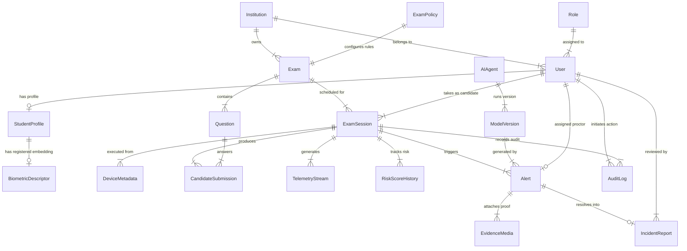

# Database Architecture & Data Modeling Document
## SentinelAI: Autonomous Multi-Agent Exam Integrity Platform

**Document Metadata**
- **Document Title:** SentinelAI Production Database Architecture & Data Modeling Specification
- **Author:** Principal Database Architect & Enterprise Data Systems Specialist
- **Status:** Approved / Ready for API Design Phase
- **Target Audience:** Database Engineers, Lead Backend Engineers, Data Platform Engineers, Compliance Officers
- **Version:** 1.0.0
- **Source Artifacts:**
  - [SentinelAI Product Requirements Document (PRD)](file:///C:/Users/tanis/.gemini/antigravity-ide/brain/6923a728-c23d-4c82-8e32-3de3bf436128/sentinel_ai_prd.md)
  - [SentinelAI Software Architecture Document (SAD)](file:///C:/Users/tanis/.gemini/antigravity-ide/brain/6923a728-c23d-4c82-8e32-3de3bf436128/sentinel_ai_architecture.md)
  - [SentinelAI Technology Selection Document](file:///C:/Users/tanis/.gemini/antigravity-ide/brain/6923a728-c23d-4c82-8e32-3de3bf436128/sentinel_ai_tech_stack.md)

---

## Table of Contents
1. [Data Architecture Overview](#1-data-architecture-overview)
2. [Domain Model](#2-domain-model)
3. [Entity Relationship Model](#3-entity-relationship-model)
4. [Table Specifications](#4-table-specifications)
5. [Comprehensive Data Dictionary](#5-comprehensive-data-dictionary)
6. [Indexing Strategy](#6-indexing-strategy)
7. [Query Optimization & Workload Management](#7-query-optimization--workload-management)
8. [Time-Series Data Strategy](#8-time-series-data-strategy)
9. [AI Evidence & Media Storage Architecture](#9-ai-evidence--media-storage-architecture)
10. [Tamper-Resistant Audit Logging](#10-tamper-resistant-audit-logging)
11. [Data Retention & Lifecycle Purge Policy](#11-data-retention--lifecycle-purge-policy)
12. [Backup & Disaster Recovery (DR) Plan](#12-backup--disaster-recovery-dr-plan)
13. [Database Scalability Strategy](#13-database-scalability-strategy)
14. [Security, Privacy & Compliance Architecture](#14-security-privacy--compliance-architecture)
15. [Multi-Tenant Isolation Architecture](#15-multi-tenant-isolation-architecture)
16. [Data Integrity & Concurrency Control](#16-data-integrity--concurrency-control)
17. [Database Risks & Mitigation Strategies](#17-database-risks--mitigation-strategies)
18. [Future Schema Evolution](#18-future-schema-evolution)

---

## 1. Data Architecture Overview

### 1.1 Multi-Engine Polyglot Data Strategy
SentinelAI adopts a **Polyglot Data Persistence Architecture** to meet the diverse operational demands of real-time multi-agent telemetry streaming, low-latency biometric similarity searching, transactional exam state enforcement, and tamper-evident compliance archiving.

```
+-----------------------------------------------------------------------------------+
|                        SENTINEL AI POLYGLOT DATA ARCHITECTURE                     |
+-----------------------------------------------------------------------------------+
| 1. RELATIONAL TRANSACTIONAL ENGINE  : PostgreSQL 16 (Tenants, Users, Exams, Sessions)|
| 2. TIME-SERIES TELEMETRY ENGINE     : TimescaleDB (High-frequency Event Streams)   |
| 3. IN-MEMORY STATE & QUEUE CACHE    : Redis Cluster 7.x (Baselines, Live Alerts)  |
| 4. VECTOR BIOMETRIC ENGINE          : Qdrant Vector Database (512-dim Embeddings) |
| 5. UNSTRUCTURED MEDIA OBJECT VAULT  : Amazon S3 / MinIO (Encrypted Snapshots/Audio)|
| 6. IMMUTABLE COMPLIANCE LEDGER      : Amazon QLDB / Immutable Hash-Chain Store    |
| 7. SEARCH & AUDIT ANALYTICS ENGINE : OpenSearch 2.x (Proctor Audit & Log Search)   |
+-----------------------------------------------------------------------------------+
```

### 1.2 Data Categorization Matrix

| Data Category | Target Persistence Engine | Primary Access Pattern | Storage Growth Rate | Retention Target |
| :--- | :--- | :--- | :--- | :--- |
| **Institutional & Core Metadata** | Relational DB (PostgreSQL) | Low-frequency Read/Write; High ACID requirements | Very Low (< 5 GB / year) | Permanent (Life of Account) |
| **Exam Roster & Submissions** | Relational DB (PostgreSQL) | High Read; Batch Write upon question save | Low (< 50 GB / year) | 7 Years (Academic Standards) |
| **Real-Time Sensor Telemetry** | Time-Series Engine (TimescaleDB)| High-frequency Write (50k/s); Time-window queries | Extremely High (TB / month) | 30 to 90 Days |
| **Live Baseline & Alert State** | In-Memory Cache (Redis) | Sub-millisecond Read/Write key-value lookups | Transient (RAM Bounded) | Ephemeral (Session Lifetime) |
| **Biometric Facial Embeddings** | Vector DB (Qdrant) | Sub-10ms Similarity Search during auth | Medium (< 20 GB / million users)| Ephemeral / Purge on Request |
| **Raw Video & Audio Clips** | Object Storage (AWS S3) | Write-once; Read-on-demand during proctor review | Massive (PB / year) | 30 to 90 Days (GDPR Purge) |
| **System & Security Audit Logs** | Immutable Ledger + OpenSearch | Append-Only Write; High-volume audit filtering | High (100 GB / month) | 7 Years (Compliance Hold) |

---

## 2. Domain Model

### 2.1 Core System Entities

| Domain Area | Entity Name | Logical Purpose & Business Context |
| :--- | :--- | :--- |
| **Tenant & Identity** | `Institution` | Represents an educational institution, licensing body, or corporate enterprise tenant. |
| **Tenant & Identity** | `User` | Represents any individual interacting with the platform (Candidate, Proctor, Admin, Auditor). |
| **Tenant & Identity** | `Role` | Defines RBAC permission boundaries and platform access levels. |
| **Tenant & Identity** | `StudentProfile` | Stores candidate-specific metadata, academic IDs, and baseline accommodations. |
| **Tenant & Identity** | `BiometricDescriptor` | Holds 512-dimensional facial feature vector embeddings (no raw images). |
| **Exam Management** | `Exam` | Defines an examination template, subject area, duration, and question set. |
| **Exam Management** | `ExamPolicy` | Stores proctoring sensitivity profiles, agent activation toggles, and threshold rules. |
| **Exam Management** | `Question` | Represents individual exam questions (Multiple Choice, Text Essay, Code). |
| **Session Lifecycle** | `ExamSession` | Tracks a specific candidate's live examination attempt instance. |
| **Session Lifecycle** | `CandidateSubmission` | Stores candidate answers submitted during an active session. |
| **Session Lifecycle** | `DeviceMetadata` | Records candidate hardware, OS, screen resolution, IP address, and browser footprints. |
| **AI Monitoring** | `TelemetryStream` | Holds raw time-series sensor events (gaze, head pose, mouse, keyboard dynamics). |
| **AI Monitoring** | `AIAgent` | Catalog of platform AI agents (Vision Guard, Behavioral Analyst, Collusion, Risk, Orchestrator). |
| **AI Monitoring** | `ModelVersion` | Tracks ML model artifact versions, training metrics, and weights deployed in production. |
| **Risk & Decision** | `RiskScoreHistory` | Stores continuous time-series risk trajectory evaluations (0.00–1.00) calculated by agents. |
| **Risk & Decision** | `Alert` | Represents a flagged integrity breach routed to proctors (Low, Med, High, Critical). |
| **Risk & Decision** | `EvidenceMedia` | Metadata links to encrypted S3 media clips (webcam video, screen recording, audio WAV). |
| **Proctor Action** | `IncidentReport` | Formally logs proctor review actions, candidate warnings, and supervisor overrides. |
| **Audit & Governance**| `AuditLog` | Cryptographically linked immutable ledger entry of all system, AI, and human actions. |

---

## 3. Entity Relationship Model



---

## 4. Table Specifications

### 4.1 Table Group: Tenant & Identity Management

#### Table: `institutions`
- **Purpose:** Primary tenant directory storing institutional configurations and SSO settings.
- **Primary Key:** `institution_id` (UUIDv4)
- **Foreign Keys:** None
- **Unique Constraints:** `domain_name`, `slug`
- **Business Rules:** Every candidate, exam, and proctor must belong to exactly one institution.

#### Table: `users`
- **Purpose:** Central user registry for all platform roles.
- **Primary Key:** `user_id` (UUIDv4)
- **Foreign Keys:** `institution_id` $\rightarrow$ `institutions(institution_id)`
- **Unique Constraints:** `(institution_id, email)`, `(institution_id, external_student_id)`
- **Business Rules:** Password credentials stored as Argon2id hashes; multi-tenant email uniqueness enforced within tenant scope.

#### Table: `student_profiles`
- **Purpose:** Stores candidate-specific medical accommodations and verification status.
- **Primary Key:** `profile_id` (UUIDv4)
- **Foreign Keys:** `user_id` $\rightarrow$ `users(user_id)`
- **Unique Constraints:** `user_id`
- **Business Rules:** Pre-approved accommodations (e.g., medical device allowances) dictate AI rule suppression flags.

### 4.2 Table Group: Exam Configuration & Scheduling

#### Table: `exams`
- **Purpose:** Stores exam metadata, duration, passing score, and question parameters.
- **Primary Key:** `exam_id` (UUIDv4)
- **Foreign Keys:** `institution_id` $\rightarrow$ `institutions(institution_id)`
- **Unique Constraints:** `(institution_id, code)`
- **Business Rules:** Published exams cannot undergo structural question modifications while active sessions exist.

#### Table: `exam_policies`
- **Purpose:** Configures proctoring sensitivity levels, AI agent weights, and threshold triggers.
- **Primary Key:** `policy_id` (UUIDv4)
- **Foreign Keys:** `exam_id` $\rightarrow$ `exams(exam_id)`
- **Unique Constraints:** `exam_id`
- **Business Rules:** Defines weightings ($w_1, w_2, w_3$) and thresholds (Low: 0.40, Med: 0.55, High: 0.70, Critical: 0.85).

### 4.3 Table Group: Session Lifecycle & Telemetry

#### Table: `exam_sessions`
- **Purpose:** Tracks an individual candidate's live examination attempt.
- **Primary Key:** `session_id` (UUIDv4)
- **Foreign Keys:** `exam_id` $\rightarrow$ `exams(exam_id)`, `candidate_id` $\rightarrow$ `users(user_id)`
- **Unique Constraints:** `(exam_id, candidate_id, attempt_number)`
- **Business Rules:** Enforces status transitions: `SCHEDULED` $\rightarrow$ `VERIFYING` $\rightarrow$ `IN_PROGRESS` $\rightarrow$ `COMPLETED` / `TERMINATED`.

#### Table: `telemetry_streams` (Hypertable)
- **Purpose:** Time-series store holding continuous raw sensor feature extraction vectors.
- **Primary Key:** Composite `(session_id, timestamp)`
- **Foreign Keys:** `session_id` $\rightarrow$ `exam_sessions(session_id)`
- **Partition Strategy:** TimescaleDB Hypertable partitioned by `timestamp` (1-day chunks) and `session_id` space hash.

### 4.4 Table Group: AI Decision & Evidence

#### Table: `alerts`
- **Purpose:** Stores AI-generated integrity alerts routed to proctors.
- **Primary Key:** `alert_id` (UUIDv4)
- **Foreign Keys:** `session_id` $\rightarrow$ `exam_sessions(session_id)`, `agent_id` $\rightarrow$ `ai_agents(agent_id)`
- **Unique Constraints:** None
- **Business Rules:** Contains natural-language explainability trace, confidence score, and current resolution status (`PENDING`, `DISMISSED`, `WARNED`, `ESCALATED`).

#### Table: `evidence_media`
- **Purpose:** Metadata repository linking flagged alerts to encrypted object store media objects.
- **Primary Key:** `evidence_id` (UUIDv4)
- **Foreign Keys:** `alert_id` $\rightarrow$ `alerts(alert_id)`
- **Unique Constraints:** `s3_object_key`
- **Business Rules:** Holds S3 URI, start/end timestamps, clip duration, and encryption KMS key references.

---

## 5. Comprehensive Data Dictionary

| Table Name | Column Name | Data Type | Nullable? | Constraints / Defaults | Description & Example Value |
| :--- | :--- | :--- | :---: | :--- | :--- |
| `users` | `user_id` | `UUID` | No | Primary Key | Unique user identifier (`usr_9a8b7c6d...`). |
| `users` | `institution_id` | `UUID` | No | FK $\rightarrow$ `institutions` | Tenant ownership ID (`inst_12345`). |
| `users` | `role_type` | `VARCHAR(32)` | No | ENUM check | Role (`STUDENT`, `PROCTOR`, `SUPERVISOR`, `ADMIN`). |
| `users` | `email` | `VARCHAR(255)`| No | Lowercase text | Email address (`student@university.edu`). |
| `users` | `password_hash` | `VARCHAR(255)`| Yes | Argon2id Hash | Nullable for SSO SAML users. |
| `exam_sessions` | `session_id` | `UUID` | No | Primary Key | Unique live session attempt ID. |
| `exam_sessions` | `status` | `VARCHAR(32)` | No | Default: `'SCHEDULED'`| Current state (`IN_PROGRESS`, `TERMINATED`). |
| `exam_sessions` | `current_risk` | `NUMERIC(4,3)`| No | Range: 0.000 to 1.000| Instantaneous risk score (`0.875`). |
| `telemetry_streams`| `timestamp` | `TIMESTAMPTZ`| No | Primary Key Part | ISO-8601 millisecond timestamp (`2026-07-25T10:14:22.104Z`). |
| `telemetry_streams`| `gaze_x` | `REAL` | Yes | Normalized [-1.0, 1.0]| Horizontal eye gaze vector offset. |
| `telemetry_streams`| `gaze_y` | `REAL` | Yes | Normalized [-1.0, 1.0]| Vertical eye gaze vector offset. |
| `telemetry_streams`| `head_pose_yaw` | `REAL` | Yes | Degrees [-180, 180] | Head turn yaw rotation. |
| `telemetry_streams`| `keystroke_dwell` | `INTEGER` | Yes | Milliseconds | Key press down duration (`115 ms`). |
| `alerts` | `alert_id` | `UUID` | No | Primary Key | Unique alert instance identifier. |
| `alerts` | `alert_level` | `VARCHAR(16)` | No | ENUM check | Severity (`LOW`, `MEDIUM`, `HIGH`, `CRITICAL`). |
| `alerts` | `confidence_score`|`NUMERIC(4,3)`| No | Range: 0.000 to 1.000| Agent inference confidence (`0.945`). |
| `alerts` | `explainability_txt`|`TEXT` | No | Plaintext string | AI reasoning trace statement. |
| `audit_logs` | `log_id` | `UUID` | No | Primary Key | Unique audit entry ID. |
| `audit_logs` | `prev_entry_hash` |`CHAR(64)` | No | SHA-256 Hex | Cryptographic hash of preceding log entry. |
| `audit_logs` | `entry_hash` | `CHAR(64)` | No | SHA-256 Hex | Cryptographic hash of current log entry payload. |

---

## 6. Indexing Strategy

### 6.1 Performance-Critical Indexes

```
+-----------------------------------------------------------------------------------+
|                            PRIMARY INDEXING TOPOLOGY                              |
+-----------------------------------------------------------------------------------+
| 1. MULTI-TENANT ISOLATION : B-Tree Index on (institution_id, user_id)             |
| 2. LIVE PROCTOR QUEUE     : Partial B-Tree Index on (session_id, current_risk DESC) |
|                             WHERE status = 'IN_PROGRESS'                          |
| 3. TIME-SERIES RANGE SCAN : Hypertable Chunk Composite Index on (session_id, time) |
| 4. ALERT TRIAGE SEARCH    : Composite Index on (session_id, alert_level, status)  |
| 5. AUDIT VERIFICATION     : B-Tree Index on (institution_id, log_id, timestamp)  |
+-----------------------------------------------------------------------------------+
```

### 6.2 Index Specification Matrix

| Table Name | Index Name | Index Type | Index Columns | Business Rationale & Query Pattern Supported |
| :--- | :--- | :--- | :--- | :--- |
| `users` | `idx_users_tenant_email` | B-Tree | `(institution_id, email)` | Fast candidate login & SSO lookup within tenant scope. |
| `exam_sessions` | `idx_active_sessions_risk` | Partial B-Tree| `(institution_id, current_risk DESC)` WHERE `status = 'IN_PROGRESS'` | Powers Live Proctor Dashboard auto-sorting high-risk candidate grid. |
| `telemetry_streams`| `idx_telemetry_session_time`| Hypertable B-Tree| `(session_id, timestamp DESC)` | Rapid retrieval of 10-second telemetry snippets surrounding flagged events. |
| `alerts` | `idx_alerts_session_level` | B-Tree | `(session_id, alert_level, created_at)` | Fetches evidence timeline events for post-exam integrity reports. |
| `incident_reports` | `idx_incidents_proctor` | B-Tree | `(proctor_id, created_at)` | Tracks proctor activity metrics and workload resolution SLA analysis. |
| `audit_logs` | `idx_audit_chain` | B-Tree | `(institution_id, log_id, timestamp)` | Fast sequential scan for cryptographic SHA-256 hash chain verification. |

---

## 7. Query Optimization & Workload Management

### 7.1 Read vs. Write Workload Segregation
- **Write-Heavy Ingestion Path:** Telemetry events and continuous risk scores write to sharded TimescaleDB hyper-tables and Redis queues, completely bypassing primary relational tables to eliminate lock contention.
- **Read-Heavy Proctor Dashboard Path:** Live Proctor Dashboards query Redis In-Memory session state structures for candidate grid rendering. Relational DB is queried only when a proctor clicks an alert card for detailed evidence drill-down.
- **Connection Pooling:** All microservices connect via **PgBouncer** running in Transaction Pooling mode, supporting up to 20,000 application client connections while capping PostgreSQL backend connections to 200 per node.

---

## 8. Time-Series Data Strategy

### 8.1 TimescaleDB Partitioning & Hypertable Design
Continuous sensor signals (webcam gaze vectors, head pose pitch/yaw/roll, keystroke dwell/flight times, mouse curvature velocity) generate approximately 1.5 GB of raw telemetry data per 1,000 candidate exam hours.

```
+-----------------------------------------------------------------------------------+
|                        TIMESCALE DB HYPERTABLE PARTITIONING                       |
+-----------------------------------------------------------------------------------+
| [Hypertable: telemetry_streams]                                                   |
|   ├── Chunk 1: 2026-07-25 [Partition Key: Hash(session_id)] -> Disk Compressor    |
|   ├── Chunk 2: 2026-07-26 [Partition Key: Hash(session_id)] -> Active Write Buffer|
|   └── Compression Policy: Compress chunks older than 7 days (90% size reduction)  |
+-----------------------------------------------------------------------------------+
```

- **Compression Policy:** Chunks older than 7 days are automatically compressed using TimescaleDB columnar compression, reducing disk footprint by up to 90%.
- **Retention Policy:** Chunks older than configured tenant retention limits (e.g., 60 days) are automatically dropped via background worker processes.

---

## 9. AI Evidence & Media Storage Architecture

### 9.1 Media-to-Metadata Mapping Strategy
Raw video streams, screen recordings, and audio snippets are **never** stored in relational database tables. All binary media files reside in S3-compatible Object Storage.

```
+------------------+         +------------------+         +---------------------+
| Relational DB    |         | Object Storage   |         | Key Management      |
| Table: alerts    |         | (AWS S3 Vault)   |         | Service (AWS KMS)   |
+--------+---------+         +--------+---------+         +----------+----------+
         |                            |                              |
         | (1. Stores S3 Pointer)     | (2. Stores AES-256 Clip)     | (3. Envelope Key)
         v                            v                              v
[evidence_media] ------> [s3://bucket/session_uuid/clip_id.mp4] <--- [Session DEK]
```

### 9.2 Evidence Link Payload Structure
When an alert is flagged, the system stores an `evidence_media` record containing:
- `s3_bucket_name`: `sentinelai-evidence-prod-us-east-1`
- `s3_object_key`: `tenant_123/session_abc/ev_gaze_shift_101422.mp4`
- `media_type`: `VIDEO_WEBCAM_SNIPPET`
- `duration_seconds`: `10.50`
- `start_timestamp`: `2026-07-25T10:14:17.000Z`
- `end_timestamp`: `2026-07-25T10:14:27.500Z`
- `kms_key_arn`: `arn:aws:kms:us-east-1:123456789:key/session-key-uuid`

---

## 10. Tamper-Resistant Audit Logging

### 10.1 SHA-256 Cryptographic Hash Chain Model
To ensure legal defensibility during candidate misconduct appeals, all proctor interventions, AI score modifications, and system events are written to an append-only `audit_logs` table structured as a **Cryptographic Hash Chain**.

```
+-----------------------------------------------------------------------------------+
|                        CRYPTOGRAPHIC AUDIT LOG HASH CHAIN                         |
+-----------------------------------------------------------------------------------+
| Entry N-1: [LogID: 101] -> Hash: 8f9a0b...                                        |
|   │                                                                               |
|   v                                                                               |
| Entry N  : [LogID: 102] -> PrevHash: 8f9a0b... -> Payload -> Hash: 3c2d1e...       |
|   │                                                                               |
|   v                                                                               |
| Entry N+1: [LogID: 103] -> PrevHash: 3c2d1e... -> Payload -> Hash: 7a6f5e...       |
+-----------------------------------------------------------------------------------+
```

- **Hash Formula:**
  $$\text{EntryHash}_N = \text{SHA256}(\text{LogID}_N \parallel \text{Timestamp}_N \parallel \text{UserID}_N \parallel \text{PrevHash}_{N-1} \parallel \text{PayloadJSON}_N)$$
- **Tamper Detection:** An automated background auditor continuously recalculates the chain hash sequence. Any manual database alteration invalidates all subsequent hash links, instantly triggering a security alert.

---

## 11. Data Retention & Lifecycle Purge Policy

### 11.1 Retention & Purge Schedule Matrix

| Data Category | Operational Retention | Archival Retention | Purge Automation Mechanism | Compliance Framework |
| :--- | :--- | :--- | :--- | :--- |
| **Raw Webcam / Screen Video** | 30 Days | 60 Days (Encrypted Hold)| S3 Lifecycle Rule (`Expiration: 60 Days`)| GDPR Right to Erasure |
| **Acoustic Audio WAV Clips** | 30 Days | 60 Days | S3 Lifecycle Rule (`Expiration: 60 Days`)| GDPR / FERPA Compliance |
| **Raw Sensor Telemetry Streams**| 14 Days | 30 Days (Compressed) | TimescaleDB `drop_chunks()` policy | Institutional Policy |
| **Biometric Facial Embeddings** | Ephemeral | 0 Days (Immediate Purge) | Qdrant `DeleteVector` API upon exam end | BIPA / CCPA Biometric Limits |
| **Integrity PDF Reports** | 1 Year | 7 Years | Cold Object Glacier Migration | Academic Accreditation Rules |
| **Immutable Audit Logs** | 1 Year | 7 Years | Immutable WORM Ledger Storage | Legal / Judicial Hold Rules |

---

## 12. Backup & Disaster Recovery (DR) Plan

### 12.1 Disaster Recovery SLA Targets
- **Recovery Point Objective (RPO):** $< 5 \text{ seconds}$ (Zero data loss for exam submissions and audit trails).
- **Recovery Time Objective (RTO):** $< 60 \text{ seconds}$ (Automated multi-AZ database cluster failover).

### 12.2 Backup Strategy Matrix

| Backup Type | Execution Frequency | Target Destination | Retention Window | Verification Strategy |
| :--- | :--- | :--- | :--- | :--- |
| **Continuous WAL Archiving** | Continuous (Real-time stream)| Multi-AZ S3 Vault | 14 Days | Automated Point-in-Time Recovery (PITR) test build daily. |
| **Daily Full DB Snapshot** | Daily @ 02:00 UTC | Cross-Region S3 Storage | 30 Days | Automated restoration test in isolated sandbox cluster. |
| **Object Store Versioning** | Continuous | Cross-Region S3 Replication| 60 Days | Cryptographic MD5 checksum validation upon sync. |

---

## 13. Database Scalability Strategy

### 13.1 Growth Scaling Roadmap (100 to 1,000,000 Users)

| Candidate Scale | Daily Ingest Volume | Database Infrastructure Architecture | Read/Write Mitigation Strategy |
| :--- | :--- | :--- | :--- |
| **100 Users** | $\sim 2 \text{ GB}$ | Single Primary PostgreSQL (Multi-AZ) + Redis Single Node | Standard connection pooling. |
| **1,000 Users** | $\sim 20 \text{ GB}$ | Primary PostgreSQL + 2 Read Replicas + Redis Cluster | Offload proctor reporting queries to Read Replicas. |
| **10,000 Users** | $\sim 200 \text{ GB}$ | TimescaleDB Multinode Cluster + PgBouncer Cluster | Separate telemetry time-series engine from transactional DB. |
| **100,000 Users** | $\sim 2 \text{ TB}$ | **Multi-Tenant Database Partitioning** (Tenant Sharding) | Shard databases by `institution_id` hash across compute clusters. |
| **1,000,000 Users**| $\sim 20 \text{ TB}$ | **Global Distributed Database Architecture** | Regional DB clusters (US, EU, APAC) with global identity directory. |

---

## 14. Security, Privacy & Compliance Architecture

### 14.1 Encryption Specifications
- **Encryption at Rest:** All database storage volumes, S3 buckets, and Redis nodes encrypted using AES-256-GCM via KMS Envelope Encryption keys.
- **Encryption in Transit:** All database client connections enforce TLS 1.3 with mandatory server certificate verification (`sslmode=verify-full`).

### 14.2 Row-Level Security (RLS) Multi-Tenant Enforcement
PostgreSQL **Row-Level Security (RLS)** is enforced on every tenant-owned table (`users`, `exams`, `exam_sessions`, `alerts`).

```
+-----------------------------------------------------------------------------------+
|                        ROW-LEVEL SECURITY (RLS) EXECUTION                         |
+-----------------------------------------------------------------------------------+
| Application Connection Session Context: SET LOCAL app.current_tenant_id = 'inst_123'|
|                                                                                   |
| Database Policy: CREATE POLICY tenant_isolation_policy ON exam_sessions           |
|                  USING (institution_id = current_setting('app.current_tenant_id'));|
|                                                                                   |
| Result: Queries strictly return records matching 'inst_123'. Zero cross-leakage.  |
+-----------------------------------------------------------------------------------+
```

---

## 15. Multi-Tenant Isolation Architecture

```
+-----------------------------------------------------------------------------------+
|                     MULTI-TENANT ISOLATION ARCHITECTURE MAP                       |
+-----------------------------------------------------------------------------------+
| [INSTITUTION A: University X]  [INSTITUTION B: Certification Body Y]              |
|          │                                    │                                   |
|          v                                    v                                   |
| [API Connection Session A]           [API Connection Session B]                   |
| Tenant Context: inst_univ_x          Tenant Context: inst_cert_y                  |
|          │                                    │                                   |
|          +-----------------+------------------+                                   |
|                            │                                                      |
|                            v                                                      |
|   [PostgreSQL Engine with Mandatory Row-Level Security Policies]                  |
|   ├── Table: exam_sessions (Tenant Univ X Rows Isolated from Cert Y Rows)          |
|   ├── Vector DB: Qdrant Collection filtered by Payload: {tenant_id: "inst_univ_x"} |
|   └── S3 Object Vault: s3://sentinelai-vault/inst_univ_x/ vs /inst_cert_y/       |
+-----------------------------------------------------------------------------------+
```

---

## 16. Data Integrity & Concurrency Control

### 16.1 Concurrency & Locking Strategy
- **Optimistic Locking:** Utilized for candidate exam submissions (`CandidateSubmission` table features an integer `version` field) to prevent race conditions during rapid answer saves.
- **ACID Transaction Isolation:** Transactional operations (such as session termination or score override) execute under `READ COMMITTED` isolation mode with strict timeout bounds (max query execution time: 5,000 ms).

---

## 17. Database Risks & Mitigation Strategies

| Identified Database Risk | Risk Severity | Likelihood | Technical Mitigation Strategy |
| :--- | :--- | :--- | :--- |
| **Telemetry Write Buffer Exhaustion** | High | Medium | Implement Redis stream backpressure buffer; drop low-priority gaze micro-vectors during peak bursts. |
| **Cross-Tenant Data Leakage** | Critical | Low | Mandatory PostgreSQL RLS policies + Automated CI/CD integration tests verifying multi-tenant query bounds. |
| **S3 Media Storage Cost Explosion** | Medium | High | Enforce automated S3 Lifecycle Rules: drop clean (zero-risk) candidate video clips after 30 days. |
| **TimescaleDB Chunk Lock Contention** | Medium | Low | Align hypertable partition chunk size to exactly 1-day windows; partition concurrently by `session_id`. |

---

## 18. Future Schema Evolution

1. **Voice Biometric Fingerprint Vectors:** Schema provisioned to support 128-dimensional acoustic voice embeddings in `StudentProfile` for continuous speaker verification.
2. **LLM Investigation Reasoning Trees:** JSONB schema expansion in `alerts` table to store complete multi-agent graph reasoning trees for interactive LLM proctor assistant queries.
3. **Cross-Institutional Plagiarism Hashes:** Schema design ready for storing anonymized MinHash signatures of essay submissions across institutions to detect global paper leaks without breaching PII privacy.

---

## 19. Document Sign-off & Next Steps

This Database Architecture & Data Modeling Specification formally completes **Step 4**. The database architecture is locked and approved.

- **PRD & SAD & Tech Stack Alignment:** 100% Compliant.
- **SQL / ORM / Code Content:** Zero implementation code present.
- **Next Phase:** Proceed to **Step 5: API Design & Specification**.
