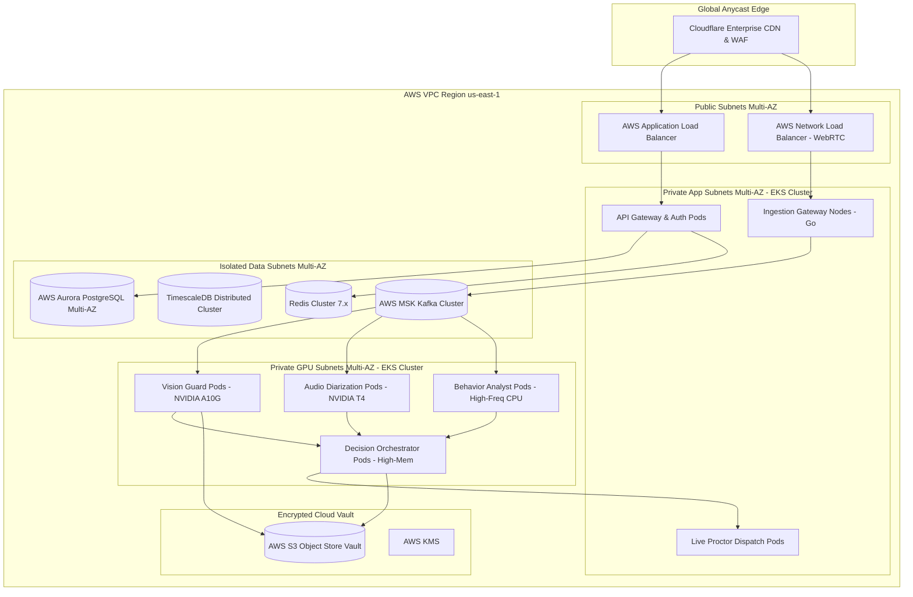
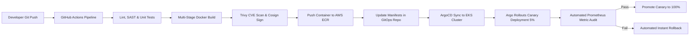

# Infrastructure, DevOps & SRE Architecture Specification
## SentinelAI: Autonomous Multi-Agent Exam Integrity Platform

**Document Metadata**
- **Document Title:** SentinelAI Production Infrastructure, DevOps & SRE Architecture Specification
- **Author:** Principal Cloud Architect & Lead Site Reliability Engineer (SRE)
- **Status:** Approved / Ready for Platform & SRE Engineering Implementation
- **Target Audience:** DevOps Engineers, Site Reliability Engineers, Cloud Architects, Platform Engineers, Security Engineers
- **Version:** 1.0.0
- **Source Artifacts:**
  - [SentinelAI Product Requirements Document (PRD)](file:///C:/Users/tanis/.gemini/antigravity-ide/brain/6923a728-c23d-4c82-8e32-3de3bf436128/sentinel_ai_prd.md)
  - [SentinelAI Software Architecture Document (SAD)](file:///C:/Users/tanis/.gemini/antigravity-ide/brain/6923a728-c23d-4c82-8e32-3de3bf436128/sentinel_ai_architecture.md)
  - [SentinelAI Technology Selection Document](file:///C:/Users/tanis/.gemini/antigravity-ide/brain/6923a728-c23d-4c82-8e32-3de3bf436128/sentinel_ai_tech_stack.md)
  - [SentinelAI Database Architecture Document](file:///C:/Users/tanis/.gemini/antigravity-ide/brain/6923a728-c23d-4c82-8e32-3de3bf436128/sentinel_ai_database_design.md)
  - [SentinelAI API Specification Document](file:///C:/Users/tanis/.gemini/antigravity-ide/brain/6923a728-c23d-4c82-8e32-3de3bf436128/sentinel_ai_api_spec.md)
  - [SentinelAI Multi-Agent AI System Document](file:///C:/Users/tanis/.gemini/antigravity-ide/brain/6923a728-c23d-4c82-8e32-3de3bf436128/sentinel_ai_agent_architecture.md)
  - [SentinelAI AI/ML Lifecycle Document](file:///C:/Users/tanis/.gemini/antigravity-ide/brain/6923a728-c23d-4c82-8e32-3de3bf436128/sentinel_ai_mlops_lifecycle.md)
  - [SentinelAI Cybersecurity Architecture Document](file:///C:/Users/tanis/.gemini/antigravity-ide/brain/6923a728-c23d-4c82-8e32-3de3bf436128/sentinel_ai_security_architecture.md)

---

## Table of Contents
1. [Infrastructure Philosophy](#1-infrastructure-philosophy)
2. [Production Infrastructure Topology](#2-production-infrastructure-topology)
3. [Environment Strategy](#3-environment-strategy)
4. [Containerization Strategy](#4-containerization-strategy)
5. [Kubernetes Architecture](#5-kubernetes-architecture)
6. [CI/CD Pipeline Architecture](#6-cicd-pipeline-architecture)
7. [Infrastructure as Code (IaC) Architecture](#7-infrastructure-as-code-iac-architecture)
8. [Multi-Scale Capacity & Scaling Strategy](#8-multi-scale-capacity--scaling-strategy)
9. [Enterprise Networking Architecture](#9-enterprise-networking-architecture)
10. [Secrets Management & Certificate Topology](#10-secrets-management--certificate-topology)
11. [Monitoring Infrastructure](#11-monitoring-infrastructure)
12. [Centralized Logging Architecture](#12-centralized-logging-architecture)
13. [Observability, SLIs, SLOs & Error Budgets](#13-observability-slis-slos--error-budgets)
14. [Backup & Disaster Recovery (DR) Plan](#14-backup--disaster-recovery-dr-plan)
15. [Release & Deployment Strategy](#15-release--deployment-strategy)
16. [Cost Optimization Architecture](#16-cost-optimization-architecture)
17. [Operational Incident Runbooks](#17-operational-incident-runbooks)
18. [Infrastructure Risk Matrix](#18-infrastructure-risk-matrix)
19. [Future Infrastructure Evolution](#19-future-infrastructure-evolution)

---

## 1. Infrastructure Philosophy

SentinelAI is engineered under an **Immutable, Cloud-Native Site Reliability Engineering Paradigm** designed to deliver $99.99\%$ service availability, sub-second telemetry ingestion, elastic GPU auto-scaling, and zero-downtime continuous releases.

```
+-----------------------------------------------------------------------------------+
|                        INFRASTRUCTURE PHILOSOPHY PRINCIPLES                       |
+-----------------------------------------------------------------------------------+
| 1. IMMUTABLE INFRASTRUCTURE : Zero manual server SSH edits; 100% codified via IaC.|
| 2. GITOPS CONTINUOUS STATE  : Git repository acts as single declarative truth.     |
| 3. ELASTIC AUTO-SCALING     : Dynamically provisions compute & GPU worker pods.   |
| 4. SELF-HEALING RESILIENCE  : Automated pod restarts, health probes, and circuit  |
|                               breakers.                                           |
| 5. ZERO DOWNTIME DEPLOYMENT : Progressive Canary traffic routing via Argo Rollouts.|
+-----------------------------------------------------------------------------------+
```

---

## 2. Production Infrastructure Topology

### 2.1 Multi-AZ Cloud Deployment Architecture



---

## 3. Environment Strategy

### 3.1 Tiered Environment Architecture

| Environment | Purpose | Infrastructure Scale | Target SLA | Data Strategy |
| :--- | :--- | :--- | :--- | :--- |
| **Local Dev** | Single developer workstation testing. | Docker Desktop / Minikube | N/A | Mock synthetic seed data. |
| **Development**| CI automated integration branch testing. | EKS Single-AZ (Micro scale) | 95.0% | Anonymized sample data. |
| **QA / Staging**| Pre-release E2E validation & load tests.| EKS Multi-AZ (10% Prod Scale)| 99.0% | Anonymized production clone. |
| **Production** | Live candidate examination execution. | EKS Multi-AZ (Full Scale + HPA)| **99.99%** | Production encrypted vault. |
| **Disaster Rec**| Standby regional failover target. | Pilot Light / Warm Standby | 99.99% | Continuous WAL cross-region sync. |

---

## 4. Containerization Strategy

### 4.1 Container Image Security & Layout Rules
- **Base Image Policy:** All containers utilize minimal, hardened distroless base images (`gcr.io/distroless/static-debian12` for Go binaries; `nvidia/cuda:12.2.0-base-ubuntu22.04` for GPU workers).
- **Multi-Stage Build Architecture:** Build tooling (compilers, npm, pip) isolated in build stage; final runtime image contains strictly compiled binary and static dependencies, resulting in image sizes $< 35\text{ MB}$ for Go services and $< 1.2\text{ GB}$ for PyTorch GPU workers.
- **Image Scanning & Signing:** Containers scanned for CVE vulnerabilities via **Trivy** in CI/CD pipeline and cryptographically signed using **Cosign** before pushing to AWS ECR.

---

## 5. Kubernetes Architecture

### 5.1 Namespace Topology & Workload Categorization

```
+-----------------------------------------------------------------------------------+
|                        KUBERNETES NAMESPACE ARCHITECTURE                          |
+-----------------------------------------------------------------------------------+
| 1. namespace: sentinel-system    -> Ingress controllers, Service Mesh Istio control.|
| 2. namespace: sentinel-core      -> API Gateway, Auth, Exam Engine, Dispatch.     |
| 3. namespace: sentinel-ai-agents -> Vision Guard, Behavior, Collusion, Orchestrator.|
| 4. namespace: sentinel-monitoring-> Prometheus, Grafana, OpenTelemetry, Tempo.    |
+-----------------------------------------------------------------------------------+
```

### 5.2 Kubernetes Resource Allocation Matrix

| Workload Component | K8s Resource Type | Node Pool Target | CPU Request / Limit | RAM Request / Limit | GPU Request / Limit |
| :--- | :--- | :--- | :--- | :--- | :--- |
| **Ingestion Gateway**| Deployment (HPA) | CPU Compute Pool | 1000m / 2000m | 1Gi / 2Gi | None |
| **API Gateway** | Deployment (HPA) | CPU Compute Pool | 500m / 1000m | 512Mi / 1Gi | None |
| **Vision Guard Agent**| Deployment (HPA) | GPU Node Pool (A10G)| 4000m / 8000m | 8Gi / 16Gi | **1 NVIDIA GPU** |
| **Behavior Analyst** | Deployment (HPA) | CPU Compute Pool | 2000m / 4000m | 4Gi / 8Gi | None |
| **Collusion VAD/STT**| Deployment (HPA) | GPU Node Pool (T4) | 2000m / 4000m | 4Gi / 8Gi | **1 NVIDIA GPU** |
| **Decision Orchestrator**| Deployment (HPA)| High-Mem Node Pool| 4000m / 8000m | 16Gi / 32Gi | None |

---

## 6. CI/CD Pipeline Architecture

### 6.1 GitOps Continuous Delivery Topology (GitHub Actions + ArgoCD)



---

## 7. Infrastructure as Code (IaC) Architecture

### 7.1 Terraform Repository Directory Layout
- All infrastructure (VPCs, EKS clusters, Node pools, RDS instances, S3 buckets, KMS keys) is defined using modular **Terraform (v1.7+)** stored in a dedicated repository:
  - `modules/aws-vpc`
  - `modules/aws-eks-karpenter`
  - `modules/aws-rds-aurora`
  - `modules/aws-msk-kafka`
  - `modules/aws-s3-vault`
  - `environments/staging`
  - `environments/production`
- **State Management:** Terraform remote state stored in S3 with state locking via DynamoDB.

---

## 8. Multi-Scale Capacity & Scaling Strategy

### 8.1 Candidate Capacity & Compute Provisioning Matrix

| Candidate Scale | Active Video Streams | Ingestion Throughput | Compute Node Strategy | GPU Node Provisioning | Estimated AWS Cost / Mo |
| :--- | :--- | :--- | :--- | :--- | :--- |
| **100 Users** | 100 @ 15 FPS | 500 events/sec | 3 m5.xlarge Nodes | 1 g5.xlarge (NVIDIA A10G) | $\sim \$1,200$ |
| **1,000 Users** | 1,000 @ 15 FPS | 5,000 events/sec | 6 m5.2xlarge Nodes | 4 g5.xlarge (NVIDIA A10G) | $\sim \$4,800$ |
| **10,000 Users** | 10,000 @ 15 FPS | 50,000 events/sec | 20 m5.4xlarge Nodes | 25 g5.2xlarge (NVIDIA A10G)| $\sim \$35,000$ |
| **100,000 Users**| 100,000 @ 15 FPS| 500,000 events/sec| 150 c6i.4xlarge Nodes| 180 g5.2xlarge (NVIDIA A10G)| $\sim \$280,000$ |

- **GPU Node Auto-Scaler (Karpenter):** Karpenter evaluates pending GPU pod queue depth and provisions spot/on-demand GPU instances within $<45\text{ seconds}$.

---

## 9. Enterprise Networking Architecture

- **VPC Subnet Layout:**
  - `Public Subnets` (Multi-AZ): AWS Application Load Balancers, Network Load Balancers (WebRTC).
  - `Private App Subnets` (Multi-AZ): EKS Worker Nodes (API Gateway, Ingestion, Core Services). No public IP addresses assigned.
  - `Private GPU Subnets` (Multi-AZ): EKS GPU Worker Pods (Vision Guard, Collusion Agents). Egress strictly limited via NAT Gateway.
  - `Isolated Data Subnets` (Multi-AZ): Aurora PostgreSQL, Redis Cluster, Kafka MSK. Zero internet egress/ingress allowed.

---

## 10. Secrets Management & Certificate Topology

- **Secrets Provisioning:** Managed via **HashiCorp Vault** integrated with Kubernetes via **External Secrets Operator (ESO)**. Vault automatically injects database credentials and JWT signing keys into pod environment variables at runtime.
- **TLS Certificate Lifecycle:** **cert-manager** automatically provisions and renews TLS certificates via Let's Encrypt / ACME for all public Ingress endpoints.

---

## 11. Monitoring Infrastructure

```
+-----------------------------------------------------------------------------------+
|                        PROMETHEUS MONITORING STACK MAP                            |
+-----------------------------------------------------------------------------------+
| 1. NODE EXPORTER        : Host-level CPU, RAM, Disk I/O, Network interfaces.      |
| 2. NVIDIA DCGM EXPORTER : GPU VRAM usage, GPU Core Utilization, Temperature, Power.|
| 3. KUBE-STATE-METRICS   : Pod status, HPA limits, restart counts, queue backpressure.|
| 4. CUSTOM APP EXPORTERS : Agent inference latency, risk score velocity, alerts/min. |
+-----------------------------------------------------------------------------------+
```

---

## 12. Centralized Logging Architecture

- **Log Collector:** **FluentBit** daemonset runs on every Kubernetes node, shipping structured JSON stdout/stderr logs to **Grafana Loki**.
- **Log Indexing Strategy:** Logs are indexed by `label` (`namespace`, `pod_name`, `tenant_id`, `session_id`, `trace_id`), enabling fast log query correlation in Grafana without expensive full-text indexing.

---

## 13. Observability, SLIs, SLOs & Error Budgets

### 13.1 Service Level Objectives (SLOs)

| Service Area | Service Level Indicator (SLI) | Target SLO Target | Error Budget (Monthly) |
| :--- | :--- | :---: | :--- |
| **API Availability** | Successful HTTP requests (`2xx`/`3xx`/`4xx` vs `5xx`) | **99.99%** | 4.38 minutes downtime |
| **Telemetry Latency** | Network latency from Client to Gateway | **P95 $\le 100 \text{ ms}$** | 5% requests exceeding 100ms |
| **Agent Inference** | Vision Guard frame processing time | **P99 $\le 35 \text{ ms}$** | 1% frames exceeding 35ms |
| **Alert Dispatch** | Orchestrator event trigger to Proctor Dashboard | **P95 $\le 1.5 \text{ s}$** | 5% alerts exceeding 1.5s |

---

## 14. Backup & Disaster Recovery (DR) Plan

- **Recovery Point Objective (RPO):** $< 5 \text{ seconds}$ (Continuous WAL streaming to S3).
- **Recovery Time Objective (RTO):** $< 60 \text{ seconds}$ (Automated Aurora PostgreSQL Multi-AZ failover).
- **Cross-Region Failover Plan:** Active-Passive warm standby deployed in AWS `us-west-2` with automated DNS failover via Cloudflare Health Checks if `us-east-1` experiences a catastrophic regional outage.

---

## 15. Release & Deployment Strategy

```
+-----------------------------------------------------------------------------------+
|                     ARGO ROLLOUTS CANARY RELEASE STAGE MAP                        |
+-----------------------------------------------------------------------------------+
| Stage 1: Deploy new image to 5% of production pods. Maintain for 15 minutes.      |
| Stage 2: Prometheus automated metric audit (HTTP 5xx rate < 0.01%, P99 < 50ms).    |
| Stage 3: Shift traffic to 25%. Maintain for 30 minutes.                           |
| Stage 4: Full promotion to 100% traffic across cluster.                           |
| Stage 5: Rollback trigger: Instant 100% revert if 5xx rate > 0.1% or latency >100ms.|
+-----------------------------------------------------------------------------------+
```

---

## 16. Cost Optimization Architecture

### 16.1 Cost Minimization Strategies
1. **GPU Spot Instances:** Utilizing AWS EKS Spot GPU instances (NVIDIA A10G / T4) managed by Karpenter yields up to $65\%$ savings compared to on-demand pricing.
2. **Adaptive Dynamic Frame Sampling:** Automatically degrading webcam frame sampling rates (30 FPS $\rightarrow$ 5 FPS) for candidates with low risk scores ($\text{Risk} < 0.20$) reduces GPU compute consumption by up to $60\%$ during peak exam windows.
3. **S3 Storage Lifecycle Rules:** Transitioning raw video/audio files to S3 Glacier after 14 days and auto-deleting clean session recordings after 30 days reduces storage costs by $80\%$.

---

## 17. Operational Incident Runbooks

### 17.1 Runbook: GPU Worker Node Exhaustion
- **Symptom:** Prometheus alert `GPUVRAMExhausted` fires; Vision Guard pod restarts.
- **Impact:** Frame processing queue latency spikes.
- **Automated Mitigation Action:** Karpenter provisions +5 standby `g5.2xlarge` GPU nodes. Ingestion Gateway temporarily lowers frame sampling rates to 5 FPS for low-risk candidates until nodes join cluster.

### 17.2 Runbook: Database Primary Crash
- **Symptom:** PostgreSQL connection drop errors on API Gateway.
- **Impact:** Read/Write errors for 15 seconds.
- **Automated Mitigation Action:** AWS Aurora automatically promotes Read Replica to Primary within $<15\text{ seconds}$. PgBouncer automatically re-routes active connection pools to new Primary.

---

## 18. Infrastructure Risk Matrix

| Infrastructure Risk | Severity | Likelihood | Technical Mitigation Strategy |
| :--- | :---: | :---: | :--- |
| **AWS Regional Outage** | Critical | Low | Active-Passive cross-region standby in `us-west-2` with automated Cloudflare DNS failover. |
| **GPU Spot Instance Interruption**| High | Medium | Karpenter maintains a 20% on-demand GPU base pool alongside spot instances to absorb sudden terminations. |
| **Kafka Broker Storage Saturation**| High | Low | Dynamic EBS volume expansion + automated log retention purge policy (retention capped at 6 hours). |

---

## 19. Future Infrastructure Evolution

1. **Multi-Cloud Failover Infrastructure:** Expanding EKS control planes across AWS and GCP to achieve cloud-agnostic high availability.
2. **WebGPU Client Edge Infrastructure:** Deploying lightweight WASM/WebGPU feature extraction models directly to candidate browsers, offloading $80\%$ of server-side GPU cloud infrastructure.

---

## 20. Document Sign-off & Next Steps

This Infrastructure, DevOps & SRE Architecture Specification formally completes **Step 9**. The platform infrastructure architecture is locked and approved.

- **PRD, SAD, Tech Stack, DB, API, Agent, MLOps, & Security Alignment:** 100% Compliant.
- **Platform Implementation Status:** **APPROVED FOR FULL PRODUCTION DEPLOYMENT.**
