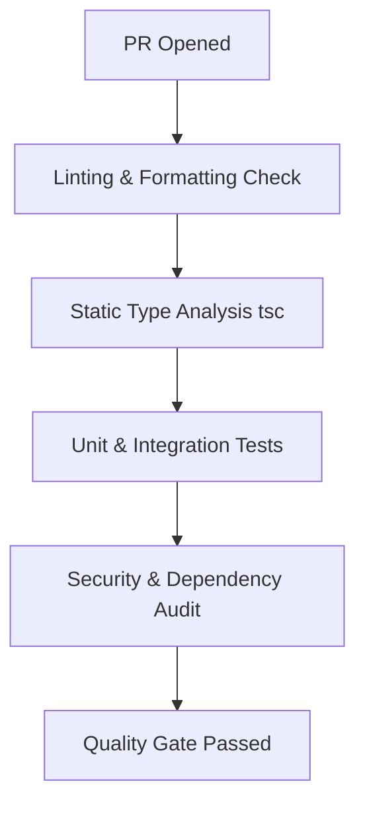

# SentinelAI Enterprise Engineering Handbook

**Document Version:** 1.0.0  
**Status:** Official Engineering Specification & Handbook  
**Target Audience:** Principal Architects, Lead Engineers, Backend/Frontend Developers, ML Engineers, Cybersecurity Auditors, and Automated Code Generators.

---

## Executive Summary

This Engineering Handbook defines the technical standards, architectural paradigms, quality controls, and operational workflows for **SentinelAI**—the Enterprise Autonomous Multi-Agent Exam Integrity Platform. Adherence to this document is mandatory for all human contributors, engineering squads, and AI code generation pipelines.

---

# 1. Engineering Principles

Every architectural decision, code refactoring, and feature implementation in SentinelAI must align with these core principles:

| Principle | Core Concept | Application in SentinelAI | Trade-offs & Nuances |
| :--- | :--- | :--- | :--- |
| **Clean Architecture** | Separation of software into concentric layers with strict inner-directed dependency rules. | Core domain models (`packages/types`) must have zero dependencies on frameworks, databases, or UI renderers. | Increases initial file count and requires explicit mapping between DTOs and Domain Models. |
| **SOLID Principles** | Single Responsibility, Open/Closed, Liskov Substitution, Interface Segregation, Dependency Inversion. | Each AI agent (`VisionGuard`, `BehavioralAnalyst`) does one thing. Extensions use interface implementations without mutating core logic. | Higher upfront abstraction overhead; avoids massive monolithic class definitions. |
| **DRY (Don't Repeat Yourself)** | Single, authoritative representation of knowledge across the system. | Shared domain types, risk constants, and UI color functions live in `@sentinel-ai/types`, `@sentinel-ai/constants`, and `@sentinel-ai/ui`. | Over-abstraction can cause tight coupling across unrelated modules; extract only true domain logic. |
| **KISS (Keep It Simple, Stupid)** | Avoid unnecessary complexity and over-engineering. | Avoid complex custom state machines where plain TypeScript discriminated unions suffice. | Resist premature optimization; optimize only after empirical log evidence. |
| **YAGNI (You Aren't Gonna Need It)** | Implement features only when required, not in anticipation of future needs. | Build explicit real-time telemetry pipelines before adding speculative predictive analytics plugins. | Requires disciplined scope boundaries during sprint planning. |
| **Separation of Concerns** | Distinct features managed by independent software sections. | Frontend handles rendering; Backend API handles validation; Decision Orchestrator handles multi-modal correlation. | Requires clear RPC/REST API contracts between layers. |
| **Dependency Inversion** | Depend upon abstractions, not concrete implementations. | Backend services receive interface abstractions (`IExamRepository`, `IAuditLedger`) injected at runtime. | Enables seamless unit mocking and swapping storage engines without touching business logic. |
| **Composition over Inheritance** | Combine simple objects to achieve complex behaviors rather than deep class hierarchies. | Agents are composed within the `DecisionOrchestratorAgent` via constructor injection rather than extending base classes. | Prevents fragile base-class problems across large engineering teams. |

---

# 2. Repository Conventions

SentinelAI uses a unified Turbo/PNPM monorepo design structure.

### Folder Structure
```
sentinel-ai/
├── apps/                        # End-user applications
│   ├── student-portal/          # Candidate exam workspace
│   ├── proctor-dashboard/       # Live proctor command center
│   └── admin-portal/            # Institutional governance & compliance portal
├── services/                    # Autonomous backend microservices
│   ├── backend/                 # Main Express + WebSocket orchestrator engine
│   └── ml-inference/            # Python PyTorch / ONNX ML inference service
├── packages/                    # Shared workspace libraries
│   ├── types/                   # Shared TypeScript interface definitions
│   ├── constants/               # System thresholds, weights, error codes
│   └── ui/                      # Shared UI design tokens and components
├── docs/                        # ADRs, API specs, security manuals
└── tools/                       # CI/CD scripts and local dev automation
```

### File & Directory Naming Conventions
- **Directories:** Kebab-case (e.g., `decision-orchestrator`, `student-portal`).
- **TypeScript Files:** Kebab-case (e.g., `vision-guard.ts`, `exam-service.ts`).
- **React Components:** PascalCase for files and folders (e.g., `EvidenceModal.tsx`, `RiskCard/index.tsx`).
- **Python Modules:** Snake_case (e.g., `feature_extractor.py`, `onnx_runner.py`).

### Import Order Hierarchy
Imports must be grouped in the following strict order, separated by a blank line:
1. External core libraries (React, Express, PyTorch, etc.)
2. Workspace packages (`@sentinel-ai/types`, `@sentinel-ai/constants`, `@sentinel-ai/ui`)
3. Internal domain modules / services (relative paths)
4. Styles / Asset imports

---

# 3. Language Standards

## 3.1 TypeScript Standards

- **Strict Type Checking:** `strict: true`, `noImplicitAny: true`, and `noUnusedLocals: true` are enforced in all `tsconfig.json` files.
- **Explicit Return Types:** All exported functions and class methods must declare explicit return types.
- **Interfaces vs Types:** Use `interface` for object structures that can be extended; use `type` for union types, tuples, or primitives.
- **Enums:** Avoid numeric enums. Use string literal union types (e.g., `export type AlertLevel = 'NONE' | 'LOW' | 'MEDIUM' | 'HIGH' | 'CRITICAL';`) to guarantee JSON serialization safety.
- **Null & Undefined:** Prefer `undefined` over `null` for optional properties.

## 3.2 Python Standards (AI/ML Services)

- **PEP 8 Compliance:** Enforced via `ruff` and `black`.
- **Type Hints:** All function signatures must include Python type annotations (`typing` module / standard 3.10+ types).
- **Pydantic Validation:** All external data models (Kafka vectors, REST payloads) must be defined as `pydantic.BaseModel` schemas.
- **Docstrings:** Google-style docstrings for all classes, methods, and public routines.

---

# 4. API Standards

SentinelAI uses REST for management control planes and WebSockets/gRPC for high-throughput real-time telemetry streaming.

### Standard Response Envelope
All REST API endpoints must return a standardized JSON envelope:

```json
{
  "success": true,
  "data": { ... },
  "meta": {
    "requestId": "req_987654321",
    "timestamp": "2026-07-25T12:00:00.000Z"
  }
}
```

### Standard Error Schema
```json
{
  "success": false,
  "error": {
    "code": "EXAM_SESSION_LOCKED",
    "message": "The candidate examination session is currently paused by a proctor.",
    "details": [
      { "field": "sessionId", "issue": "Session state is PAUSED" }
    ]
  },
  "meta": {
    "requestId": "req_987654321",
    "timestamp": "2026-07-25T12:00:00.000Z"
  }
}
```

### HTTP Status Code Guidelines
- `200 OK`: Request succeeded.
- `201 Created`: Entity created successfully.
- `400 Bad Request`: Input payload validation failure.
- `401 Unauthorized`: Invalid or expired JWT token.
- `403 Forbidden`: Authenticated user lacks permission.
- `404 Not Found`: Target resource does not exist.
- `429 Too Many Requests`: Rate limit boundary exceeded.
- `500 Internal Server Error`: Unhandled server exception.

---

# 5. Backend Standards

- **Controller Layer:** Light request translation. Validates input schemas, extracts tokens, calls services, returns HTTP envelopes. No domain business logic permitted.
- **Service Layer:** Authoritative business logic execution. Orchestrates domain entities, transactional boundaries, and external adapters.
- **Repository Layer:** Data persistence interaction. Encapsulates database queries (Prisma/PostgreSQL/Redis) behind abstract interfaces.
- **DTOs vs Domain Entities:** DTOs represent wire transfer formats; Domain Entities represent core business objects. Direct database model exposure to clients is strictly forbidden.
- **Middleware:** Cross-cutting concerns (JWT auth, rate limiting, request correlation IDs, audit hashing) must be executed in isolated middleware pipelines.

---

# 6. Frontend Standards

- **Component Hierarchy:** Presentational components must be decoupled from data-fetching hooks.
- **State Management Strategy:**
  - *Local UI State:* React `useState` / `useReducer`.
  - *Server Cache:* React Query (`@tanstack/react-query`) for REST endpoints.
  - *Real-time Stream State:* React Context or Zustand store connected to WebSockets.
- **Performance Guidelines:**
  - Wrap high-frequency rendering callbacks in `useCallback`.
  - Virtualize high-density candidate grids (`react-window` or custom virtual scroll) when rendering >50 live streams.
  - No inline heavy mathematical calculations in render loops; use `useMemo`.
- **Accessibility (a11y):**
  - Minimum WCAG 2.1 AA compliance.
  - All interactive icons must have `aria-label` tags.
  - Dynamic risk colors must maintain a contrast ratio >= 4.5:1 against dark backgrounds.

---

# 7. AI/ML Standards

- **Dataset Versioning:** All training and evaluation datasets must be tracked in DVC (Data Version Control) with SHA-256 content hashes.
- **Model Registry:** Trained ML artifacts (PyTorch checkpoints, ONNX models) must be registered in MLflow with semantic versioning (`v1.4.2`).
- **Inference Guidelines:**
  - Python ML inference code must compile models to ONNX Runtime or TensorRT.
  - Batch size must be dynamically configurable.
  - Maximum single-frame inference threshold: $\le 15\text{ms}$.
- **Reproducibility:** Training scripts must seed random number generators (`numpy`, `torch`, `random`) explicitly before execution.

---

# 8. Logging Standards

- **Structured JSON Logging:** All log outputs must be structured JSON (using `pino` or `structlog`).
- **Required Log Context Fields:**
  - `timestamp` (ISO 8601 UTC)
  - `level` (`DEBUG`, `INFO`, `WARN`, `ERROR`, `FATAL`)
  - `correlationId` / `requestId`
  - `sessionId` (if session scope active)
  - `service` (e.g., `backend-orchestrator`, `vision-guard`)
- **Sensitive Data Masking:** PII (Candidate SSN, biometric templates, full face frame images) must NEVER be written to stdout or application log files.

---

# 9. Error Handling Standards

- **Exception Hierarchy:**
  - Custom base exception: `SentinelError`.
  - Subclasses: `ValidationError`, `AuthenticationError`, `DomainPolicyError`, `AgentInferenceError`.
- **User-Facing Safety:** Internal database stack traces or SQL syntax errors must NEVER leak to API consumers.
- **Retry Policies:** Exponential backoff with jitter for transient network failures ($T_{wait} = 2^k \times \text{base} + \text{rand}$).
- **Graceful Fallbacks:** If an AI sub-agent times out ($\ge 500\text{ms}$), the orchestrator must flag `AGENT_TIMEOUT` and gracefully rely on remaining active signals without crashing the session stream.

---

# 10. Security Standards

- **Zero-Trust Access:** Every internal microservice call requires mTLS authentication and cryptographically signed JWT tokens.
- **Secret Management:** Hardcoded credentials or API keys in source code are strictly forbidden. Secrets must be injected via HashiCorp Vault or AWS Secrets Manager.
- **Input Sanitization:** All text inputs (essay answers, policy search queries) must be sanitized against SQL injection, XSS, and command injection attacks.
- **Audit Hash-Chain:** All proctor interventions (warnings, session terminations, alert dismissals) must be written to the SHA-256 cryptographic hash-chain ledger.

---

# 11. Testing Standards

### Testing Pyramid & Target Coverage
| Test Type | Target Coverage | Scope & Tools |
| :--- | :--- | :--- |
| **Unit Tests** | $\ge 85\%$ | Individual functions, utility mappers, agents (`Vitest`, `PyTest`). |
| **Integration Tests** | $\ge 75\%$ | REST API routes, WebSocket handlers, DB transactions (`Supertest`). |
| **Contract Tests** | $100\%$ of APIs | OpenAPI / JSON Schema validation between services. |
| **AI Validation Tests** | $\ge 95\%$ Precision | Cross-dataset false-positive benchmark suites. |
| **E2E Tests** | Critical Flows | Full candidate exam flow & proctor alert triggers (`Playwright`). |

---

# 12. Documentation Standards

- **README Files:** Every application and shared package must contain a top-level `README.md` detailing purpose, installation, environment variables, and usage.
- **Architecture Decision Records (ADRs):** Significant design changes must be documented as ADRs in `docs/adr/00XX-title.md`.
- **API Specs:** OpenAPI 3.0 specs generated automatically or maintained synchronously with code changes.
- **Code Comments:** Write comments explaining *why* complex business rules exist, not *what* trivial lines of code do.

---

# 13. Git Workflow

- **Branch Naming:**
  - `feature/ST-102-gaze-tracking`
  - `bugfix/ST-204-websocket-reconnect`
  - `hotfix/ST-999-auth-token-leak`
- **Conventional Commits:**
  - `feat(vision): add 3D head pose angle threshold evaluation`
  - `fix(backend): patch risk decay memory leak in long sessions`
  - `docs(api): update WebSocket telemetry vector schema`
- **Pull Request Requirements:**
  - PR title must follow conventional commit standard.
  - Linked Jira/GitHub issue ID.
  - Summary of technical changes and manual verification proof (screenshots/logs).
  - Minimum 2 senior peer approvals required before merge.

---

# 14. Performance Standards

| Metric | Target SLA | Critical Threshold |
| :--- | :--- | :--- |
| **REST API Response Time (p95)** | $\le 100\text{ms}$ | $> 300\text{ms}$ |
| **Telemetry Ingestion Throughput** | $\ge 10,000\text{ vectors/sec}$ | $< 2,000\text{ vectors/sec}$ |
| **AI Multi-Modal Signal Correlation** | $\le 30\text{ms}$ | $> 100\text{ms}$ |
| **WebSocket Broadcast Latency** | $\le 50\text{ms}$ | $> 200\text{ms}$ |
| **Frontend First Contentful Paint (FCP)** | $\le 1.2\text{s}$ | $> 2.5\text{s}$ |

---

# 15. Code Quality Gates (CI Pipeline)

Every pull request must pass the automated GitHub Actions / GitLab CI pipeline:



1. **Format Check:** `prettier --check` / `black --check`.
2. **Linter:** `eslint` / `ruff` with zero warnings allowed.
3. **Type Checker:** `tsc --noEmit` / `mypy`.
4. **Automated Tests:** Vitest & PyTest suites pass with required coverage thresholds.
5. **Security Scan:** Snyk / `npm audit` / `trivy` container scanning with zero `HIGH` or `CRITICAL` CVEs.

---

# 16. Definition of Done (DoD) Checklist

A user story or feature is considered **DONE** and ready for release only when all criteria below are satisfied:

- [ ] **Code Complete:** Feature implementation adheres strictly to Clean Architecture & Engineering Standards.
- [ ] **Type Checked:** Zero TypeScript or Python type errors.
- [ ] **Unit & Integration Tested:** All new paths covered by automated unit/integration tests.
- [ ] **CI Quality Gates Passed:** Build, lint, static analysis, and security checks green in CI.
- [ ] **Security Audited:** Input validation, secret handling, and cryptographic hash logging verified.
- [ ] **Performance Benchmarked:** Latency SLAs met under stress testing.
- [ ] **Documentation Updated:** `README.md`, API specs, and inline docstrings updated.
- [ ] **Peer Approved:** Reviewed and approved by at least 2 senior engineering team members.
