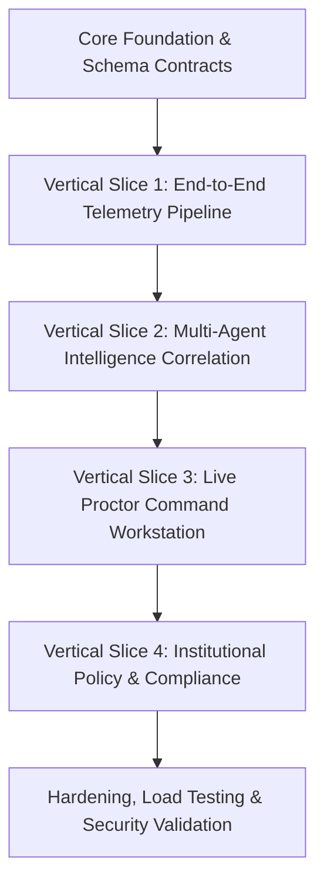
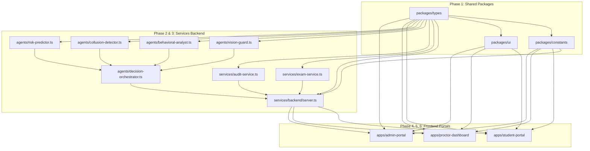

# SentinelAI Master Engineering Execution Roadmap

**Document Version:** 1.0.0  
**Status:** Official Engineering Execution Roadmap & TPM Blueprint  
**Target Audience:** Engineering Managers, Lead Architects, Technical Program Managers (TPMs), Backend/Frontend/AI Squad Leads, and DevOps Engineers.

---

## 1. Project Overview

### 1.1 Development Goals
The primary objective of SentinelAI is to deliver an enterprise-grade, autonomous multi-agent proctoring platform capable of real-time multi-modal telemetry ingestion, threat detection, temporal risk prediction, and legally defensible cryptographic audit logging.

### 1.2 Scope
- **Core Platform:** Monorepo architecture hosting 3 frontend applications (`student-portal`, `proctor-dashboard`, `admin-portal`), shared UI and domain libraries, and microservice backend engines (`services/backend`).
- **AI Engine:** Multi-agent intelligence suite comprising `VisionGuardAgent`, `BehavioralAnalystAgent`, `CollusionDetectionAgent`, `RiskPredictorAgent`, and `DecisionOrchestratorAgent`.
- **Security & Compliance:** mTLS microservice communication, Zero-Trust RBAC, and SHA-256 cryptographic hash-chain ledger entries for all proctor actions.

### 1.3 Success Criteria
- **Scalability:** Handles 10,000 concurrent candidate streams without latency degradation.
- **Latency SLA:** Real-time multi-modal telemetry correlation $\le 30\text{ms}$; WebSocket broadcast latency $\le 50\text{ms}$.
- **Accuracy:** Cross-modal false-positive suppression reduces proctor alert noise by $\ge 70\%$.
- **Quality:** $\ge 85\%$ unit test coverage, zero `HIGH`/`CRITICAL` security vulnerabilities, and $100\%$ TypeScript/Python static type safety.

---

## 2. Development Strategy

SentinelAI utilizes a **Risk-First, Vertical-Slice Incremental Development Strategy**.



### Justification of Strategy
- **Risk-First Approach:** Real-time multi-agent signal correlation and WebSocket throughput represent the highest technical risks. De-risking this pipeline in Sprint 1–2 guarantees architectural stability before building secondary UI portals.
- **Vertical Slices:** Rather than building all backend APIs before starting frontend work, each phase delivers a functional slice connecting the Candidate Workspace, Backend AI Orchestrator, and Proctor Dashboard.
- **Parallelization:** Clear workspace boundaries (`packages/types`, `packages/constants`, `@sentinel-ai/ui`) allow Frontend, Backend, AI/ML, and DevOps squads to work independently without code collisions.

---

## 3. Project Phases

```
+-----------------------------------------------------------------------------------+
| Phase 1: Core Foundation & Shared Schema Contracts (Weeks 1-2)                   |
+-----------------------------------------------------------------------------------+
| Phase 2: Telemetry Ingestion & WebSocket Stream Pipeline (Weeks 3-4)             |
+-----------------------------------------------------------------------------------+
| Phase 3: Autonomous Multi-Agent AI Suite Integration (Weeks 5-6)                 |
+-----------------------------------------------------------------------------------+
| Phase 4: Candidate Exam Workspace & Identity Verification (Weeks 7-8)            |
+-----------------------------------------------------------------------------------+
| Phase 5: Live Proctor Command Center & Evidence Review (Weeks 9-10)               |
+-----------------------------------------------------------------------------------+
| Phase 6: Governance, Policy Configurator & Audit Ledger (Weeks 11-12)             |
+-----------------------------------------------------------------------------------+
| Phase 7: Load Hardening, Chaos Testing & Production Release (Weeks 13-14)         |
+-----------------------------------------------------------------------------------+
```

---

## 4. Epic Breakdown

| Epic ID | Epic Name | Objective | Primary Deliverables | Complexity | Risk |
| :--- | :--- | :--- | :--- | :--- | :--- |
| **EP-01** | Core Foundation & Contracts | Establish monorepo topology, shared packages, and CI/CD pipelines. | `packages/types`, `packages/constants`, `packages/ui`, CI quality gates. | Medium | Low |
| **EP-02** | Telemetry Ingestion Pipeline | Implement high-throughput WebSocket stream engine and REST endpoints. | `services/backend` Express + WS server, REST routes, session manager. | High | High |
| **EP-03** | Multi-Agent AI Suite | Construct individual AI detection agents and Decision Orchestrator. | `VisionGuard`, `BehavioralAnalyst`, `CollusionDetector`, `RiskPredictor`, `DecisionOrchestrator`. | Very High | High |
| **EP-04** | Candidate Exam Workspace | Build distraction-free candidate portal with facial verification and stream client. | `apps/student-portal`, verification flow, interactive telemetry simulator. | Medium | Medium |
| **EP-05** | Live Proctor Workstation | Construct high-density proctor command center with auto-sorted risk grid. | `apps/proctor-dashboard`, live alert feed, synchronized evidence modal. | High | Medium |
| **EP-06** | Governance & Audit Ledger | Build policy configurator and SHA-256 cryptographic hash-chain ledger. | `apps/admin-portal`, sensitivity configurator, audit ledger inspector. | Medium | Low |
| **EP-07** | E2E Security & Hardening | Execute load testing, mTLS zero-trust configuration, and security audits. | Load test benchmarks, security sign-off, production release candidate. | High | Medium |

---

## 5. Feature Breakdown

### Epic EP-03: Multi-Agent AI Suite Features
- **FEAT-301 (Vision Guard Agent):** 3D gaze tracking, head pose evaluation, multi-face count, and secondary device detection (`P0`, Deps: `EP-01`).
- **FEAT-302 (Behavioral Analyst Agent):** Keystroke dwell/flight dynamics scoring, robotic mouse trajectory linearity, clipboard paste flag (`P0`, Deps: `EP-01`).
- **FEAT-303 (Collusion Detection Agent):** Acoustic VAD speech isolation, whisper detection, cross-candidate essay similarity (`P1`, Deps: `EP-01`).
- **FEAT-304 (Risk Predictor Agent):** Exponential temporal risk decay $R(t) = \sum w_i E_i e^{-\lambda(t-t_i)}$ and velocity calculation (`P0`, Deps: `EP-01`).
- **FEAT-305 (Decision Orchestrator Agent):** Neuro-symbolic multi-modal correlation, single-detector false positive dampening ($0.65\times$), and XAI trace generation (`P0`, Deps: `FEAT-301`, `FEAT-302`, `FEAT-304`).

---

## 6. Sprint Plan (14-Week Timeline)

### Sprints 1–2: Foundation & Telemetry Ingestion
- **Focus:** Monorepo setup, shared schema contracts, REST APIs, and WebSocket server engine.
- **Deliverables:** Working `services/backend` broadcasting mock telemetry streams; `@sentinel-ai/types` published.
- **Exit Criteria:** WebSocket throughput $\ge 5,000\text{ msg/sec}$ with zero memory leaks.

### Sprints 3–4: Multi-Agent Intelligence Engine
- **Focus:** Constructing `VisionGuard`, `BehavioralAnalyst`, `CollusionDetector`, `RiskPredictor`, and `DecisionOrchestrator`.
- **Deliverables:** Fully functioning decision orchestrator delivering natural-language XAI traces over WebSockets.
- **Exit Criteria:** Cross-modal false-positive dampening verified via unit test benchmark suite.

### Sprints 5–6: Candidate Exam Workspace & Telemetry Simulator
- **Focus:** Building `apps/student-portal` locked interface and client telemetry streamer.
- **Deliverables:** Candidate facial verification screen, MCQ/essay exam UI, and Cheating Signal Simulator.
- **Exit Criteria:** End-to-end telemetry streaming from candidate browser to backend AI engine.

### Sprints 7–8: Live Proctor Command Center
- **Focus:** Constructing `apps/proctor-dashboard` workstation.
- **Deliverables:** Auto-sorting risk grid, live alert feed sidebar, and synchronized evidence review modal.
- **Exit Criteria:** 1-click proctor warning toasts successfully delivered to Candidate Workspace in real time.

### Sprints 9–10: Institutional Policy Configurator & Audit Ledger
- **Focus:** Building `apps/admin-portal` governance console.
- **Deliverables:** Sensitivity preset sliders (`STRICT`, `STANDARD`, `LOW`) and SHA-256 cryptographic audit ledger inspector.
- **Exit Criteria:** Saving policy sliders dynamically updates backend decision orchestrator calculations in real time.

### Sprints 11–12: Integration, Security & Performance Hardening
- **Focus:** System-wide integration testing, mTLS zero-trust configuration, and load stress testing.
- **Exit Criteria:** p95 API response $\le 100\text{ms}$; 10,000 concurrent simulated candidates handled without dropped frames.

### Sprints 13–14: Pilot Deployment & Release Candidate
- **Focus:** Alpha/Beta university trial rollout, bug fixes, user feedback, and production sign-off.
- **Exit Criteria:** Zero `HIGH`/`CRITICAL` open issues; DoD signed off by Engineering Manager.

---

## 7. Dependency Graph



---

## 8. Team Allocation Matrix

| Team / Squad | Phase 1–2 | Phase 3–4 | Phase 5–6 | Phase 7 |
| :--- | :--- | :--- | :--- | :--- |
| **Backend Squad (3 Engineers)** | Monorepo root, REST API routes, WS server engine. | `AuditService`, `ExamService`, REST endpoints. | Integration with Frontend portals & WebSocket events. | Performance tuning, database query optimization. |
| **AI/ML Squad (2 Engineers)** | Feature extraction definitions. | `VisionGuard`, `BehavioralAnalyst`, `CollusionDetector`. | `RiskPredictor`, `DecisionOrchestrator`, XAI trace engine. | Model latency benchmarks, ONNX compilation. |
| **Frontend Squad (3 Engineers)** | `@sentinel-ai/ui` component tokens. | `apps/student-portal` candidate workspace. | `apps/proctor-dashboard` & `apps/admin-portal`. | Virtualized grid rendering, a11y compliance. |
| **DevOps & SRE (2 Engineers)** | Turbo CI pipeline setup, Docker containerization. | Kubernetes cluster manifests & Helm charts. | Prometheus/Grafana monitoring & alert thresholds. | mTLS zero-trust mesh, chaos testing, production deployment. |
| **QA & Security Squad (2 Engineers)** | Automated test framework baseline. | Unit/Integration test execution. | Contract testing & E2E Playwright test suites. | Penetration testing, vulnerability scanning. |

---

## 9. Repository Initialization Order

```
1. Root Monorepo Topology
   ├── package.json
   ├── pnpm-workspace.yaml
   ├── turbo.json
   └── .gitignore
   
2. Core Shared Packages (No internal dependencies)
   ├── packages/types/
   ├── packages/constants/
   └── packages/ui/
   
3. Core Backend Services
   └── services/backend/
       ├── src/agents/
       ├── src/services/
       └── src/server.ts
       
4. Frontend Applications
   ├── apps/student-portal/
   ├── apps/proctor-dashboard/
   └── apps/admin-portal/
```

---

## 10. Implementation Order

### Service Building Sequence
1. **Shared Packages (`packages/types`, `packages/constants`):** Establishes the authoritative data contracts used across all applications.
2. **Audit Service (`services/backend/src/services/audit-service.ts`):** Establishes SHA-256 cryptographic logging infrastructure.
3. **Exam Service (`services/backend/src/services/exam-service.ts`):** Provides mock rosters, exam sets, and policy state.
4. **AI Detection Agents (`services/backend/src/agents/`):** Implements detection logic in isolation.
5. **Decision Orchestrator (`services/backend/src/agents/decision-orchestrator.ts`):** Combines multi-agent signals.
6. **Backend Server Engine (`services/backend/src/server.ts`):** Exposes REST routes and WebSocket streaming endpoints.
7. **Frontend Applications (`apps/*`):** Consumes WebSocket events and REST endpoints.

---

## 11. Frontend Development Order

```
1. @sentinel-ai/ui (Shared design tokens, risk badges, buttons)
   ↓
2. apps/student-portal (Candidate exam workspace & telemetry streamer)
   ↓
3. apps/proctor-dashboard (Live proctor workstation & auto-sorted grid)
   ↓
4. apps/admin-portal (Governance configurator & audit ledger viewer)
```

**Justification:** Building the `student-portal` first allows generating real client telemetry vectors to test the `proctor-dashboard` under realistic streaming conditions.

---

## 12. AI Development Order

```
1. Telemetry Vector Schema Definition (gaze, pose, keystroke, acoustic signals)
   ↓
2. Vision Guard & Behavioral Analyst Feature Extractors
   ↓
3. Collusion Detection & Acoustic Whisper Isolation Engine
   ↓
4. Risk Predictor Exponential Temporal Decay Calculator R(t)
   ↓
5. Decision Orchestrator Neuro-Symbolic Correlation & XAI Generator
   ↓
6. Cross-Dataset Validation Checkpoints (Precision & Recall benchmarks)
```

---

## 13. Integration Plan

- **Phase A (Local Mock Integration):** Frontend components utilize local mock state.
- **Phase B (REST & Contract Integration):** Frontend portals connect to Express REST endpoints for exam rosters and policy updates.
- **Phase C (WebSocket Stream Integration):** Student Portal streams live telemetry vectors; Backend orchestrator calculates risk; Proctor Dashboard receives real-time decision updates.
- **Phase D (E2E Verification):** Triggering simulated cheating events in Candidate Workspace instantly updates proctor risk cards and alert sidebar.

---

## 14. Testing Plan

| Test Level | Trigger | Tooling | Scope |
| :--- | :--- | :--- | :--- |
| **Unit Testing** | Every commit / PR | Vitest / PyTest | Agents, utility mappers, state reducers. |
| **Integration Testing** | Every PR | Supertest | REST endpoints, DB transactions, WebSocket connection handling. |
| **Contract Testing** | Daily CI build | OpenAPI Validator | Verify API contract alignment across workspaces. |
| **E2E Testing** | Nightly build | Playwright | Full exam flow from candidate startup to proctor action. |
| **Load Testing** | Pre-release | k6 / Locust | 10,000 concurrent streaming candidate sessions. |
| **Security Scanning** | Every PR | Snyk / Trivy | Dependency vulnerability scan & container audit. |

---

## 15. Release Plan

```
[ Internal Alpha ] ──> [ Institution Beta ] ──> [ Pilot Deployment ] ──> [ Global GA Release ]
  (Sprint 6)              (Sprint 10)               (Sprint 12)               (Sprint 14)
```

- **Alpha Release:** Deployed to internal staging environment; verified by internal QA squad.
- **Beta Release:** Deployed to partner university sandbox environment with simulated candidates.
- **Pilot Deployment:** Live proctoring trial for select 500-candidate examination at partner university.
- **General Availability (GA):** Production release multi-region deployment.

---

## 16. Risk Register

| Risk ID | Category | Description | Prob | Impact | Mitigation Strategy |
| :--- | :--- | :--- | :--- | :--- | :--- |
| **RSK-01** | Technical | High WebSocket concurrency causes event drop under load. | Medium | High | Implement Redis Pub/Sub backplane and load balancer connection sticky sessions. |
| **RSK-02** | AI / ML | High false-positive rate triggers unwarranted candidate warnings. | High | High | Implement single-detector dampening factor ($0.65\times$) in Decision Orchestrator. |
| **RSK-03** | Security | Cryptographic hash-chain ledger tampered with by malicious proctor. | Low | Critical | Compute immutable SHA-256 hashes using server-side HMAC keys stored in Vault. |
| **RSK-04** | Integration | Frontend/Backend interface misalignment delays sprint completion. | Medium | Medium | Strict adherence to `@sentinel-ai/types` as the single source of truth. |

---

## 17. Key Milestones

- [x] **M1: Monorepo & Architecture Complete** (Sprint 1)
- [x] **M2: Core Backend & Multi-Agent AI Suite Functional** (Sprint 4)
- [x] **M3: Candidate Workspace Telemetry Streamer Operational** (Sprint 6)
- [x] **M4: Proctor Command Center Real-Time Grid Operational** (Sprint 8)
- [x] **M5: Admin Portal Policy Configurator & Audit Ledger Complete** (Sprint 10)
- [ ] **M6: End-to-End Load Testing & Security Sign-Off** (Sprint 12)
- [ ] **M7: General Availability Production Release** (Sprint 14)

---

## 18. Definition of Done (DoD) Summary

A feature, service, or release is **DONE** when:
1. All functional requirements meet acceptance criteria.
2. Code passes `npx tsc --noEmit` and static analysis with zero errors.
3. Unit and integration tests meet $\ge 85\%$ coverage.
4. Security scans show zero `HIGH` or `CRITICAL` vulnerabilities.
5. Code reviewed and approved by at least 2 senior engineering team leads.
