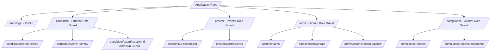
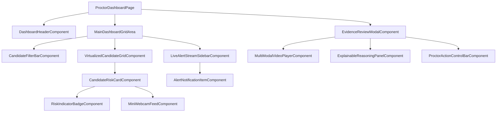

# Frontend Architecture & Staff UX Specification
## SentinelAI: Autonomous Multi-Agent Exam Integrity Platform

**Document Metadata**
- **Document Title:** SentinelAI Production Frontend Architecture & Staff UX Specification
- **Author:** Principal Frontend Architect & Staff UX Engineer
- **Status:** Approved / Ready for Frontend Implementation Phase
- **Target Audience:** Lead Frontend Engineers, UI/UX Developers, Design System Engineers, Accessibility Specialists
- **Version:** 1.0.0
- **Source Artifacts:**
  - [SentinelAI Product Requirements Document (PRD)](file:///C:/Users/tanis/.gemini/antigravity-ide/brain/6923a728-c23d-4c82-8e32-3de3bf436128/sentinel_ai_prd.md)
  - [SentinelAI Software Architecture Document (SAD)](file:///C:/Users/tanis/.gemini/antigravity-ide/brain/6923a728-c23d-4c82-8e32-3de3bf436128/sentinel_ai_architecture.md)
  - [SentinelAI Technology Selection Document](file:///C:/Users/tanis/.gemini/antigravity-ide/brain/6923a728-c23d-4c82-8e32-3de3bf436128/sentinel_ai_tech_stack.md)
  - [SentinelAI Database Architecture Document](file:///C:/Users/tanis/.gemini/antigravity-ide/brain/6923a728-c23d-4c82-8e32-3de3bf436128/sentinel_ai_database_design.md)
  - [SentinelAI API Specification Document](file:///C:/Users/tanis/.gemini/antigravity-ide/brain/6923a728-c23d-4c82-8e32-3de3bf436128/sentinel_ai_api_spec.md)
  - [SentinelAI Multi-Agent AI System Document](file:///C:/Users/tanis/.gemini/antigravity-ide/brain/6923a728-c23d-4c82-8e32-3de3bf436128/sentinel_ai_agent_architecture.md)
  - [SentinelAI AI/ML Lifecycle Document](file:///C:/Users/tanis/.gemini/antigravity-ide/brain/6923a728-c23d-4c82-8e32-3de3bf436128/sentinel_ai_mlops_lifecycle.md)
  - [SentinelAI Cybersecurity Architecture Document](file:///C:/Users/tanis/.gemini/antigravity-ide/brain/6923a728-c23d-4c82-8e32-3de3bf436128/sentinel_ai_security_architecture.md)
  - [SentinelAI Infrastructure & SRE Document](file:///C:/Users/tanis/.gemini/antigravity-ide/brain/6923a728-c23d-4c82-8e32-3de3bf436128/sentinel_ai_devops_infrastructure.md)
  - [SentinelAI Backend Module Architecture Document](file:///C:/Users/tanis/.gemini/antigravity-ide/brain/6923a728-c23d-4c82-8e32-3de3bf436128/sentinel_ai_backend_architecture.md)

---

## Table of Contents
1. [Frontend Architecture Overview](#1-frontend-architecture-overview)
2. [Applications Catalog](#2-applications-catalog)
3. [Routing Architecture & Guards](#3-routing-architecture--guards)
4. [Page Specifications](#4-page-specifications)
5. [Component Architecture & Hierarchy](#5-component-architecture--hierarchy)
6. [Layout System Specifications](#6-layout-system-specifications)
7. [State Management Architecture](#7-state-management-architecture)
8. [WebSocket Real-Time Event Integration](#8-websocket-real-time-event-integration)
9. [Data Fetching & Caching Strategy](#9-data-fetching--caching-strategy)
10. [Form Handling & Validation Framework](#10-form-handling--validation-framework)
11. [Charts & Data Visualization System](#11-charts--data-visualization-system)
12. [Accessibility & Universal Design (WCAG 2.1 AA)](#12-accessibility--universal-design-wcag-21-aa)
13. [Responsive & High-Density Display Strategy](#13-responsive--high-density-display-strategy)
14. [Frontend Security Architecture](#14-frontend-security-architecture)
15. [Performance Optimization & Virtualization](#15-performance-optimization--virtualization)
16. [Global Error Handling & Fallback UI](#16-global-error-handling--fallback-ui)
17. [Design System & Style Guide Tokens](#17-design-system--style-guide-tokens)
18. [Future Frontend Architecture Evolution](#18-future-frontend-architecture-evolution)

---

## 1. Frontend Architecture Overview

### 1.1 Architectural Philosophy: Component-Driven Hybrid Architecture
SentinelAI frontend is structured as a high-performance **Component-Driven Next.js Application Architecture** designed to support sub-100ms real-time proctor dashboard updates, 60 FPS video stream playback, and a distraction-free, zero-lag candidate exam environment.

```
+-----------------------------------------------------------------------------------+
|                        FRONTEND ARCHITECTURE PRINCIPLES                           |
+-----------------------------------------------------------------------------------+
| 1. HYBRID RENDERING        : Next.js Server Components (RSC) for Admin / Client   |
|                              Interactivity for Live Proctor Grids & WebRTC.       |
| 2. ZERO-LAG VIRTUALIZATION  : Windowed grid rendering for 1,000+ active candidates.|
| 3. ACCESSIBILITY FIRST     : Full WCAG 2.1 Level AA compliance across portals.    |
| 4. DECOUPLED STATE         : Local UI (Zustand) decoupled from Server Query Cache.|
| 5. FAULT-TOLERANT RETRIES  : Auto-reconnecting WebSocket backplane with offline state.|
+-----------------------------------------------------------------------------------+
```

---

## 2. Applications Catalog

### 2.1 Application Portfolio

| Application Portal | Target Persona | Primary Responsibilities | Core Dependencies | Primary Layout |
| :--- | :--- | :--- | :--- | :--- |
| **Candidate Exam Workspace** | Student | System check, identity verification, locked question workspace. | WebRTC, Local encrypted storage | `LockdownStudentLayout` |
| **Live Proctor Dashboard** | Live Proctor | Auto-sorted risk queue, real-time alerts, multi-modal clip review. | WebSockets, Canvas renderers | `HighDensityProctorLayout` |
| **Supervisor Control Console**| Proctor Supervisor| Multi-proctor shift monitoring, score overrides, exam terminations.| Recharts, Audit Ledger Client | `SupervisorConsoleLayout` |
| **Institutional Admin Portal**| Exam Admin | Exam creation, policy sensitivity sliders, roster provisioning. | TanStack Table, React Hook Form| `AdminDashboardLayout` |
| **Compliance & Audit Portal** | Compliance Officer | Post-exam integrity report viewing, PDF downloads, GDPR purges. | PDF Viewer, Evidence Modal | `AuditReportLayout` |

---

## 3. Routing Architecture & Guards



### 3.1 Route Guards & Protection Rules
- **Candidate Lockdown Guard:** Prevents route navigation out of `/candidate/exam/:sessionId` while exam status is `IN_PROGRESS`. Intercepts browser `popstate` and tab closing.
- **RBAC Role Guard:** Validates session JWT claims (`role`) before rendering target layout; unauthorized access redirects to `/auth/unauthorized`.

---

## 4. Page Specifications

### 4.1 Page Specification Catalog

#### Page: `LiveProctorDashboardPage` (`/proctor/live-dashboard`)
- **Purpose:** Primary real-time candidate monitoring station for live proctors.
- **Displayed Data:** Candidate grid auto-sorted by current Risk Score (Red, Yellow, Green), total active count, unresolved alert badge counts, system telemetry metrics.
- **User Actions:** Click candidate card (opens evidence modal), send warning toast, trigger 2-way audio check, escalate session to supervisor.
- **API / WS Calls:** `GET /dashboard/candidates`, WebSocket `wss://stream.sentinelai.io/ws/v1/proctor`.
- **States:**
  - *Loading:* Skeleton card grid.
  - *Empty:* "No active candidates in assigned session queue."
  - *Error:* "WebSocket stream disconnected. Retrying in 5s..."

#### Page: `CandidateExamPage` (`/candidate/exam/:sessionId`)
- **Purpose:** Secure, distraction-free environment for answering exam questions.
- **Displayed Data:** Current question stem, answer choices, exam time remaining, persistent network connectivity status indicator.
- **User Actions:** Select option, type essay answer, navigate questions, request technical proctor help, submit exam.
- **API Calls:** `GET /sessions/:id/questions`, `POST /sessions/:id/answers` (Autosave).

---

## 5. Component Architecture & Hierarchy



---

## 6. Layout System Specifications

### 6.1 Layout Grid System
- **High-Density Proctor Layout:** 4-column responsive CSS Grid (24-inch 1080p display shows 16 candidate cards; 4K display shows 48 cards simultaneously).
- **Lockdown Student Layout:** Single-column centered container (max-width `960px`) with fixed top progress bar and persistent connection health indicator.

---

## 7. State Management Architecture

```
+-----------------------------------------------------------------------------------+
|                        STATE MANAGEMENT TOPOLOGY MAP                              |
+-----------------------------------------------------------------------------------+
| 1. GLOBAL UI STATE (Zustand)     : Theme, Sidebar collapse, Selected Candidate ID.|
| 2. SERVER STATE (TanStack Query) : Exam Rosters, Policies, Static Reports.        |
| 3. REAL-TIME STATE (Zustand + WS): Dynamic Risk Scores, Active Alert Queues.      |
| 4. EXAM WORKSPACE STATE (Zustand): Current Question, Unsaved Answers, Timer.       |
| 5. AUTH STATE (Zustand + Cookie) : JWT Token, User Metadata, Tenant Context.     |
+-----------------------------------------------------------------------------------+
```

---

## 8. WebSocket Real-Time Event Integration

### 8.1 Client Socket Lifecycle & Synchronization
- **Connection Handshake:** Opens connection to `wss://stream.sentinelai.io/ws/v1/proctor` injecting Bearer JWT in connection query string.
- **Event Handling:**
  - `ALERT_TRIGGERED`: Prepends alert item to `AlertSidebar`; moves candidate card to top of `VirtualizedCandidateGrid`.
  - `RISK_SCORE_UPDATE`: Updates dynamic Risk Score badge color and numerical value without triggering full grid re-render.
- **Exponential Reconnect Strategy:** Reconnect attempts execute at intervals of $1\text{s}, 2\text{s}, 4\text{s}, 8\text{s}, 16\text{s}, 30\text{s}$ (max limit). Missed state resynced via `GET /dashboard/candidates` upon connection restoration.

---

## 9. Data Fetching & Caching Strategy

- **TanStack Query (React Query v5):** Serves as primary server state manager.
- **Stale-While-Revalidate Policy:**
  - Static Exam Rosters & Policies: `staleTime = 10 minutes`.
  - User Metadata: `staleTime = 1 hour`.
  - Dashboard Analytics: `staleTime = 0` (always revalidates via WebSocket updates).
- **Optimistic Updates:** Candidate answer choices update local UI state immediately, rolling back only if backend autosave returns `5xx` error.

---

## 10. Form Handling & Validation Framework

- **Form Technology Stack:** **React Hook Form + Zod Schema Validation**.
- **Autosave Engine:** Debounced answer input saves execute automatically $1,500\text{ms}$ after the candidate stops typing, preventing excessive API requests while guaranteeing zero data loss.

---

## 11. Charts & Data Visualization System

```
+-----------------------------------------------------------------------------------+
|                         DATA VISUALIZATION COMPONENTS                             |
+-----------------------------------------------------------------------------------+
| 1. RISK TIMELINE CHART      : Recharts Area Chart displaying Risk Score vs Time.   |
| 2. BEHAVIOR SPECTRUM        : Canvas 2D Scatter Plot for Gaze & Mouse Curvature.  |
| 3. EXAM STATS DISTRIBUTION  : Recharts Bar Chart showing Risk Score Histograms.   |
| 4. AI CONFIDENCE BREAKDOWN  : Donut Chart showing individual agent weights.       |
+-----------------------------------------------------------------------------------+
```

---

## 12. Accessibility & Universal Design (WCAG 2.1 AA)

- **Keyboard Navigation:** Full keyboard navigation supported across candidate exam workspace (Tab sequence, Space selection, Arrow key question navigation).
- **Screen Reader Support:** All visual risk indicators feature hidden `aria-label` text (e.g., `<span aria-label="Risk Score Critical: 88 percent">`).
- **Contrast & Typography:** Minimum 4.5:1 text-to-background contrast ratio across all light/dark interface components.

---

## 13. Responsive & High-Density Display Strategy

- **Ultra-Wide 4K Monitoring Grid:** Automatically expands to a 6-column layout on $3840 \times 2160$ displays, allowing proctors to view 48 high-resolution video streams in a single viewport.
- **Tablet / Laptop Adaptability:** Dynamically adjusts to a 2-column layout on $1280 \times 800$ screens with collapsible sidebars.

---

## 14. Frontend Security Architecture

- **Token Storage Policy:** Short-lived access tokens held strictly in memory (Zustand state); refresh tokens stored in `HttpOnly`, `Secure`, `SameSite=Strict` cookies.
- **Content Security Policy (CSP):** Enforces strict script and connect source limits:
  `default-src 'self'; script-src 'self'; connect-src 'self' wss://stream.sentinelai.io https://api.sentinelai.io;`
- **XSS Prevention:** All user-generated text rendered through sanitized React components; raw HTML injection forbidden.

---

## 15. Performance Optimization & Virtualization

- **Virtualized Candidate Grid:** Uses `@tanstack/react-virtual` to render only the candidate cards currently visible within the proctor's viewport, maintaining a fixed DOM node count regardless of total candidate scale (e.g., 5,000 active examinees).
- **Code Splitting & Lazy Loading:** Next.js dynamic imports route-split heavy components (Multi-Modal Video Player, Recharts Data Analytics) so the initial JavaScript bundle remains $< 120\text{ KB}$.

---

## 16. Global Error Handling & Fallback UI

```
[Component Exception Triggered]
  │
  v
[React Error Boundary Interception]
  │
  ├── Local Component Error  --> Render Local Fallback Component ("Failed to load chart")
  │
  └── Global Application Error -> Render Global Error Screen ("Session Interrupted - Reconnecting")
```

---

## 17. Design System & Style Guide Tokens

### 17.1 Core Color Palette & Tokens

| Design Token Name | Hex Code | System Usage |
| :--- | :--- | :--- |
| `--color-bg-primary` | `#0D1117` | Dark mode main application background. |
| `--color-bg-card` | `#161B22` | Card, modal, and panel background. |
| `--color-risk-green` | `#238636` | Low Risk Score indicator ($0.00 - 0.39$). |
| `--color-risk-yellow` | `#D29922` | Medium Risk Score indicator ($0.40 - 0.54$). |
| `--color-risk-orange` | `#DB6D28` | High Risk Score indicator ($0.55 - 0.69$). |
| `--color-risk-red` | `#DA3633` | Critical Risk Score indicator ($\ge 0.70$). |
| `--color-text-primary` | `#F0F6FC` | Primary high-contrast body text. |
| `--color-brand-primary` | `#1F6FEB` | Primary button & active navigation highlight. |

---

## 18. Future Frontend Architecture Evolution

1. **WebGPU Client Edge Feature Extractor:** Integrating client-side WASM/WebGPU models directly into candidate browser shells to process face mesh and gaze vectors locally, saving upstream server compute.
2. **Offline-First PWA Candidate Engine:** Supporting progressive web app (PWA) offline exam execution with background sync upon network reconnection.

---

## 19. Document Sign-off & Next Steps

This Frontend Architecture & Staff UX Specification formally completes **Step 11**. The frontend blueprint is locked and approved.

- **PRD, SAD, Tech Stack, DB, API, Agent, MLOps, Security, SRE, & Backend Alignment:** 100% Compliant.
- **Frontend Implementation Status:** **APPROVED FOR DIRECT UI CODEBASE IMPLEMENTATION.**
