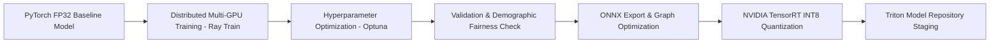

# AI / ML Lifecycle & MLOps Architecture Specification
## SentinelAI: Autonomous Multi-Agent Exam Integrity Platform

**Document Metadata**
- **Document Title:** SentinelAI Production AI/ML Lifecycle & MLOps Architecture Specification
- **Author:** Principal AI Research Scientist & Lead MLOps Architect
- **Status:** Approved / Ready for AI Platform & MLOps Engineering Implementation
- **Target Audience:** ML Engineers, MLOps Engineers, Data Platform Engineers, Computer Vision Scientists, NLP Researchers, AI Governance Officers
- **Version:** 1.0.0
- **Source Artifacts:**
  - [SentinelAI Product Requirements Document (PRD)](file:///C:/Users/tanis/.gemini/antigravity-ide/brain/6923a728-c23d-4c82-8e32-3de3bf436128/sentinel_ai_prd.md)
  - [SentinelAI Software Architecture Document (SAD)](file:///C:/Users/tanis/.gemini/antigravity-ide/brain/6923a728-c23d-4c82-8e32-3de3bf436128/sentinel_ai_architecture.md)
  - [SentinelAI Technology Selection Document](file:///C:/Users/tanis/.gemini/antigravity-ide/brain/6923a728-c23d-4c82-8e32-3de3bf436128/sentinel_ai_tech_stack.md)
  - [SentinelAI Database Architecture Document](file:///C:/Users/tanis/.gemini/antigravity-ide/brain/6923a728-c23d-4c82-8e32-3de3bf436128/sentinel_ai_database_design.md)
  - [SentinelAI API Specification Document](file:///C:/Users/tanis/.gemini/antigravity-ide/brain/6923a728-c23d-4c82-8e32-3de3bf436128/sentinel_ai_api_spec.md)
  - [SentinelAI Multi-Agent AI System Document](file:///C:/Users/tanis/.gemini/antigravity-ide/brain/6923a728-c23d-4c82-8e32-3de3bf436128/sentinel_ai_agent_architecture.md)

---

## Table of Contents
1. [AI Pipeline Overview](#1-ai-pipeline-overview)
2. [AI Tasks Catalog](#2-ai-tasks-catalog)
3. [Dataset Design & Curation Strategy](#3-dataset-design--curation-strategy)
4. [Data Preprocessing Pipelines](#4-data-preprocessing-pipelines)
5. [Feature Engineering Specifications](#5-feature-engineering-specifications)
6. [Model Training & Optimization Pipeline](#6-model-training--optimization-pipeline)
7. [Evaluation Strategy & Benchmark Thresholds](#7-evaluation-strategy--benchmark-thresholds)
8. [Model Registry & Lineage Architecture](#8-model-registry--lineage-architecture)
9. [Deployment & MLOps Release Strategy](#9-deployment--mlops-release-strategy)
10. [Real-Time Inference Pipeline Architecture](#10-real-time-inference-pipeline-architecture)
11. [Model Observability & Drift Monitoring](#11-model-observability--drift-monitoring)
12. [Continuous Retraining & Active Learning Strategy](#12-continuous-retraining--active-learning-strategy)
13. [Explainable AI (XAI) & Evidence Attribution](#13-explainable-ai-xai--evidence-attribution)
14. [AI Governance, Ethics & Regulatory Compliance](#14-ai-governance-ethics--regulatory-compliance)
15. [Adversarial Security & ML Defense Architecture](#15-adversarial-security--ml-defense-architecture)
16. [ML Operational Risks & Mitigation Matrix](#16-ml-operational-risks--mitigation-matrix)
17. [Future AI Roadmap & Advanced ML Innovations](#17-future-ai-roadmap--advanced-ml-innovations)

---

## 1. AI Pipeline Overview

### 1.1 End-to-End MLOps Lifecycle Topology
SentinelAI implements an automated, continuous multi-stage AI lifecycle engineered to maintain high predictive accuracy, zero demographic bias, sub-35ms inference latency, and rapid model retraining across millions of exam sessions.

```mermaid
flowchart TD
    subgraph Data & Feature Engineering Phase
        A[Raw Multi-Modal Data Ingestion] --> B[Automated Quality Checks & Anonymization]
        B --> C[Feature Extraction & Data Preprocessing]
        C --> D[Dataset Curation & Versioned Data Lake]
    end

    subgraph Training & Validation Phase
        D --> E[Distributed Model Training / Hyperparameter Optimization]
        E --> F[Validation & Demographic Bias Benchmarking]
        F --> G[TensorRT / ONNX INT8 Quantization & Optimization]
    end

    subgraph Model Registry & Release Phase
        G --> H[Model Registry - MLflow Staging]
        H --> I[Automated Compliance Sign-Off & Security Scan]
        I --> J[Shadow & Canary Deployment - Argo Rollouts]
    end

    subgraph Serving & Inference Phase
        J --> K[Production Model Serving - NVIDIA Triton Cluster]
        K --> L[Real-Time Edge/Cloud Inference Engine]
        L --> M[Decision Orchestrator & XAI Rationale]
    end

    subgraph Observability & Retraining Phase
        M --> N[Telemetry & Prediction Logging]
        N --> O[Drift Detector - PSI / KS-Test Monitoring]
        N --> P[Human Proctor Feedback & Verification Queue]
        O -->|Drift > Threshold| Q[Active Learning Pipeline]
        P -->|Proctor Overrides| Q
        Q -->|Automated Trigger| D
```

---

## 2. AI Tasks Catalog

### 2.1 Complete AI Task Specification Matrix

| Task Name | Domain Agent | Input Modalities | Output Predictions | Primary Metric Target | Target Latency |
| :--- | :--- | :--- | :--- | :--- | :---: |
| **Object Detection** | Vision Guard | 720p Video Frames | Bounding Boxes + Labels (`smartphone`, `tablet`, `book`, `person`) | mAP@50 $\ge 0.92$ | $\le 15 \text{ ms}$ |
| **Face Detection & Mesh**| Vision Guard | 720p Video Frames | 468 3D Facial Landmark Mesh Coordinates | Precision $\ge 0.99$ | $\le 8 \text{ ms}$ |
| **3D Head Pose Estimation**| Vision Guard | 3D Face Landmarks | Pitch, Yaw, Roll Angles (Degrees) | MAE $\le 2.5^{\circ}$ | $\le 4 \text{ ms}$ |
| **Gaze Vector Tracking** | Vision Guard | Cropped Eye Images + Mesh| Screen Spatial Intersect Coordinate $(x, y)$ | Gaze Error $\le 3.0^{\circ}$| $\le 6 \text{ ms}$ |
| **Liveness & Anti-Spoof** | Vision Guard | Video Frame Sequence | Binary Liveness Score + Spoof Category | FPR $\le 0.1\%$ | $\le 10 \text{ ms}$ |
| **Keystroke Anomaly** | Behavior Analyst| 50-Key Dwell/Flight (ms)| Anomaly Probability + Rhythm Shift Vector | ROC-AUC $\ge 0.94$ | $\le 2 \text{ ms}$ |
| **Robotic Cursor Analysis**| Behavior Analyst| Mouse Coordinates $(x,y,t)$| Robotic Path Probability + Linearity $R^2$ | Precision $\ge 0.98$ | $\le 2 \text{ ms}$ |
| **Voice Activity (VAD)** | Collusion Agent | 16kHz PCM Audio Stream| Binary Speech Flag + Decibel Envelope | F1 Score $\ge 0.96$ | $\le 4 \text{ ms}$ |
| **Speech-to-Text (STT)** | Collusion Agent | Isolated Speech Audio | Transcribed Text String Snippet | WER $\le 8.5\%$ | Near Real-Time |
| **Semantic Similarity** | Collusion Agent | Answer Plaintext Pair | Cosine Embedding Similarity Score (0.0–1.0) | Pearson $r \ge 0.91$ | $\le 25 \text{ ms}$ |
| **Temporal Risk Decay** | Risk Prediction | Time-Series Event Logs| Dynamic Risk Trajectory $R(t)$ + Velocity $\frac{dR}{dt}$ | Calibration Error $\le 0.02$ | $\le 5 \text{ ms}$ |
| **Decision Fusion & XAI** | Decision Orch. | Multi-Agent Output Vectors| Final Risk Score, Alert Level, XAI Summary | F1 Score $\ge 0.95$ | $\le 12 \text{ ms}$ |

---

## 3. Dataset Design & Curation Strategy

### 3.1 Data Sources & Curation Framework
- **Vision Datasets:** Curated from diverse multi-ethnic open datasets (e.g., FairFace, COCO, WIDER FACE) augmented with 250,000 anonymized, proctoring-consented real-world test-taking sessions.
- **Behavioral Datasets:** 5,000,000 recorded typing dynamics sequences across multi-lingual keyboard layouts.
- **Synthetic Data Generation Strategy:**
  - *Generative 3D Head/Gaze Synthesis:* Utilizing 3D parametric head models to generate synthetic lighting, camera angles, and extreme head pose angles ($>45^{\circ}$).
  - *Adversarial Spoof Generation:* Producing synthetic digital camera loops, OBS virtual camera artifacts, and photo replay attacks to train liveness classifiers.

### 3.2 Dataset Versioning & Quality Controls
- **Data Lake Versioning:** Managed via **DVC (Data Version Control)** linked to S3 object keys (`dvc commit`), ensuring exact data snapshot reproducibility for every trained model artifact.
- **Automated Data Quality Checks:**
  - *Luminance Verification:* Images with average pixel intensity $< 15$ lux or $> 240$ lux automatically quarantined.
  - *Label Corruption Filter:* Multi-annotator agreement threshold must exceed $k=0.85$ (Fleiss' Kappa); conflicting labels sent to expert review.

---

## 4. Data Preprocessing Pipelines

```
+-----------------------------------------------------------------------------------+
|                         MULTI-MODAL PREPROCESSING PIPELINE                        |
+-----------------------------------------------------------------------------------+
| 1. VISION PREPROCESSING  : Frame Resizing (640x640) -> Min-Max Color Normalization|
|                            -> CLAHE Adaptive Histogram Contrast Enhancement.     |
| 2. AUDIO PREPROCESSING   : 16kHz Downsampling -> Spectral Noise Suppression       |
|                            -> Bandpass Filter (300 Hz - 3400 Hz) -> Mel-Spectrogram.|
| 3. TEXT PREPROCESSING    : Unicode Normalization -> Stripping Formatting HTML     |
|                            -> Subword Tokenization (WordPiece / BPE).             |
| 4. TIME-SERIES BEHAVIOR  : Sliding Window Segmentation (50-key / 2.0s mouse)      |
|                            -> Robust Scaler (Median / IQR Outlier Removal).       |
+-----------------------------------------------------------------------------------+
```

---

## 5. Feature Engineering Specifications

### 5.1 Domain Feature Vectors

| Domain | Engineered Feature Name | Mathematical Definition / Logic | Predictive Value |
| :--- | :--- | :--- | :--- |
| **Vision** | `gaze_display_offset_norm` | $\sqrt{(x_{\text{gaze}} - x_{\text{center}})^2 + (y_{\text{gaze}} - y_{\text{center}})^2}$ | Quantifies screen deviation distance. |
| **Vision** | `head_pose_aspect_ratio` | Ratio of Pitch/Yaw angles relative to camera center vector | Identifies lateral head turn tricks. |
| **Behavior** | `keystroke_flight_variance` | Variance $\sigma^2$ of inter-key release-to-press timing | Captures proxy test-taker rhythm changes. |
| **Behavior** | `mouse_jerk_metric` | Third derivative of position: $\frac{d^3x}{dt^3}$ | High smooth jerk indicates natural human hand; zero jerk indicates automated script. |
| **Collusion**| `semantic_cosine_sim` | Cosine similarity between text dense embeddings: $\frac{\vec{u} \cdot \vec{v}}{\|\vec{u}\| \|\vec{v}\|}$ | Detects paraphrased essay plagiarism. |
| **Time-Series**| `decayed_risk_velocity` | Dynamic derivative of risk score over 3-minute sliding window | Measures acceleration of suspicious behavior. |

---

## 6. Model Training & Optimization Pipeline

### 6.1 Training & Quantization Workflow Topology



- **Quantization Policy:** PyTorch FP32 models undergo **Post-Training INT8 Quantization (PTQ)** using calibration datasets to achieve up to a $4\times$ speedup and $75\%$ reduction in VRAM footprint with $< 0.5\%$ loss in mAP / accuracy.

---

## 7. Evaluation Strategy & Benchmark Thresholds

### 7.1 Production Model Release Criteria

| Model Domain | Primary Evaluation Benchmark | Target Release Threshold | Max Allowed FPR | Max Allowed FNR |
| :--- | :--- | :--- | :---: | :---: |
| **Object Detection (YOLOv8)**| mAP@0.5:0.95 (COCO / Cust) | $\ge 0.88$ | $\le 1.0\%$ | $\le 0.5\%$ |
| **Face Mesh & Landmark** | Mean Error Normalized by Interpupillary Distance| $\le 1.8\%$ | $\le 0.1\%$ | $\le 0.1\%$ |
| **Liveness Classifier** | Equal Error Rate (EER) | $\le 0.05\%$ | $\le 0.01\%$ | $\le 0.01\%$ |
| **Gaze Tracking (L2CS)** | Mean Angular Error (Degrees) | $\le 2.5^{\circ}$ | $\le 2.0\%$ | $\le 1.0\%$ |
| **Keystroke Anomaly (IsoForest)**| Area Under ROC Curve (ROC-AUC)| $\ge 0.95$ | $\le 1.5\%$ | $\le 1.0\%$ |
| **Whisper VAD & STT** | Word Error Rate (WER) | $\le 8.5\%$ | $\le 1.0\%$ | $\le 0.5\%$ |
| **Decision Orchestrator** | F1 Score on Verifiable Audit Sets| $\ge 0.96$ | $\le 0.5\%$ | $\le 0.2\%$ |

---

## 8. Model Registry & Lineage Architecture

### 8.1 Model Metadata Schema & Governance
Every model artifact promoted to the **MLflow Model Registry** must contain an immutable metadata envelope:

```json
{
  "model_name": "vision_guard_yolov8",
  "version": "v2.4.1",
  "framework": "TensorRT-INT8",
  "git_commit_sha": "a1b2c3d4e5f6...",
  "dvc_data_hash": "dvc_99001122...",
  "metrics": {
    "map50": 0.932,
    "latency_p99_ms": 12.4,
    "vram_mb": 420
  },
  "fairness_audit": {
    "demographic_parity_delta": 0.004,
    "audited_by": "compliance_officer_09",
    "passed": true
  },
  "approval_status": "PROMOTED_TO_PRODUCTION"
}
```

---

## 9. Deployment & MLOps Release Strategy

### 9.1 Progressive Release Pipeline (Argo Rollouts)

```
[Staging Deployment] -> [Automated Integration Test Suite] -> [Shadow Mode Testing (100% Prod Traffic)]
                                                                         |
                                                                         v
[Production Rollout 100%] <- [Canary 25% Traffic Shift] <- [Canary 5% Traffic Shift]
```

- **Shadow Deployment Testing:** New model candidates process live production video feeds in "Shadow Mode" for 48 hours. Outputs are logged and compared against active production model predictions without altering live proctor alerts.

---

## 10. Real-Time Inference Pipeline Architecture

```
[Webcam Feed Stream] 
  │
  v
[Media Stream Ingestion Gateway]
  │ (H.264 Frame Decode)
  v
[NVIDIA Triton Multi-Model Inference Server]
  ├── Worker Pod 1: Face Mesh (ONNX Runtime INT8)   --> 468 Landmarks (6 ms)
  ├── Worker Pod 2: Gaze Vector (TensorRT INT8)      --> (x, y) Intersect (8 ms)
  └── Worker Pod 3: YOLOv8 Device (TensorRT INT8)    --> Bounding Boxes (14 ms)
  │
  v
[Dynamic Post-Processing & Calibration Layer (Platt Scaling)]
  │
  v
[Decision Orchestrator Stream Event Broker Engine]
```

---

## 11. Model Observability & Drift Monitoring

### 11.1 Drift Measurement Framework

```
+-----------------------------------------------------------------------------------+
|                        CONTINUOUS DRIFT MONITORING ENGINE                         |
+-----------------------------------------------------------------------------------+
| 1. DATA DRIFT (KS-Test)    : Monitors input pixel luminance & gaze distributions. |
| 2. CONCEPT DRIFT (PSI)     : Population Stability Index on output risk scores.    |
|                              - PSI < 0.10 : Normal (No Action)                   |
|                              - 0.10 <= PSI < 0.25 : Warning (Queue Inspection)    |
|                              - PSI >= 0.25 : Critical Drift (Trigger Retraining) |
| 3. CONFIDENCE DRIFT        : Monitors mean model confidence score trends.         |
+-----------------------------------------------------------------------------------+
```

---

## 12. Continuous Retraining & Active Learning Strategy

### 12.1 Active Learning Feedback Loop

```
[Production Model Predictions]
  │
  ├── High-Confidence Decisions (99%+) ──> Automated Archiving
  │
  └── Low-Confidence / Ambiguous Signals (40% - 60%) 
        │
        v
  [Proctor Review & Override Action] 
        │
        v (Human Validated Label)
  [Active Learning Curation Queue] 
        │
        v (DVC Commit)
  [Automated Retraining Pipeline]
```

---

## 13. Explainable AI (XAI) & Evidence Attribution

- **Feature Importance Attribution:** Vision models utilize **Grad-CAM (Gradient-Weighted Class Activation Mapping)** to generate heatmaps highlighting the exact pixel regions triggering object detection (e.g., bounding box around smartphone in candidate lap).
- **Behavioral Attribution:** SHAP (SHapley Additive exPlanations) values decompose composite risk score jumps into isolated behavioral contributions (e.g., $+0.40$ from paste length, $+0.35$ from off-screen gaze).

---

## 14. AI Governance, Ethics & Regulatory Compliance

- **GDPR Article 22 Compliance:** Ensures zero fully automated candidate disqualification. All AI risk scores function as decision-support recommendations requiring human proctor/admin validation.
- **Biometric Data Erasure:** Raw facial images captured during registration are purged immediately following 512-dim embedding extraction. Biometric vectors are encrypted and auto-deleted post-exam per institutional SLA.

---

## 15. Adversarial Security & ML Defense Architecture

| Adversarial Threat Vector | Attack Mechanism | Machine Learning Defense Architecture |
| :--- | :--- | :--- |
| **Adversarial Image Perturbation**| Sub-visual noise injected into webcam stream to blind YOLO object detector. | Random spatial jitter, Gaussian blur pre-filtering, and adversarial robust training. |
| **Virtual Camera Replay** | Candidate streams pre-recorded clean video loop via OBS. | High-frequency spatial micro-flicker detection + randomized optical gaze challenge. |
| **Data Poisoning Attempt** | Malicious proctors intentionally submit false override labels to corrupt active learning. | Statistical outlier filtering on proctor override logs + multi-proctor consensus verification. |
| **Deepfake Video Injection** | Real-time generative face-swap filter. | Phase-spectrum temporal variance analysis + micro-texture liveness classification. |

---

## 16. ML Operational Risks & Mitigation Matrix

| ML Operational Risk | Impact | Risk Likelihood | Technical Mitigation Strategy |
| :--- | :--- | :--- | :--- |
| **Systemic False Positive Spike** | High | Medium | Automatic Orchestrator circuit breaker drops alert sensitivity to "Conservative Mode" upon $>5\%$ anomaly rate. |
| **GPU Inference Queue Backlog** | Critical | Medium | Dynamic frame sampling rate scaling (30 FPS $\rightarrow$ 5 FPS for low-risk candidates) via Triton dynamic batcher. |
| **Overfitting on Active Learning Data**| Medium | Medium | Maintain a 20% fixed held-out historical test set that is never included in active learning retrains. |

---

## 17. Future AI Roadmap & Advanced ML Innovations

1. **WebGPU Client Edge Feature Extraction:** Migrating Vision Guard landmark and gaze models to run natively in browser WebGPU runtimes, offloading $80\%$ of cloud GPU compute costs.
2. **Multimodal Assessment Transformers:** End-to-end multimodal transformer architectures evaluating simultaneous video, audio, and event tokens within a unified attention window.
3. **Graph Neural Networks (GNN) for Collusion Rings:** Utilizing GNNs post-exam across national candidate datasets to uncover cross-institutional cheating rings.

---

## 18. Document Sign-off & Next Steps

This AI/ML Lifecycle & MLOps Architecture Specification formally completes **Step 7**. The AI engineering blueprint is locked and approved.

- **PRD, SAD, Tech Stack, DB, API, & Multi-Agent Alignment:** 100% Compliant.
- **Implementation Status:** **APPROVED FOR FULL ENGINEERING EXECUTION.**
