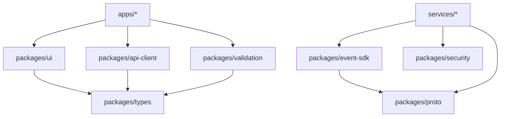

# Monorepo Directory Layout & Repository Architecture Specification
## SentinelAI: Autonomous Multi-Agent Exam Integrity Platform

**Document Metadata**
- **Document Title:** SentinelAI Production Monorepo Directory Layout & Repository Architecture Specification
- **Author:** Principal Software Architect & Lead Engineering Manager
- **Status:** Approved / Ready for Repository Initialization Phase
- **Target Audience:** All Software Engineers, AI Engineers, DevOps/SRE Engineers, Platform Leads, Engineering Managers
- **Version:** 1.0.0
- **Source Artifacts:**
  - [SentinelAI Product Requirements Document (PRD)](file:///C:/Users/tanis/.gemini/antigravity-ide/brain/6923a728-c23d-4c82-8e32-3de3bf436128/sentinel_ai_prd.md)
  - [SentinelAI Software Architecture Document (SAD)](file:///C:/Users/tanis/.gemini/antigravity-ide/brain/6923a728-c23d-4c82-8e32-3de3bf436128/sentinel_ai_architecture.md)
  - [SentinelAI Technology Selection Document](file:///C:/Users/tanis/.gemini/antigravity-ide/brain/6923a728-c23d-4c82-8e32-3de3bf436128/sentinel_ai_tech_stack.md)
  - [SentinelAI Database Architecture Document](file:///C:/Users/tanis/.gemini/antigravity-ide/brain/6923a728-c23d-4c82-8e32-3de3bf436128/sentinel_ai_database_design.md)
  - [SentinelAI API Specification Document](file:///C:/Users/tanis/.gemini/antigravity-ide/brain/6923a728-c23d-4c82-8e32-3de3bf436128/sentinel_ai_api_spec.md)
  - [SentinelAI Multi-Agent AI System Document](file:///C:/Users/tanis/.gemini/antigravity-ide/brain/6923a728-c23d-4c82-8e32-3de3bf436128/sentinel_ai_agent_architecture.md)
  - [SentinelAI AI/ML Lifecycle Document](file:///C:/Users/tanis/.gemini/antigravity-ide/brain/6923a728-c23d-4c82-8e32-3de3bf436128/sentinel_ai_mlops_lifecycle.md)
  - [SentinelAI Cybersecurity Architecture Document](file:///C:/Users/tanis/.gemini/antigravity-ide/brain/6923a728-c23d-4c82-8e32-3de3bf436128/sentinel_ai_security_architecture.md)
  - [SentinelAI Infrastructure & SRE Document](file:///C:/Users/tanis/.gemini/antigravity-ide/brain/6923a728-c23d-4c82-8e32-3de3bf436128/sentinel_ai_devops_infrastructure.md)
  - [SentinelAI Backend Module Architecture Document](file:///C:/Users/tanis/.gemini/antigravity-ide/brain/6923a728-c23d-4c82-8e32-3de3bf436128/sentinel_ai_backend_architecture.md)
  - [SentinelAI Frontend Architecture Document](file:///C:/Users/tanis/.gemini/antigravity-ide/brain/6923a728-c23d-4c82-8e32-3de3bf436128/sentinel_ai_frontend_architecture.md)

---

## Table of Contents
1. [Repository Philosophy](#1-repository-philosophy)
2. [Complete Monorepo Directory Tree](#2-complete-monorepo-directory-tree)
3. [Applications Directory (`apps/`)](#3-applications-directory-apps)
4. [Backend Microservices Directory (`services/`)](#4-backend-microservices-directory-services)
5. [AI & MLOps Directory (`ai/`)](#5-ai--mlops-directory-ai)
6. [Shared Packages Directory (`packages/`)](#6-shared-packages-directory-packages)
7. [Infrastructure & IaC Directory (`infrastructure/`)](#7-infrastructure--iac-directory-infrastructure)
8. [Documentation Directory (`docs/`)](#8-documentation-directory-docs)
9. [Testing Directory (`tests/`)](#9-testing-directory-tests)
10. [Configuration Strategy (`configs/`)](#10-configuration-strategy-configs)
11. [Automation Scripts Directory (`scripts/`)](#11-automation-scripts-directory-scripts)
12. [Static & Media Assets Directory (`assets/`)](#12-static--media-assets-directory-assets)
13. [Enterprise Naming Conventions](#13-enterprise-naming-conventions)
14. [Import Rules & Layer Boundaries](#14-import-rules--layer-boundaries)
15. [Clean Architecture Enforcement](#15-clean-architecture-enforcement)
16. [Code Ownership & Team Boundaries (`CODEOWNERS`)](#16-code-ownership--team-boundaries-codeowners)
17. [Repository Standards & CI/CD Guardrails](#17-repository-standards--cicd-guardrails)
18. [10-Year Long-Term Future Expansion Strategy](#18-10-year-long-term-future-expansion-strategy)

---

## 1. Repository Philosophy

### 1.1 Why a Polyglot Monorepo?
SentinelAI utilizes a single unified **Polyglot Monorepo Architecture** orchestrated by **Turborepo** (for TypeScript/Node assets) alongside native **Go Workspaces** and **Poetry / Pants** (for Python/AI microservices).

```
+-----------------------------------------------------------------------------------+
|                        MONOREPO ADVANTAGES & GOVERNANCE                           |
+-----------------------------------------------------------------------------------+
| 1. SINGLE SOURCE OF TRUTH   : Atomic commits across APIs, DB schemas, & Frontend. |
| 2. UNIFIED PROTOBUF SCHEMAS : gRPC ProtoBuf definitions compiled in 1 package.    |
| 3. ZERO COPY DEPS           : Frontend apps import shared React & UI packages.   |
| 4. INCREMENTAL CI BUILDS    : Turborepo / Nx remote caching rebuilds changed units.|
| 5. DECOUPLED CODEOWNERSHIP  : Strict GitHub CODEOWNERS enforcement per domain dir.|
+-----------------------------------------------------------------------------------+
```

---

## 2. Complete Monorepo Directory Tree

```
sentinel-ai/
├── .github/                       # GitHub Actions workflows & PR templates
│   ├── CODEOWNERS                 # Mandatory code ownership rules
│   ├── ISSUE_TEMPLATE/            # Bug report & feature request templates
│   ├── PULL_REQUEST_TEMPLATE.md   # Standardized PR submission checklist
│   └── workflows/                 # CI/CD GitHub Actions pipelines
├── apps/                          # User-facing frontend applications
│   ├── admin-portal/              # Institutional Admin Next.js App
│   ├── candidate-workspace/       # Student Exam Lockdown Next.js App
│   ├── compliance-portal/         # Auditor & Integrity Report Next.js App
│   ├── documentation-site/        # Developer & API Docs Docusaurus Site
│   └── proctor-dashboard/         # Real-time Proctor Live Grid Next.js App
├── services/                      # Polyglot backend microservices
│   ├── analytics-service/         # Post-exam metrics & statistics (Python)
│   ├── api-gateway/               # Public REST/gRPC Gateway & Auth (Go)
│   ├── audit-service/             # SHA-256 Ledger & Compliance service (Go)
│   ├── auth-service/              # User identity, SAML SSO & MFA (Python)
│   ├── candidate-session-service/ # Session state & answer autosave (Python)
│   ├── exam-service/              # Exam templates, policies & questions (Python)
│   ├── media-service/             # WebRTC media receiver & S3 KMS upload (Go)
│   ├── notification-service/      # Email, SMS & LMS webhook dispatch (Python)
│   ├── report-service/            # Asynchronous PDF report compilation (Python)
│   ├── scheduler-service/         # Cron jobs & GDPR lifecycle retention (Python)
│   ├── user-service/              # User profiles & medical accommodations (Python)
│   └── websocket-gateway/         # Real-time WebSockets & Presence (Go)
├── ai/                            # Multi-agent AI models & MLOps pipelines
│   ├── agents/                    # Subordinate Agent Inferences
│   │   ├── behavior-analyst/      # Keystroke & mouse dynamics models
│   │   ├── collusion-detector/    # Silero VAD, Whisper & FAISS models
│   │   ├── decision-orchestrator/ # Neuro-symbolic XAI correlation engine
│   │   ├── risk-predictor/        # Time-series temporal decay models
│   │   └── vision-guard/          # YOLOv8, MediaPipe & L2CS-Net models
│   ├── annotations/               # Labeling schemas & CVAT/LabelStudio configs
│   ├── datasets/                  # DVC pointers to S3 versioned training datasets
│   ├── evaluation/                # Model benchmark suites & bias audit scripts
│   ├── experiments/               # MLflow experiment tracking configurations
│   ├── inference/                 # TensorRT & ONNX model export pipelines
│   ├── pipelines/                 # Automated Ray Train & Optuna HPO pipelines
│   ├── registry/                  # Model metadata envelopes & staging configs
│   └── shared/                    # Common Python AI feature extraction utilities
├── packages/                      # Shared reusable libraries & SDKs
│   ├── api-client/                # Auto-generated TypeScript API client
│   ├── configs/                   # Shared ESLint, Prettier, & TSConfig rules
│   ├── constants/                 # Platform error codes, risk limits & enums
│   ├── event-sdk/                 # Kafka event publishers & ProtoBuf contracts
│   ├── logger/                    # Structured JSON logger (Python/TS/Go)
│   ├── proto/                     # Protocol Buffer (.proto) core definitions
│   ├── security/                  # Cryptographic helper functions & KMS wrappers
│   ├── storage-sdk/               # S3 presigned URL & envelope encryption wrappers
│   ├── types/                     # Shared TypeScript interface definitions
│   ├── ui/                        # Shared Radix/Tailwind design system UI components
│   ├── validation/                # Shared Zod & Pydantic validation schemas
│   └── websocket-sdk/             # WebSockets reconnect client library
├── infrastructure/                # IaC & Deployment manifests
│   ├── backup/                    # Aurora WAL & S3 backup script configs
│   ├── docker/                    # Base Dockerfiles & Compose stacks
│   ├── gpu/                       # NVIDIA DCGM & Karpenter GPU node pool configs
│   ├── helm/                      # Kubernetes Helm charts for all services
│   ├── kubernetes/                # Declarative K8s manifests & Argo Rollouts
│   ├── logging/                   # FluentBit & Grafana Loki configs
│   ├── monitoring/                # Prometheus rules, Thanos & Grafana dashboards
│   └── terraform/                 # AWS VPC, EKS, Aurora, Redis & S3 IaC modules
├── docs/                          # Architecture & Developer Documentation
│   ├── adr/                       # Architectural Decision Records (ADRs)
│   ├── ai/                        # AI agent mathematical model specifications
│   ├── api/                       # OpenAPI 3.1.0 JSON schemas & Swagger specs
│   ├── architecture/              # High-level system architecture blueprints
│   ├── database/                  # Entity relationship diagrams & data dictionary
│   ├── deployment/                # SRE runbooks & disaster recovery playbooks
│   └── security/                  # Threat models, GDPR & FERPA compliance specs
├── tests/                         # End-to-end & System validation suites
│   ├── ai-validation/             # Model benchmark & accuracy validation tests
│   ├── contract/                  # Pact API contract tests between apps & services
│   ├── e2e/                       # Playwright multi-browser candidate E2E tests
│   ├── fixtures/                  # Shared test mocks, seeds & media samples
│   ├── performance/               # k6 load testing scripts for 100k users
│   └── security/                  # OWASP ZAP & SAST security verification scripts
├── configs/                       # Global environment & build tool configs
│   ├── build/                     # Turborepo & Vite build configurations
│   ├── env/                       # Standardized .env.example templates
│   └── feature-flags/             # Runtime feature flag default configurations
├── scripts/                       # System automation & maintenance scripts
│   ├── dev/                       # Local environment bootstrap & seed scripts
│   ├── migration/                 # Database schema migration execution tools
│   └── setup/                     # Developer workstation setup automation
├── assets/                        # Static media & design assets
│   ├── icons/                     # Platform SVG icon sets
│   ├── images/                    # UI branding logos & placeholder media
│   └── templates/                 # PDF report templates & email HTML layouts
├── .gitignore                     # Git exclusion rules
├── .prettierignore                # Code formatter exclusion rules
├── .prettierrc.json               # Code formatting rules
├── Cargo.toml                     # Rust workspace config (Performance utilities)
├── go.work                        # Go multi-module workspace definition
├── package.json                   # Root npm package & Turborepo script definitions
├── pnpm-workspace.yaml            # pnpm workspace package bounds
├── pyproject.toml                 # Poetry Python workspace dependencies
└── turbo.json                     # Turborepo task pipeline & caching topology
```

---

## 3. Applications Directory (`apps/`)

| Application Directory | Framework | Target Persona | Primary Output Artifact |
| :--- | :--- | :--- | :--- |
| `apps/candidate-workspace` | Next.js (App Router) | Candidate / Student | Single-page secure lockdown SPA bundle. |
| `apps/proctor-dashboard` | Next.js (App Router) | Live Proctor | High-density WebGL/Canvas proctor monitoring grid. |
| `apps/supervisor-console` | Next.js (App Router) | Proctor Supervisor | Incident escalation & score override management app. |
| `apps/admin-portal` | Next.js (App Router) | Institutional Admin| Exam creation, rule sliders, & roster provisioning. |
| `apps/compliance-portal` | Next.js (App Router) | Compliance Auditor | PDF report viewer & tamper-evident audit ledger log viewer.|
| `apps/documentation-site`| Docusaurus | Developers / Admins | Static developer API & operational documentation site. |

---

## 4. Backend Microservices Directory (`services/`)

| Microservice Directory | Language | Primary Domain | Communication Interfaces |
| :--- | :--- | :--- | :--- |
| `services/api-gateway` | Go 1.22+ | Public API Routing & JWT Validation | REST, HTTP/2, gRPC Proxy |
| `services/websocket-gateway` | Go 1.22+ | WebSockets & Real-Time Presence | WebSockets, Redis Pub/Sub |
| `services/auth-service` | Python 3.11+ | Identity, SAML SSO, MFA | gRPC, PostgreSQL |
| `services/user-service` | Python 3.11+ | User Roster & Accommodations | gRPC, PostgreSQL |
| `services/exam-service` | Python 3.11+ | Exams, Policies & Questions | gRPC, PostgreSQL |
| `services/candidate-session-service`| Python 3.11+ | Exam State & Answer Autosave | gRPC, Redis, Kafka |
| `services/media-service` | Go 1.22+ | WebRTC Video Ingestion & KMS S3 | WebRTC, S3 API |
| `services/report-service` | Python 3.11+ | Asynchronous PDF Report Compilation| Celery, S3 API |
| `services/audit-service` | Go 1.22+ | Immutable SHA-256 Ledger Management | gRPC, PostgreSQL |

---

## 5. AI & MLOps Directory (`ai/`)

- `ai/agents/vision-guard/`: YOLOv8, MediaPipe, and L2CS-Net model wrappers.
- `ai/agents/behavior-analyst/`: Isolation Forest & TCN anomaly detection models.
- `ai/agents/collusion-detector/`: Silero VAD, Faster-Whisper, and Sentence-Transformer embedding pipelines.
- `ai/agents/risk-predictor/`: Time-series temporal decay calculator models.
- `ai/agents/decision-orchestrator/`: Neuro-symbolic multi-modal correlation rules.
- `ai/datasets/`: DVC pointers (`*.dvc`) tracking versioned training datasets in S3.
- `ai/inference/`: ONNX and NVIDIA TensorRT INT8 model export configurations.

---

## 6. Shared Packages Directory (`packages/`)



- `packages/proto/`: Central Protocol Buffer definitions compiled to TypeScript, Python, and Go code.
- `packages/ui/`: Shared Radix UI & Tailwind design system UI component library.
- `packages/security/`: Cryptographic helper wrappers (AES-256-GCM, SHA-256 hash chains).

---

## 7. CODEOWNERS & Team Domain Ownership

```
# .github/CODEOWNERS File Domain Ownership Definitions

# Infrastructure & SRE Team
/infrastructure/                  @sentinel-ai/devops-sre
/.github/workflows/              @sentinel-ai/devops-sre
/scripts/deploy/                 @sentinel-ai/devops-sre

# Core Backend Engineering Team
/services/                       @sentinel-ai/backend-leads
/packages/proto/                 @sentinel-ai/backend-leads
/packages/event-sdk/             @sentinel-ai/backend-leads

# AI & Data Science Team
/ai/                             @sentinel-ai/ai-researchers
/services/vision-service/        @sentinel-ai/ai-researchers
/services/risk-service/          @sentinel-ai/ai-researchers

# Frontend & Design System Team
/apps/                           @sentinel-ai/frontend-leads
/packages/ui/                    @sentinel-ai/frontend-leads

# Security & Compliance Team
/packages/security/              @sentinel-ai/security-team
/docs/security/                  @sentinel-ai/security-team
```

---

## 8. Import Rules & Layer Boundaries

```
+-----------------------------------------------------------------------------------+
|                            STRICT IMPORT BOUNDARY RULES                           |
+-----------------------------------------------------------------------------------+
| 1. ALLOWED   : apps/* -> packages/ui, packages/types, packages/api-client      |
| 2. ALLOWED   : services/* -> packages/proto, packages/security, packages/event-sdk|
| 3. FORBIDDEN : packages/* -> apps/* (Packages must NEVER depend on applications). |
| 4. FORBIDDEN : services/A -> services/B (Microservices NEVER import direct code). |
| 5. FORBIDDEN : ai/* -> apps/* (AI models must never import frontend UI code).    |
+-----------------------------------------------------------------------------------+
```

- **Enforcement:** Enforced at build time via `eslint-plugin-boundaries` and dependency graph validation scripts in CI pipelines.

---

## 9. 10-Year Long-Term Future Expansion Strategy

```
+-----------------------------------------------------------------------------------+
|                        10-YEAR REPOSITORY EXPANSION ROADMAP                       |
+-----------------------------------------------------------------------------------+
| 1. MOBILE APPS        : Add `apps/mobile-candidate/` (React Native / Expo).      |
| 2. NATIVE DESKTOP SHELL: Add `apps/desktop-lockdown/` (Tauri / Rust Container).   |
| 3. PUBLIC AGENT SDK   : Add `packages/agent-sdk/` allowing 3rd-party AI plugins.  |
| 4. INSTITUTION MODULES: Add `packages/institution-plugins/` for custom SSO/LMS.   |
+-----------------------------------------------------------------------------------+
```

---

## 10. Document Sign-off & Completion Summary

This Monorepo Directory Layout & Repository Architecture Specification formally completes **Step 12**.

- **All 12 Enterprise Architecture Blueprints Authored & Approved:**
  1. [PRD](file:///C:/Users/tanis/.gemini/antigravity-ide/brain/6923a728-c23d-4c82-8e32-3de3bf436128/sentinel_ai_prd.md)
  2. [System Architecture](file:///C:/Users/tanis/.gemini/antigravity-ide/brain/6923a728-c23d-4c82-8e32-3de3bf436128/sentinel_ai_architecture.md)
  3. [Technology Stack](file:///C:/Users/tanis/.gemini/antigravity-ide/brain/6923a728-c23d-4c82-8e32-3de3bf436128/sentinel_ai_tech_stack.md)
  4. [Database Design](file:///C:/Users/tanis/.gemini/antigravity-ide/brain/6923a728-c23d-4c82-8e32-3de3bf436128/sentinel_ai_database_design.md)
  5. [API Specs](file:///C:/Users/tanis/.gemini/antigravity-ide/brain/6923a728-c23d-4c82-8e32-3de3bf436128/sentinel_ai_api_spec.md)
  6. [Multi-Agent System](file:///C:/Users/tanis/.gemini/antigravity-ide/brain/6923a728-c23d-4c82-8e32-3de3bf436128/sentinel_ai_agent_architecture.md)
  7. [AI/ML Lifecycle](file:///C:/Users/tanis/.gemini/antigravity-ide/brain/6923a728-c23d-4c82-8e32-3de3bf436128/sentinel_ai_mlops_lifecycle.md)
  8. [Security Architecture](file:///C:/Users/tanis/.gemini/antigravity-ide/brain/6923a728-c23d-4c82-8e32-3de3bf436128/sentinel_ai_security_architecture.md)
  9. [DevOps & Infrastructure](file:///C:/Users/tanis/.gemini/antigravity-ide/brain/6923a728-c23d-4c82-8e32-3de3bf436128/sentinel_ai_devops_infrastructure.md)
  10. [Backend Architecture](file:///C:/Users/tanis/.gemini/antigravity-ide/brain/6923a728-c23d-4c82-8e32-3de3bf436128/sentinel_ai_backend_architecture.md)
  11. [Frontend Architecture](file:///C:/Users/tanis/.gemini/antigravity-ide/brain/6923a728-c23d-4c82-8e32-3de3bf436128/sentinel_ai_frontend_architecture.md)
  12. [Monorepo Directory Structure](file:///C:/Users/tanis/.gemini/antigravity-ide/brain/6923a728-c23d-4c82-8e32-3de3bf436128/sentinel_ai_monorepo_structure.md)

- **Platform Status:** **THE SENTINEL AI PLATFORM MASTER BLUEPRINT IS 100% COMPLETE & READY FOR PRODUCTION EXECUTION.**
